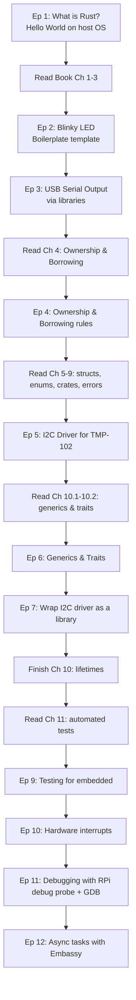
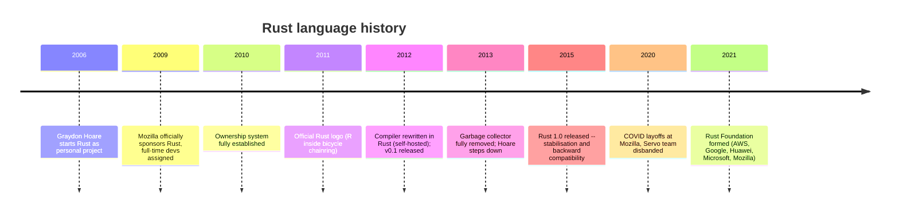
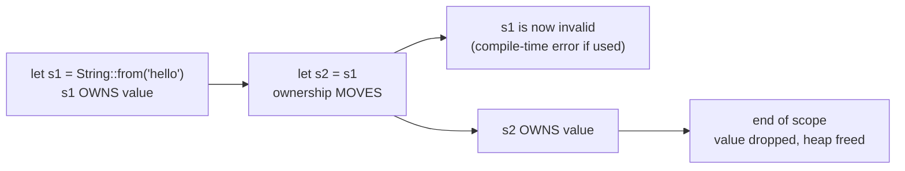

# Lecture 01: Intro to Embedded Rust - Part 1: What is Rust?

**Video:** https://www.youtube.com/watch?v=mz-vW-Ar_GM
**Uploader:** DigiKey  **Duration:** ~56 min  **Published:** 2026-01-22

## Table of Contents
- [Series Overview and Prerequisites](#series-overview-and-prerequisites)
- [Learning Resources: The Rust Book and Rustlings](#learning-resources-the-rust-book-and-rustlings)
- [Series Roadmap: Episode by Episode](#series-roadmap-episode-by-episode)
- [A Motivating C Example: Undefined Behaviour](#a-motivating-c-example-undefined-behaviour)
- [The History of Rust](#the-history-of-rust)
- [Memory Management Strategies](#memory-management-strategies)
- [The Ownership Model](#the-ownership-model)
- [Rust as a Systems Language](#rust-as-a-systems-language)
- [Rust Adoption in Industry](#rust-adoption-in-industry)
- [Rust for Embedded Systems](#rust-for-embedded-systems)
- [Limitations of Rust](#limitations-of-rust)
- [Embedded-Specific Limitations](#embedded-specific-limitations)
- [Hardware Required for the Series](#hardware-required-for-the-series)
- [Setting Up the Docker Image](#setting-up-the-docker-image)
- [Interacting With the Container](#interacting-with-the-container)
- [Writing Hello World Manually with rustc](#writing-hello-world-manually-with-rustc)
- [Crates, Cargo, and Cargo.toml](#crates-cargo-and-cargotoml)
- [Cargo Profiles: Debug vs Release](#cargo-profiles-debug-vs-release)
- [cargo check for Faster Feedback](#cargo-check-for-faster-feedback)
- [Rustlings: Hands-on Exercises](#rustlings-hands-on-exercises)
- [Recommended Reading Before Episode 2](#recommended-reading-before-episode-2)
- [Quick Reference](#quick-reference)

## Series Overview and Prerequisites

Rust is a programming language like C, C++, Python, Java, and so on. It was built as a *systems language* with a focus on **safety** and **speed**. As a result, it is a natural fit for embedded systems, with a few caveats explored later in the series.

The goal of this series is to get viewers up and running with Rust on embedded systems, which means learning a new language while learning the basic constructs for writing small, efficient microcontroller code.

> [!TIP]
> If you want to jump straight in, skip to the end of this episode where the Docker image is set up and Hello World is built, then move to the next video for a basic blinking LED app.

> [!WARNING]
> Do **not** start this series if it's your first time with embedded systems. Rust is still relatively new and can be tricky to get working with microcontrollers. You are also learning a new language on top of the embedded parts -- Rust has a steeper learning curve than, say, Python.

Recommended background:

| Skill area | Examples |
| --- | --- |
| Microcontroller comfort | Arduino, MicroPython, CircuitPython |
| Vendor-tool experience (ideal) | STM32 (STM32Cube), ESP-IDF using C/C++ |
| Memory concepts | Stack vs heap, how pointers work in C |
| Prior series (mentioned) | "Getting Started with STM32", "Introduction to RTOS" |

Rust builds on these concepts with its ownership model, so it helps to be familiar with them before tackling Rust.

The instructor will mix language teaching with embedded teaching: assume the viewer is familiar with embedded concepts but probably has not used Rust yet. Between episodes the viewer is asked to read parts of the Rust book and try hands-on exercises so the videos can focus on embedded content while Rust is being learned in parallel.

## Learning Resources: The Rust Book and Rustlings

**The Rust Programming Language** -- known as "the Rust Book" or just "the book" -- is the official online guide for learning Rust. It is maintained by the Rust team and, in the instructor's experience, is the best guide for understanding the language.

> [!NOTE]
> Brown University maintains an **interactive version** of the book with quizzes to test your knowledge. The instructor recommends working through that version, though some quiz questions can be quite tricky.

The series will reference chapters of the book throughout, for example:

> Read chapters 5 through 9 before an episode where we start working on our own I2C driver.

This gives familiarity with concepts like *structs, enums, and error handling* before seeing them used.

> [!IMPORTANT]
> The series uses the **2024 edition of Rust** and the **2024 edition of the book**.

**Rustlings** is a framework of hands-on exercises. It will be pre-installed in the Docker image. While the book talks about Rust conceptually, Rustlings is great for trying actual implementation and debugging -- the perfect companion to the book. Groups of Rustlings exercises will be recommended before each video.

## Series Roadmap: Episode by Episode

The instructor interleaves embedded examples with non-embedded examples while recommending chapters from the Rust book between episodes.



| Episode | Topic | Key idea |
| --- | --- | --- |
| 1 (this) | Rust history, motivation, Hello World on host | Build Rust programs for full OS |
| 2 | Blinky LED | Boilerplate template for the microcontroller |
| 3 | Serial over USB | Easier debugging without a separate debug probe |
| 4 | Ownership and borrowing | Non-embedded review of the core rules |
| 5 | I2C driver for a temperature sensor | Uses structs, enums, error handling |
| 6 | Generics and traits | Simple, non-embedded examples |
| 7 | Wrap the I2C driver into a library | Reusable crate |
| 8 (implied -- lifetimes content) | Lifetimes | Non-embedded examples |
| 9 | Automated tests | How testing applies to embedded |
| 10 | Hardware interrupts | Embedded-specific concept |
| 11 | Debugging with Raspberry Pi debug probe and GDB | Advanced debug techniques |
| 12 | Asynchronous tasks with **Embassy** | Embassy ships its own HAL |

> [!NOTE]
> Embassy requires a decent working knowledge of Rust to use even its basic functions. The instructor therefore recommends learning Rust with bare-metal programs first, then jumping to a framework like Embassy. Once you try Embassy, you may not want to go back to bare metal.

The early Hello World, Blinky and USB-serial episodes use **bare-metal programs and some third-party libraries**. Their main intention is to produce a template usable to build future demos.

## A Motivating C Example: Undefined Behaviour

Why Rust? Consider a tiny C example. We allocate an `int` on the heap, store 42, do something with it, then free it like a good C programmer. If we did not free it we would create a *memory leak*.

```c
int *p = malloc(sizeof(int));
*p = 42;
// ... use *p ...
free(p);
// Later:
printf("%d\n", *p);   // <-- problem: use-after-free
```

The problem comes when we access that memory **after** the `free`. This is **undefined behaviour** in C -- the language specification makes no guarantee about what happens.

Possible outcomes:

- It might print the original value, if that chunk of memory was not overwritten.
- It might print something else, if the memory was overwritten.
- It might crash the program.

That is the meaning of "undefined". Some compilers may catch it, but more often a developer spends hours debugging tricky runtime errors -- or ships the product and it randomly crashes for users, or exposes nasty vulnerabilities.

> [!CAUTION]
> Microsoft estimated that some **70% of all security bugs** are related to memory-safety issues.

## The History of Rust

This statistic was the inspiration that led **Graydon Hoare** to create Rust in 2006. While working at Mozilla, he noticed that the software running the lift in his apartment building kept crashing, requiring repeated maintenance visits. He started a new language as a personal project to prevent these runtime memory bugs by *designing a language and compiler that explicitly prevent them, without compromising execution speed*. He named the language **Rust** after a group of fungi that are "over-engineered for survival".



Key historical points:

- The original compiler was written in **OCaml**; by 2012 it was rewritten in Rust (self-hosted).
- Rust originally had a **garbage collector**, used less and less, fully removed in 2013 in favour of the ownership system.
- After Mozilla's 2020 layoffs (some 250 employees) and the disbanding of the Servo team (Mozilla's experimental Rust-based browser engine), the future of Rust looked uncertain.
- The **Rust Foundation** (founded 2021) provides funding and oversight; founding members were AWS, Google, Huawei, Microsoft and Mozilla.

## Memory Management Strategies

Most programming languages trade off between two memory-management strategies. Rust introduces a third.

| Strategy | Examples | Pros | Cons |
| --- | --- | --- | --- |
| Manual memory management | C, C++ | Fast runtime, predictable performance, small binaries, low-level control | Easy to create leaks or undefined behaviour; verbose; slow development |
| Garbage collection | Python, Java, JavaScript | Safer (few/no UB), abstraction, fast development | Runtime overhead, larger binaries, hard-to-control collection pauses, loss of low-level control |
| Ownership model | Rust | Manual-MM-like speed + memory safety; small binaries; no GC pauses | Steep learning curve, slower development, borrow checker complexity |

C is the most common language in embedded systems precisely because of manual memory management's speed and small footprint.

Starting in the late 1990s, companies, government and academia introduced **safety standards** for low-level languages to enforce memory-safe coding:

- **MISRA** -- common in automotive, aerospace, medical.
- **CERT-C**
- **ISO IEC TS 17961**

> [!NOTE]
> These standards do not change the language or compiler. They are rules and guidelines that, if followed (and policed via code review), can produce memory-safe code. Tools exist to help, but ultimately people enforce the rules.

For a long time, manual MM and garbage collection were the only two real paradigms. Rust provides a third: the **ownership model**. Early ownership concepts appeared in 1990s/early-2000s research languages such as **Lolly, Linear Objects, ML Kit, and Cyclone**, but those never made it into the mainstream.

> [!IMPORTANT]
> Rust still has *minor* runtime checks -- for example bounds-checking on array accesses -- so it carries a slight runtime overhead, but generally programs are smaller and faster than GC equivalents.

## The Ownership Model

Rust has three basic ownership rules:

1. Each value in Rust has a variable that acts as the **owner** of that value.
2. There can only be **one owner** of a value at a time.
3. When the owner goes **out of scope**, the value is **dropped**.

A brief example:

```rust
fn say_hello() {
    let s1 = String::from("hello"); // s1 owns the heap-allocated "hello"
    let s2 = s1;                    // ownership MOVED to s2
    // println!("{}", s1);          // COMPILE ERROR: s1 no longer owns anything
    println!("{}", s2);             // OK: s2 is the owner
} // s2 goes out of scope here -> value is dropped, memory freed automatically
```

What this prevents:

- If `s2` were dropped or modified and `s1` were still considered valid, you'd have a **dangling pointer**. In other languages `s1` would still point to now-freed or modified memory. Printing it could leak sensitive data or cause undefined behaviour.
- Rule 3 means when `s2` goes out of scope at the function's end, Rust automatically drops the string and frees its memory -- no manual `free()` or `drop()` is needed by the developer. This typically costs only a handful of clock cycles.



> [!NOTE]
> Rust's standard library is not completely deterministic for some overhead tasks like this cleanup, but you can create your own allocators or avoid heap allocation if you need hard real-time systems with complete determinism.

This is a basic introduction; things get more complicated when **references and borrowing** come in. The series dedicates an entire episode (episode 4) to ownership and borrowing.

## Rust as a Systems Language

Although Rust is general purpose, it is most often advertised as a *systems language*:

- Manual memory management for direct hardware control.
- **Zero-cost abstractions**: high-level features and libraries compile down to efficient machine code.
- No garbage collection -> fast, predictable performance.
- Inline assembly support, when you need code optimised for a particular CPU architecture.

This makes Rust suitable for:

- Low-level OS kernels
- Hardware drivers
- Game engines
- Web servers
- Embedded systems (the focus of this series)

## Rust Adoption in Industry

Although Rust has been around for ~20 years, only recently has it begun to gain serious adoption.

On GitHub's language popularity chart (unique developers making at least one push), **Rust climbed from rank 35 to rank 21 in about five years**.

Selected adopters:

| Sector | Companies / projects |
| --- | --- |
| Cloud / infrastructure | AWS Firecracker, Microsoft Azure IoT Edge |
| Finance | BlackRock (some fintech projects) |
| Networking / security | Tailscale, Bitwarden, 1Password |
| Other | Automotive, aerospace, consumer electronics |
| Operating systems | Linux kernel (device drivers, kernel modules -- second option after C); Microsoft rewriting core components in Rust to replace legacy C++ |

## Rust for Embedded Systems

The embedded world moves slowly, so Rust adoption is slow there too. But it is happening -- mostly via community-driven projects.

| Platform | State of Rust support |
| --- | --- |
| STM32 | Community group; ST has started shipping official Rust drivers |
| ESP32 | Mostly community-driven, some official support from Espressif |
| Raspberry Pi RP2040 / RP2350 | Impressively robust; **RP-HAL** is technically community but strongly endorsed unofficially by Raspberry Pi |
| Zephyr RTOS | Recently adding Rust support; still new, only a few target architectures so far |

> [!IMPORTANT]
> The series uses the **Raspberry Pi Pico 2 (RP2350)** because of its mature Rust support and strong tooling. Eben Upton (CEO of Raspberry Pi Holdings) appears in the video to endorse the series and notes that the Pico 2's dual Cortex-M33 cores work very well with Rust.

Quoted highlights from Eben Upton:

- Built-in memory safety prevents whole classes of bugs (buffer overflows, null-pointer dereferences) -- vital as embedded devices become more sophisticated and connected.
- Safety benefits come without performance overhead: zero-cost abstractions, predictable behaviour -- exactly what real-time embedded applications need.
- The compiler catches many mistakes at compile time rather than letting them become runtime problems.

The Zephyr project's promise: cross-platform Rust applications for a wide variety of microcontrollers, on top of a C-written RTOS.

## Limitations of Rust

Rust is **not** without limitations.

> [!WARNING]
> Rust is materially more complex than C. The borrow checker, strong typing, and verbose syntax mean development time can be slower and you will often spend time debugging compile-time errors to satisfy the borrow checker.

Other limitations:

| Issue | Cause | Impact |
| --- | --- | --- |
| Longer compile times | Borrow checker, **monomorphisation** of generics, traits | Frustrating edit-compile-debug loops |
| Larger binaries | **Static linking** by default, monomorphisation, large `std` | Bigger executables (less of an issue in embedded) |
| Unstable ABI | Rust's ABI is not standardised | Code in other languages cannot call Rust directly; must expose a C ABI |

On binary size:

- Rust statically links libraries by default -- all libraries end up in a single executable, as opposed to dynamic linking (`.so`, `.dll`).
- **Monomorphisation**: generic code is duplicated for each concrete instantiation -- more code generated.
- The Rust standard library is large.

> [!TIP]
> In embedded systems we usually assume static linking anyway and **do not use** the standard library (it is too big and assumes an underlying OS). Monomorphisation, however, can still be an issue -- bear it in mind when generics are introduced later.

On ABI -- the **Application Binary Interface** is a low-level specification that defines how compiled code components communicate: function calls into libraries, parameter passing, data structure layout. ABIs are specific to individual CPU architectures and operating systems.

- C has a **widely adopted, stable ABI**, which is why other languages can call C libraries via C bindings -- a major reason C dominates kernels, drivers, and system libraries.
- **Rust has not yet standardised its ABI.** Rust libraries must expose a C-compatible interface to be callable from other languages. This limits ecosystem growth.

In purely embedded Rust applications this only matters if you want to call Rust code from another language (e.g. from a bootloader or RTOS).

## Embedded-Specific Limitations

| Limitation | Detail |
| --- | --- |
| Immature board support | Mostly community-supported; breaking changes between versions. Cargo's dependency-management helps. |
| Limited silicon-vendor adoption | Only Raspberry Pi, Espressif, and ST Microelectronics are starting to support it officially. |
| Limited drivers / libraries | You will often need to rewrite C libraries (e.g. sensor drivers). Complex drivers -- graphics, Wi-Fi, TCP/IP -- are very new and likely buggy. |
| No mature RTOS | The two big options are **Embassy** and **RTIC** (Real-Time Interrupt-driven Concurrency). |
| Small knowledge base / community | Much smaller than Embedded C, which has decades of accumulated material. |

On RTOS-like frameworks:

| Framework | What it is | Limitation |
| --- | --- | --- |
| Embassy | Asynchronous framework | No preemptive scheduling like a traditional RTOS |
| RTIC | Concurrency framework with preemptive scheduling | No kernel, no dynamic memory allocation that a traditional RTOS would offer |

Both are technically capable but ecosystems are still growing and industry adoption is limited.

## Hardware Required for the Series

| Item | Purpose |
| --- | --- |
| Raspberry Pi Pico 2 (or Pico 2 W for Wi-Fi later) | Main microcontroller board |
| LED | Blinky demos |
| 220 Ω resistor | LED current limit |
| Push button | Input / interrupts demo |
| TMP-102 I2C temperature sensor breakout | I2C driver episodes |
| Breadboard, jumper wires, USB cable | Wiring and power |

Most of the work will be understanding how to build Rust applications, use features like **borrowing** and **generics**, and create demos around quintessential embedded concepts -- **interrupts, debugging, asynchronous execution**.

## Setting Up the Docker Image

You can install Rust locally instead of using the Docker image if you wish: visit **rust-lang.org**, click **Install** at the top, and follow the instructions for your OS.

To use the pre-configured Docker image, install **Docker Desktop** from `docker.com`. The instructor strongly recommends also installing **VS Code** locally.

Clone or download the GitHub repository:

```
github.com/Sean-Hemel/introduction-to-embedded-rust
```

The repo contains:

- The Dockerfile for the image.
- Example apps that will be created throughout the series.
- A library and (after `rustlings init`) a Rustlings folder.

Click **Code -> Download ZIP**, unzip it, then in a terminal inside that folder:

```bash
docker build -t env-embedded-rust .
```

> [!TIP]
> Use the exact name `env-embedded-rust` so it lines up with what the VS Code Dev Containers extension expects. Do not forget the trailing `.` -- that tells Docker to use the current directory as the build context.

## Interacting With the Container

There are two ways to interact with the image.

**1) Direct `docker run`:**

```bash
docker run --rm -it \
  -p 3000:3000 \
  -p 3333:3333 \
  -v "$(pwd)/workspace":/home/student/workspace \
  -w /home/student/workspace \
  env-embedded-rust
```

| Flag | Why |
| --- | --- |
| `--rm` | Remove the container on exit |
| `-it` | Interactive mode |
| `-p 3000:3000` | The image preloads the Rust book at `localhost:3000` (handy when offline) |
| `-p 3333:3333` | Needed later for debugging |
| `-v ...:/home/student/workspace` | Map host workspace into container; anything saved here persists on the host |
| `-w /home/student/workspace` | Set working directory in the container |

> [!NOTE]
> Files in `workspace` are saved to the host machine -- closing the container does not delete them.

Once running, the prompt becomes `student@<hex>`. From here you can `ls` to see the mapped workspace.

**2) VS Code Dev Containers:**

Install VS Code and the **Dev Containers** extension (the only one required locally -- everything else is preinstalled inside the container).

- Click the bottom-left **Open a remote window** button.
- With a container already running: **Attach to running container** and pick `env-embedded-rust`.
- Or open the unzipped folder via **File -> Open Folder**, then use **Reopen in Container** when prompted; this spins up a new container from the image and dev container configuration.

VS Code will install the necessary extensions, including:

- **Cortex-Debug** (with sub-dependencies: debug tracking, peripheral view, ...).
- **Rust Analyzer** -- preinstalled in the image.

Load the preloaded workspace (`default.code-workspace`) when prompted.

Exit a running container with `exit` -- because of `--rm` it is fully cleaned up.

## Writing Hello World Manually with rustc

Create the directory and file:

```
apps/
  hello-world/
    src/
      main.rs
```

```rust
fn main() {
    println!("Hello, world!");
}
```

Key syntax notes from the video:

- Rust looks for `main` as the default entry point.
- `fn` denotes a function. No parameters here.
- Blocks of code go in curly braces `{}`, similar to C, C++, Java.
- `println!` is a **macro**, denoted by the `!`. Not a function.
- The `println!` macro lives in the **standard library**, which is included by default for hosted OS programs. On compilation, Rust figures out how to link against the right OS-specific dependencies for outputting to a console.
- The string literal `"Hello, world!"` uses double quotes, like C/C++/Java.
- Statements end with semicolons; you *can* place multiple statements on one line, but conventionally one statement per line.

> [!WARNING]
> When working with embedded code we will *not* have access to (or will deliberately not include) the standard library -- there's no OS. `println!` won't work unless you include a specific embedded variant. Other ways of printing to a terminal will be explored in later episodes.

Compile and run manually with `rustc` (the Rust compiler, bundled with the toolchain):

```bash
cd apps/hello-world/src
rustc main.rs
ls           # see the built executable named `main`
./main       # prints: Hello, world!
rm main
```

## Crates, Cargo, and Cargo.toml

What we just made is a basic **crate** -- the smallest amount of code the compiler will process in a single compilation. A crate is either:

- A **binary crate**: an executable (because it has a `main` function -- an entry point).
- A **library crate**: a dependency to be imported by other crates.

Going forward the series uses **Cargo**, Rust's bundled build system and package manager. Cargo recognises a package by a `Cargo.toml` file alongside an `src/` directory.

> [!IMPORTANT]
> Unless you tell Cargo otherwise, it looks for code in a specifically named `src/` folder, and for `src/main.rs` to mark a binary crate. The naming is significant.

Create `apps/hello-world/Cargo.toml`:

```toml
[package]
name = "hello"
version = "0.1.0"
edition = "2024"

[dependencies]
```

Notes on TOML:

- **TOML** stands for **Tom's Obvious Minimal Language**.
- Section names are in square brackets; everything below belongs to that section.
- Inside a section you have key/value pairs.

Notes on the keys:

- `name` is the package name.
- `version` starts at `0.1.0` by default when Cargo initialises a package.
- `edition` is the *version of Rust* in use. The term "edition" (rather than "version") avoids confusion with package versions and dependency versions. An edition is like a Python version -- a collection of language features and rules. A new edition is released every few years.
  - **2024** is the latest stable edition; the series uses it.
  - You will also encounter dependencies that use **2021**.
  - Nightly builds exist, but the recommendation is to stick with stable editions.

> [!TIP]
> Rust does a lot of work to maintain backwards compatibility across editions: your `edition = "2024"` app can depend on libraries built with `edition = "2021"` and they will operate together fine. This sidesteps the "dependency hell" familiar from Python.

Build and run:

```bash
cd apps/hello-world
cargo build      # downloads deps, calls rustc, links, etc.
./target/debug/hello       # the executable name comes from `name` in Cargo.toml
cargo run        # builds if needed, then runs the binary
cargo clean      # deletes the `target/` folder
```

Cargo puts artifacts in `target/`. By default it uses the **debug** (also called *dev*) profile, putting outputs in `target/debug/`.

> [!NOTE]
> If you're coming from Make or CMake, Cargo is far easier than hand-writing build files.

## Cargo Profiles: Debug vs Release

`cargo build` and `cargo run` default to the **debug profile**. Use `--release` for the release profile:

```bash
cargo build --release
cargo run --release
```

After `cargo build --release` the artifact appears under `target/release/` instead of `target/debug/`.

> [!NOTE]
> In `Cargo.toml` you can specify different compiler and linker flags per profile -- e.g. debug profile with full symbol tracking and extra outputs, release profile optimised for size or speed with debug symbols stripped. You can also define your own profiles.

## cargo check for Faster Feedback

As programs grow, Rust's compile times can become slow. `cargo check` compiles all packages and dependencies *without* performing the final step of generating output code or binaries.

```bash
cargo check
```

> [!TIP]
> `cargo check` is faster than `cargo build` and is a great way to shorten the write -> check -> fix-errors loop.

## Rustlings: Hands-on Exercises

Rustlings is a collection of exercises that accompanies the Rust book. The Docker image comes with Rustlings pre-installed.

Initialise Rustlings in your workspace (so progress is saved on the host machine):

```bash
cd workspace
rustlings init
```

> [!CAUTION]
> Keep Rustlings inside the `workspace` directory. If you put it elsewhere in the container, your progress is lost when the container is removed.

After init you'll see an `exercises/` folder, organised by section. Example flow:

```bash
cd rustlings
rustlings --manual-run
```

> [!NOTE]
> Rustlings will normally use Rust Analyzer on the backend in real time. In a Docker container it can struggle, so use `--manual-run`.

Inside Rustlings:

| Hotkey | Action |
| --- | --- |
| `r` | Run the current exercise |
| `h` | Hint |
| `n` | Next exercise (only available when current one passes) |
| `q` | Quit Rustlings |

Workflow: open the file, fix the compiler errors so the program prints what the instructions ask, save, press `r` to verify "exercise done", then `n` for the next.

In `exercises/README` there is an **exercise -> book chapter mapping**. The mapping is *not always in order* -- check which book chapter each exercise group corresponds to.

> [!TIP]
> The container also hosts the Rust book locally. With the container running, browse to `http://localhost:3000` to read it offline.

## Recommended Reading Before Episode 2

Before the next episode (setting up an embedded project for the Pico 2 and blinking an LED):

- Read **chapters 1 through 3 of the Rust book** -- these walk through Hello World again, a basic guessing game, and concepts like variables and functions.
- Do **the first three sections of Rustlings exercises** after the intro -- these test variables, functions, and `if` statements.

## Source Code

The example code for this lecture lives in the repo at:

- [`workspace/apps/hello-world/`](../workspace/apps/hello-world/)

## Quick Reference

- **Rust**: systems language focused on safety and speed; created by Graydon Hoare at Mozilla, 2006.
- **Why Rust**: memory safety without GC -- *zero-cost abstractions*, predictable performance, small binaries.
- **Microsoft stat**: ~70% of all security bugs are memory-safety issues.
- **Three memory models**: manual MM (C/C++), garbage collection (Python/Java/JS), **ownership** (Rust).
- **Ownership rules**:
  1. Every value has an owner (a variable).
  2. Only one owner at a time.
  3. When the owner goes out of scope, the value is dropped.
- **References + borrowing** -- covered in episode 4.
- **Editions**: series uses **Rust 2024**; some deps use 2021. Editions guarantee cross-edition interop.
- **Hardware**: Raspberry Pi Pico 2 / Pico 2 W, LED, 220 Ω, push button, TMP-102 I2C sensor, breadboard, wires, USB cable.
- **Key tools**:
  - `rustc` -- the compiler.
  - `cargo build` / `cargo run` / `cargo clean` / `cargo check` -- build system + package manager.
  - `cargo build --release` -- release profile.
- **`Cargo.toml` skeleton**: `[package]` with `name`, `version`, `edition`; `[dependencies]`.
- **Crates**: binary (has `main`) vs library.
- **Docker image**: build with `docker build -t env-embedded-rust .`; map `workspace` volume; forward ports `3000` (book) and `3333` (debugger).
- **VS Code**: install **Dev Containers** extension; **Reopen in Container** to spin up; image preinstalls **Rust Analyzer** and **Cortex-Debug**.
- **Rustlings**: `rustlings init` in `workspace`, run with `rustlings --manual-run`; hotkeys `r`/`h`/`n`/`q`.
- **Embedded Rust adopters**: Raspberry Pi (RP2040/RP2350 via RP-HAL), Espressif (ESP32), ST (STM32), plus Zephyr adding Rust support.
- **Embedded RTOS options for Rust**: **Embassy** (async, no preemption) and **RTIC** (preemptive, no kernel / dynamic allocation).
- **Limitations**: steep learning curve, slow compile times, larger binaries (static linking + monomorphisation + large `std`), unstable ABI (needs C interface to call from other languages), immature embedded ecosystem.
- **Before episode 2**: read Rust book chapters 1-3; do Rustlings *variables*, *functions*, *if* sections.
