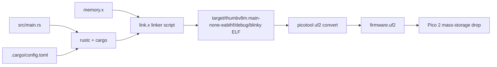

# Lecture 02: Intro to Embedded Rust - Part 2: Blink an LED

**Video:** https://www.youtube.com/watch?v=0je_kAojwUA
**Uploader:** DigiKey  **Duration:** ~43 min  **Published:** 2026-01-29

## Table of Contents
- [Overview and Prerequisites](#overview-and-prerequisites)
- [Hardware Setup](#hardware-setup)
- [Creating the Cargo Project](#creating-the-cargo-project)
- [Configuring Cargo.toml and Dependencies](#configuring-cargotoml-and-dependencies)
- [The .cargo/config.toml Build Configuration](#the-cargoconfigtoml-build-configuration)
- [The memory.x Linker Script](#the-memoryx-linker-script)
- [Writing main.rs: Bare-Metal Boilerplate](#writing-mainrs-bare-metal-boilerplate)
- [no_std and no_main Attributes](#no_std-and-no_main-attributes)
- [The Panic Handler](#the-panic-handler)
- [The RP2350 Boot Start Block](#the-rp2350-boot-start-block)
- [Crystal Frequency Constant](#crystal-frequency-constant)
- [The #[entry] Main Function](#the-entry-main-function)
- [Peripheral Access, Option and Result](#peripheral-access-option-and-result)
- [Watchdog and Clock Initialisation](#watchdog-and-clock-initialisation)
- [GPIO Pin Setup](#gpio-pin-setup)
- [The Timer and Delay Loop](#the-timer-and-delay-loop)
- [Building and Flashing](#building-and-flashing)
- [Source Code](#source-code)
- [Quick Reference](#quick-reference)

## Overview and Prerequisites

This lecture turns the abstract toolchain from Part 1 into a working embedded
program. You will produce a bare-metal Rust binary that blinks an LED on a
Raspberry Pi Pico 2 (RP2350). The walkthrough covers project scaffolding, the
Cargo and linker configuration that is unique to embedded targets, every line
of the boilerplate `main.rs`, and the build-and-flash workflow that converts
an ELF into a UF2 image.

> [!NOTE]
> Recommended reading before this episode: chapter three of *The Rust Programming
> Language* book, plus a handful of *rustlings* exercises. Chapter four
> (ownership) is the suggested follow-up before the next episode.

## Hardware Setup

The circuit is the smallest possible: one LED driven from GPIO 15, with a
current-limiting resistor to ground.

| Component | Value / Pin |
|-----------|-------------|
| Target board | Raspberry Pi Pico 2 / Pico 2 W |
| MCU | RP2350 (Cortex-M33, dual core) |
| Output pin | GPIO 15 |
| Current limit | 220 Ω resistor |
| LED forward voltage | ~2 V (typical red) |

```
   GPIO15  ----+
               |
              ___
              \ /   LED (anode at GPIO15)
              ---
               |
              | |   220 Ω
              | |
               |
              GND
```

The current-limiting resistor enforces $I_{LED} = (V_{GPIO} - V_F) / R$. With a
3.3 V GPIO and a 2 V LED, $I = (3.3 - 2) / 220 \approx 5.9$ mA, well within
Pico 2 source/sink limits.

## Creating the Cargo Project

Work inside the VS Code dev-container from Part 1 and open a bash terminal.
Navigate to the `apps` directory and scaffold the project with Cargo's
metadata-aware project generator.

```bash
cd apps
cargo new blinky --bin --vcs none
```

| Flag | Purpose |
|------|---------|
| `--bin` | Explicitly create a binary (executable) crate rather than a library. |
| `--vcs none` | Suppress `cargo`'s default creation of a `.git` folder, which would conflict with the outer repository. |

The generator produces `src/main.rs` (with a Hello World stub) and a starter
`Cargo.toml`.

## Configuring Cargo.toml and Dependencies

The project name stays `blinky`, the version `0.1.0`, and the edition `2024`.
Four crates are required for a minimum viable RP2350 bare-metal program:

| Crate | Role |
|-------|------|
| `rp235x-hal` | Community chip-specific HAL for the RP2350 / RP2354 family. |
| `embedded-hal` | Trait-based abstraction layer that chip HALs implement. |
| `cortex-m` | Low-level register and peripheral access for Arm Cortex-M cores. |
| `cortex-m-rt` | Minimal startup and runtime for Cortex-M microcontrollers. |

> [!IMPORTANT]
> `embedded-hal` does **not** compete with `rp235x-hal`. It defines the *traits*
> (interfaces) such as `OutputPin`, `DelayNs`, etc., that the chip HAL
> *implements*. Generic driver crates can therefore target the traits and work
> across vendors.

```toml
[package]
name    = "blinky"
version = "0.1.0"
edition = "2024"

[dependencies]
rp235x-hal   = { version = "0.3.0", features = ["rt", "critical-section-impl"] }
embedded-hal = "1.0.0"
cortex-m     = "0.7.7"
cortex-m-rt  = "0.7.5"

[profile.dev]
# compiler optimisations will be revisited in a later episode
```

> [!TIP]
> Always look up the latest crate versions on `crates.io` before pinning. A
> bare string after a crate name is shorthand for `version = "..."`; the
> brace form is needed only when you must enable features or override
> defaults.

Two `rp235x-hal` features are mandatory:

- `rt` -- pulls in the minimal startup/runtime.
- `critical-section-impl` -- supplies a `critical-section` implementation,
  required on RP2 chips because they have two cores even if you are using
  only one.

## The .cargo/config.toml Build Configuration

Cargo looks for `.cargo/config.toml` (at the crate root) for build settings
that cannot live in `Cargo.toml`: target triple, linker flags, and CPU
selection.

```toml
[build]
# Target is the Cortex-M33 with FPU enabled
target = "thumbv8m.main-none-eabihf"

[target.thumbv8m.main-none-eabihf]
rustflags = [
  # Compiler optimizations
  "-C", "target-cpu=cortex-m33",    # Target the Cortex-M33

  # Linker directives
  "-C", "link-arg=-Tlink.x",  # Use link.x script with cortex-m-rt to lay out memory
  "-C", "link-arg=--nmagic",  # Prevent padding memory between sections to save space
]
```

| Flag | Meaning |
|------|---------|
| `thumbv8m.main-none-eabihf` | Armv8-M Mainline, no OS, EABI, **HF** = hardware float enabled (Cortex-M33 FPU). |
| `-C target-cpu=cortex-m33` | Tells LLVM exactly which Arm core is in the RP2350. |
| `-Tlink.x` | Use the `link.x` linker script shipped by `cortex-m-rt`; it pulls in our `memory.x` for chip-specific layout. |
| `--nmagic` | Disable page alignment between sections. Saves flash bytes; useful on tight embedded targets. |

> [!NOTE]
> The `link.x` script provided by `cortex-m-rt` is generic. It delegates the
> chip-specific addresses to a separate `memory.x` file that you must supply
> at the crate root.

## The memory.x Linker Script

Copy `memory.x` from the `rp235x-hal` examples directory. It maps the RP2350
memory architecture exactly as documented in the data sheet.

```ld
MEMORY {
    /*
     * The RP2350 has either external or internal flash.
     *
     * 2 MiB is a safe default here, although a Pico 2 has 4 MiB.
     */
    FLASH : ORIGIN = 0x10000000, LENGTH = 2048K
    /*
     * RAM consists of 8 banks, SRAM0-SRAM7, with a striped mapping.
     * This is usually good for performance, as it distributes load on
     * those banks evenly.
     */
    RAM : ORIGIN = 0x20000000, LENGTH = 512K
    /*
     * RAM banks 8 and 9 use a direct mapping. They can be used to have
     * memory areas dedicated for some specific job, improving predictability
     * of access times.
     * Example: Separate stacks for core0 and core1.
     */
    SRAM8 : ORIGIN = 0x20080000, LENGTH = 4K
    SRAM9 : ORIGIN = 0x20081000, LENGTH = 4K
}

SECTIONS {
    /* ### Boot ROM info
     *
     * Goes after .vector_table, to keep it in the first 4K of flash
     * where the Boot ROM (and picotool) can find it
     */
    .start_block : ALIGN(4)
    {
        __start_block_addr = .;
        KEEP(*(.start_block));
        KEEP(*(.boot_info));
    } > FLASH

} INSERT AFTER .vector_table;

/* move .text to start /after/ the boot info */
_stext = ADDR(.start_block) + SIZEOF(.start_block);

SECTIONS {
    /* ### Picotool 'Binary Info' Entries
     *
     * Picotool looks through this block (as we have pointers to it in our
     * header) to find interesting information.
     */
    .bi_entries : ALIGN(4)
    {
        /* We put this in the header */
        __bi_entries_start = .;
        /* Here are the entries */
        KEEP(*(.bi_entries));
        /* Keep this block a nice round size */
        . = ALIGN(4);
        /* We put this in the header */
        __bi_entries_end = .;
    } > FLASH
} INSERT AFTER .text;

SECTIONS {
    /* ### Boot ROM extra info
     *
     * Goes after everything in our program, so it can contain a signature.
     */
    .end_block : ALIGN(4)
    {
        __end_block_addr = .;
        KEEP(*(.end_block));
        __flash_binary_end = .;
    } > FLASH

} INSERT AFTER .uninit;

PROVIDE(start_to_end = __end_block_addr - __start_block_addr);
PROVIDE(end_to_start = __start_block_addr - __end_block_addr);
```

| Region | Address | Size | Use |
|--------|---------|------|-----|
| Flash  | 0x10000000 | 2 MB (or 4 MB on Pico 2) | Code and read-only data. |
| RAM    | 0x20000000 | 512 KB | Stack, BSS, data. |
| SRAM8 / SRAM9 | 0x20080000 / 0x20081000 | 4 KB each | Per-core dedicated banks (not needed here). |

> [!IMPORTANT]
> The naming `memory.x` is mandatory -- `cortex-m-rt`'s `link.x` script
> hard-codes that filename when including the chip layout.

## Writing main.rs: Bare-Metal Boilerplate

The remainder of the lecture builds `src/main.rs` step by step. The complete
file is shown at the end of the section list, but each block is dissected in
sequence below.

### no_std and no_main Attributes

```rust
#![no_std]
#![no_main]
```

| Attribute | Why |
|-----------|-----|
| `#![no_std]` | Drop the Rust standard library. `std` assumes an OS (threads, files, allocator). We have none. |
| `#![no_main]` | Disable Rust's normal `fn main` entry point. The startup process for a bare-metal MCU is bespoke; `cortex-m-rt` provides its own entry through the `#[entry]` macro. |

The `#![...]` (with the bang) is an *inner attribute* applied to the entire
crate, as opposed to an outer `#[...]` attribute that decorates a single
item.

### The Panic Handler

A `no_std` binary still needs a panic handler -- the compiler will refuse to
link without one. The minimum useful implementation simply halts the CPU.

```rust
use core::panic::PanicInfo;

#[panic_handler]
fn panic(_info: &PanicInfo) -> ! {
    loop {}
}
```

| Element | Note |
|---------|------|
| `core::panic::PanicInfo` | Available from `core` (always present, even in `no_std`). |
| `&PanicInfo` | Borrow; we do not need to own the payload. |
| `-> !` | The "never" type. Tells the compiler the function never returns. |
| `loop {}` | Infinite empty loop -- the CPU spins forever on panic. |

> [!TIP]
> You can extend the panic handler to blink an error code, dump information
> over UART, or trigger a reset. For now, hanging is the simplest viable
> behaviour.

### The RP2350 Boot Start Block

The boot ROM expects a metadata block at the very start of flash. The HAL
ships a constant you can copy verbatim.

```rust
use rp235x_hal as hal;

#[unsafe(link_section = ".start_block")]
#[used]
pub static IMAGE_DEF: hal::block::ImageDef = hal::block::ImageDef::secure_exe();
```

| Attribute | Effect |
|-----------|--------|
| `#[unsafe(link_section = ".start_block")]` | Place this static into the `.start_block` section defined in `memory.x`. Linker placement is unsafe in Rust 2024. |
| `#[used]` | Prevent the compiler from optimising the static away even though no Rust code reads it -- the boot ROM does. |

> [!NOTE]
> The `unsafe` block discipline is one of Rust's defining traits: hardware
> manipulation that bypasses the borrow checker is explicit, audit-able, and
> localised. HAL crates internally use `unsafe` to deliver safe APIs to you.

### Crystal Frequency Constant

The Pico 2 ships a 12 MHz crystal. The HAL needs to know this to configure
the PLLs.

```rust
const XOSC_CRYSTAL_FREQ: u32 = 12_000_000;
```

Constants in Rust require explicit types and conventionally use
`SCREAMING_SNAKE_CASE`. The underscores are purely a readability separator.

### The #[entry] Main Function

`#[hal::entry]` (re-exported from `cortex-m-rt`) is the bare-metal substitute
for `fn main`. The function must never return.

```rust
#[hal::entry]
fn main() -> ! {
    // ...
}
```

The return type `!` is essential. If you fall out of the bottom of an embedded
`main`, there is no operating system to return *to*.

## Peripheral Access, Option and Result

The first thing inside `main` is acquiring exclusive access to the
peripherals.

```rust
let mut pac = hal::pac::Peripherals::take().unwrap();
```

`take()` returns `Option<Peripherals>` because peripherals are a *singleton*:
the first caller gets `Some(p)`, every subsequent caller gets `None`. Unlike
many languages, Rust has no `null`; absence is modelled in the type system
via `Option<T>`.

```rust
pub enum Option<T> {
    None,
    Some(T),
}
```

- `unwrap()` extracts the inner `T` from `Some`, and panics on `None`.
- A panic here triggers our panic handler -- the CPU hangs, telling us the
  peripherals were already taken.

> [!NOTE]
> Rust analyzer can display inferred types inline. On macOS press
> <kbd>Cmd</kbd>+<kbd>Alt</kbd>; on Windows/Linux press
> <kbd>Ctrl</kbd>+<kbd>Alt</kbd>. The inferred type for `pac` is
> `rp235x_hal::pac::Peripherals`.

`Result<T, E>` is the sibling of `Option<T>`, used for fallible operations
that carry an error value:

```rust
pub enum Result<T, E> {
    Ok(T),
    Err(E),
}
```

`.ok()` converts a `Result<T, E>` into `Option<T>`, discarding the error and
enabling the same `.unwrap()` pattern.

## Watchdog and Clock Initialisation

The RP2350 will not run unless its clocks (and, in practice, the watchdog)
are configured.

```rust
let mut watchdog = hal::Watchdog::new(pac.WATCHDOG);

let clocks = hal::clocks::init_clocks_and_plls(
    XOSC_CRYSTAL_FREQ,
    pac.XOSC,
    pac.CLOCKS,
    pac.PLL_SYS,
    pac.PLL_USB,
    &mut pac.RESETS,
    &mut watchdog,
)
.ok()
.unwrap();
```

| Parameter | Why it is passed |
|-----------|------------------|
| `XOSC_CRYSTAL_FREQ` | So PLL maths uses the correct reference. |
| `pac.XOSC` | The crystal oscillator peripheral. |
| `pac.CLOCKS` | The clock-tree configuration block. |
| `pac.PLL_SYS` / `pac.PLL_USB` | System and USB PLLs. |
| `&mut pac.RESETS` | Mutable borrow lets the function release peripherals from reset. |
| `&mut watchdog` | The watchdog is poked while clocks come up. |

> [!IMPORTANT]
> Note the ownership rules in play. `pac.XOSC` is **moved** into the function
> (one-shot peripheral). `pac.RESETS` is **borrowed** mutably so it can keep
> being used to gate other peripherals later.

## GPIO Pin Setup

GPIO requires the *Single-cycle I/O* (SIO) block plus the IO and Pads banks.
The HAL provides a `Pins` factory that owns these together.

```rust
let sio = hal::Sio::new(pac.SIO);

let pins = hal::gpio::Pins::new(
    pac.IO_BANK0,
    pac.PADS_BANK0,
    sio.gpio_bank0,
    &mut pac.RESETS,
);

let mut led_pin = pins.gpio15.into_push_pull_output();
```

| Item | Role |
|------|------|
| `Sio::new` | Splits off the per-core SIO peripheral; gives fast GPIO toggling. |
| `Pins::new` | Constructs the typed pin set for the only IO bank (Bank 0). |
| `into_push_pull_output()` | Type-state transition: converts the default disabled pin into a push-pull output. |

> [!TIP]
> The RP2350 has only one IO bank, but the HAL still asks you to name it
> because the API is generic enough to handle MCUs with multiple banks.

### GPIO Pin Type States

The HAL uses *type-state programming*: a `Pin<Gpio15, Disabled>` becomes a
`Pin<Gpio15, FunctionSioOutput, PullDown>` after `into_push_pull_output()`.
Methods like `set_high()` only exist on the output type, so you cannot
accidentally write to an input pin -- the compiler will refuse.

## The Timer and Delay Loop

Delays come from one of the RP2350's hardware timers.

```rust
let mut timer = hal::Timer::new_timer0(
    pac.TIMER0,
    &mut pac.RESETS,
    &clocks,
);

loop {
    led_pin.set_high().unwrap();
    timer.delay_ms(500);
    led_pin.set_low().unwrap();
    timer.delay_ms(500);
}
```

| Call | Meaning |
|------|---------|
| `Timer::new_timer0` | RP2350 exposes two timers (`TIMER0`, `TIMER1`); we move ownership of `TIMER0`. |
| `delay_ms(500)` | Provided via the `embedded-hal::delay::DelayNs` trait. |
| `.set_high()` / `.set_low()` | Provided via `embedded-hal::digital::OutputPin`. Each returns `Result<(), Infallible>` -- we `unwrap()` because no failure is possible. |

The blink period is $T = 2 \times 500\text{ ms} = 1\text{ s}$, so frequency
$f = 1\text{ Hz}$.

> [!NOTE]
> `delay_ms` is non-portable in spirit: changing chip might still require
> code edits because clock initialisation differs. The illusion of total
> portability is just that -- an illusion -- but trait-based APIs do
> minimise the diff.

## Building and Flashing

### Build Flow



### Cargo Build

```bash
cd apps/blinky
cargo build
```

Output ELF path:

```
target/thumbv8m.main-none-eabihf/debug/blinky
```

The file has no `.elf` extension but *is* a valid ELF; it cannot run on
your host machine because it targets Armv8-M.

### ELF to UF2 Conversion

```bash
picotool uf2 convert \
    target/thumbv8m.main-none-eabihf/debug/blinky \
    -t elf \
    firmware.uf2
```

| Argument | Purpose |
|----------|---------|
| `uf2 convert` | Sub-command that produces a UF2 binary. |
| `-t elf` | Tell `picotool` the input is ELF (since the extension is missing). |
| `firmware.uf2` | Output filename. |

### Flashing via Drag-and-Drop

1. Hold **BOOTSEL** on the Pico 2 and plug in the USB cable.
2. The board enumerates as a USB mass-storage device named `RP2350`.
3. Copy `firmware.uf2` onto the drive.
4. The board reboots automatically and runs your firmware.

You should see the LED blink once per second. If it does not:

| Symptom | Likely cause |
|---------|--------------|
| LED off solid | Wired backwards (anode/cathode swapped) or wrong GPIO. |
| LED on solid | `delay_ms` value zero, panic in `main`, or watchdog not declared. |
| Board not enumerating | BOOTSEL not held before plugging in. |

> [!WARNING]
> Always drive LEDs through a current-limiting resistor. Driving a
> 2 V LED directly from 3.3 V can exceed the GPIO source-current rating
> and destroy either the LED or the pad.

> [!TIP]
> A Raspberry Pi Debug Probe lets you flash and debug the ELF directly,
> skipping the UF2 step. Covered in a later episode.

## Source Code

The canonical example for this lecture is the RP2350 Pico 2 project. An RP2040
variant is also provided for reference.

- [`workspace/apps/blinky`](../workspace/apps/blinky) -- RP2350 (Raspberry Pi Pico 2), the build target used throughout this lecture.
- [`workspace/apps/blinky-rp2040`](../workspace/apps/blinky-rp2040) -- RP2040 (original Raspberry Pi Pico) variant of the same blink program.

## Quick Reference

### Required Crates

| Crate | Version (at recording) | Features |
|-------|------------------------|----------|
| `rp235x-hal` | 0.3.x | `rt`, `critical-section-impl` |
| `embedded-hal` | 1.0.0 | - |
| `cortex-m` | 0.7.7 | - |
| `cortex-m-rt` | 0.7.5 | - |

### Target Triple

| Field | Value |
|-------|-------|
| Architecture | `thumbv8m.main` |
| OS | `none` (bare metal) |
| ABI | `eabihf` (hardware float) |
| CPU | `cortex-m33` |

### Key Attributes

| Attribute | Scope | Role |
|-----------|-------|------|
| `#![no_std]` | Crate | Exclude `std`. |
| `#![no_main]` | Crate | Suppress default `main` entry. |
| `#[panic_handler]` | Function | Mark this `fn` as the panic handler. |
| `#[hal::entry]` | Function | Mark this `fn` as the bare-metal entry point. |
| `#[unsafe(link_section = "...")]` | Static | Place data in a specific linker section. |
| `#[used]` | Static | Prevent dead-code elimination. |

### Useful Commands

```bash
cargo new blinky --bin --vcs none
cargo build
picotool uf2 convert target/thumbv8m.main-none-eabihf/debug/blinky -t elf firmware.uf2
```

### Mental Model of Option / Result

| Type | Variants | Used When |
|------|----------|-----------|
| `Option<T>` | `Some(T)` / `None` | Value may be absent. |
| `Result<T, E>` | `Ok(T)` / `Err(E)` | Operation may fail with information. |

`Result::ok()` discards `Err` and yields `Option<T>`; `unwrap()` extracts the
inner `T` or panics.

### Full Reference main.rs

```rust
#![no_std]
#![no_main]

// We need to write our own panic handler
use core::panic::PanicInfo;

// Alias our HAL
use rp235x_hal as hal;

// Import traits for embedded abstractions
use embedded_hal::delay::DelayNs;
use embedded_hal::digital::OutputPin;

// Custom panic handler: just loop forever
#[panic_handler]
fn panic(_info: &PanicInfo) -> ! {
    loop {}
}

// Copy boot metadata to .start_block so Boot ROM knows how to boot our program
#[unsafe(link_section = ".start_block")]
#[used]
pub static IMAGE_DEF: hal::block::ImageDef = hal::block::ImageDef::secure_exe();

// Set external crystal frequency
const XOSC_CRYSTAL_FREQ: u32 = 12_000_000;

// Main entrypoint (custom defined for embedded targets)
#[hal::entry]
fn main() -> ! {
    // Get ownership of hardware peripherals
    let mut pac = hal::pac::Peripherals::take().unwrap();

    // Set up the watchdog and clocks
    let mut watchdog = hal::Watchdog::new(pac.WATCHDOG);
    let clocks = hal::clocks::init_clocks_and_plls(
        XOSC_CRYSTAL_FREQ,
        pac.XOSC,
        pac.CLOCKS,
        pac.PLL_SYS,
        pac.PLL_USB,
        &mut pac.RESETS,
        &mut watchdog,
    )
    .ok()
    .unwrap();

    // Single-cycle I/O block (fast GPIO)
    let sio = hal::Sio::new(pac.SIO);

    // Split off ownership of Peripherals struct, set pins to default state
    let pins = hal::gpio::Pins::new(
        pac.IO_BANK0,
        pac.PADS_BANK0,
        sio.gpio_bank0,
        &mut pac.RESETS,
    );

    // Configure pin, get ownership of that pin
    let mut led_pin = pins.gpio15.into_push_pull_output();

    // Move ownership of TIMER0 peripheral to create Timer struct
    let mut timer = hal::Timer::new_timer0(pac.TIMER0, &mut pac.RESETS, &clocks);

    // Blink loop
    loop {
        led_pin.set_high().unwrap();
        timer.delay_ms(500);
        led_pin.set_low().unwrap();
        timer.delay_ms(500);
    }
}
```

### Looking Ahead

> [!NOTE]
> The next episode extends this template with USB serial output so that you
> can `print!`-debug without a debug probe. Chapter four of the Rust book
> (ownership) is the recommended preparation.
