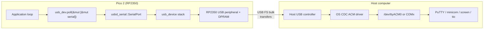

# Lecture 03: USB Serial Logging and Debugging

**Video:** https://www.youtube.com/watch?v=m6IKkkKZ6T0
**Uploader:** DigiKey **Duration:** ~27 min **Published:** 2026-02-05

## Table of Contents

- [Introduction and Motivation](#introduction-and-motivation)
- [Hardware and Library Overview](#hardware-and-library-overview)
- [Project Scaffolding from Blinky](#project-scaffolding-from-blinky)
- [Cargo Dependencies](#cargo-dependencies)
- [Imports and Module Structure](#imports-and-module-structure)
- [Clocks, Timer, and USB Bus Initialisation](#clocks-timer-and-usb-bus-initialisation)
- [Constructing the USB Device](#constructing-the-usb-device)
- [Vendor ID, Product ID, and Descriptors](#vendor-id-product-id-and-descriptors)
- [USB Class Codes and CDC](#usb-class-codes-and-cdc)
- [Receive Buffer Initialisation](#receive-buffer-initialisation)
- [The Super Loop: Polling, Reading, and Writing](#the-super-loop-polling-reading-and-writing)
- [Non-Blocking Delay with Millis](#non-blocking-delay-with-millis)
- [Building, Flashing, and Connecting a Terminal](#building-flashing-and-connecting-a-terminal)
- [Binary Size: Debug vs Release Profiles](#binary-size-debug-vs-release-profiles)
- [Host and Target USB CDC Topology](#host-and-target-usb-cdc-topology)
- [Debugging vs Printf-Style Logging](#debugging-vs-printf-style-logging)
- [Challenge Exercise](#challenge-exercise)
- [Recommended Reading and Next Episode](#recommended-reading-and-next-episode)
- [Quick Reference](#quick-reference)

## Introduction and Motivation

The previous episode produced a working blinking LED program. While useful for proving a toolchain works, an LED is severely limited for diagnostic feedback. Historically, embedded developers have leaned on UART bit-banging to surface internal state. Modern hobbyist frameworks such as Arduino and MicroPython popularised an alternative: sending textual messages over the on-board USB port directly to a host computer's serial terminal. This lecture replicates that workflow in Rust on the Raspberry Pi Pico 2 (RP2350).

> [!NOTE]
> The technique is restricted to MCUs with a native USB device peripheral. The RP2350 includes one. If you target a chip without USB, fall back to a UART plus an external USB-to-serial adapter.

The output of this lecture becomes the **template for all future debugging** in the series: print state over USB serial, observe it on the host, iterate.

## Hardware and Library Overview

The demonstration requires only the Pico 2 board; no external circuitry is connected. Two new Rust libraries are introduced:

| Crate         | Version | Role                                                                                                   |
| ------------- | ------- | ------------------------------------------------------------------------------------------------------ |
| `usb-device`  | 0.3.2   | Generic USB stack abstraction supporting many MCUs (including RP2350)                                  |
| `usbd-serial` | 0.2.2   | CDC ACM (Communications Device Class) implementation on top of `usb-device`, providing serial-over-USB |

The `usb-device` crate provides the low-level USB driver scaffolding; `usbd-serial` layers a serial port abstraction on top. Together they emit a virtual COM port that the host operating system recognises and exposes to terminal programs.

> [!IMPORTANT]
> Using native USB removes the need for a separate debug probe for printf-style debugging. The MCU enumerates as its own serial device.

## Project Scaffolding from Blinky

Rather than re-creating the boilerplate from scratch, the lecture copies the `blinky` project from the previous episode:

1. Delete `blinky/target` first (build artefacts can be many tens of megabytes and slow the copy unnecessarily).
2. Copy `blinky` and paste it under `apps/`.
3. Rename the copy to `usb-serial`.
4. Optionally delete `Cargo.lock` so it is regenerated from scratch for the new project.

This keeps memory.x, the build profile fragments, the runtime, and the panic handler in place.

## Cargo Dependencies

Add the two new crates to `Cargo.toml` under `[dependencies]`:

```toml
[package]
name = "usb-serial"
version = "0.1.0"
edition = "2021"

[dependencies]
cortex-m = "0.7"
cortex-m-rt = "0.7"
panic-halt = "0.2"
rp235x-hal = "0.3"

usb-device = "0.3.2"
usbd-serial = "0.2.2"
```

Note also that the executable name should be changed from `blinky` to `usb-serial` so the resulting ELF and UF2 are named consistently.

## Imports and Module Structure

The blinky imports are pruned. Embedded-HAL's blocking delay and the GPIO output abstractions are no longer required, because no LED is being toggled and the delay will be implemented manually using a free-running timer.

```rust
#![no_std]
#![no_main]

// We need to write our own panic handler
use core::panic::PanicInfo;

// Alias our HAL
use rp235x_hal as hal;

// USB device and Communications Class Device (CDC) support
use usb_device::{class_prelude::*, prelude::*};
use usbd_serial::SerialPort;

// Custom panic handler: just loop forever
#[panic_handler]
fn panic(_info: &PanicInfo) -> ! {
    loop {}
}
```

The curly-brace syntax `use usb_device::{class_prelude::*, prelude::*};` brings in both the **class prelude** (types and traits needed when implementing or consuming USB classes) and the **device prelude** (types like `UsbDeviceBuilder`, `UsbVidPid`).

> [!TIP]
> Preludes are a common pattern in non-trivial Rust crates. They re-export the types and traits a typical user almost always needs, sparing the consumer from listing them individually.

## Clocks, Timer, and USB Bus Initialisation

The peripheral access crate (PAC) and clock initialisation remain unchanged, since the USB peripheral depends on the PLL-driven USB clock. A `Timer` is acquired because the non-blocking delay will read its counter directly rather than use embedded-HAL's blocking `delay_ms`.

```rust
// Copy boot metadata to .start_block so Boot ROM knows how to boot our program
#[unsafe(link_section = ".start_block")]
#[used]
pub static IMAGE_DEF: hal::block::ImageDef = hal::block::ImageDef::secure_exe();

// Set external crystal frequency
const XOSC_CRYSTAL_FREQ: u32 = 12_000_000;

// Main entrypoint (custom defined for embedded targets)
#[hal::entry]
fn main() -> ! {
    // Get ownership of hardware peripherals
    let mut pac = hal::pac::Peripherals::take().unwrap();

    // Set up the watchdog and clocks
    let mut watchdog = hal::Watchdog::new(pac.WATCHDOG);
    let clocks = hal::clocks::init_clocks_and_plls(
        XOSC_CRYSTAL_FREQ,
        pac.XOSC,
        pac.CLOCKS,
        pac.PLL_SYS,
        pac.PLL_USB,
        &mut pac.RESETS,
        &mut watchdog,
    )
    .ok()
    .unwrap();

    // Move ownership of TIMER0 peripheral to create Timer struct
    let timer = hal::Timer::new_timer0(pac.TIMER0, &mut pac.RESETS, &clocks);

    // Initialize the USB driver
    let usb_bus = UsbBusAllocator::new(hal::usb::UsbBus::new(
        pac.USB,
        pac.USB_DPRAM,
        clocks.usb_clock,
        true,
        &mut pac.RESETS,
    ));
```

Key points:

- `UsbBusAllocator::new(...)` takes ownership of the bus driver and lets multiple USB classes share it.
- `hal::usb::UsbBus::new(...)` is the RP2350-specific constructor.
- `Timer::new_timer0(pac.TIMER0, ...)` is the RP2350 form; the RP2040 variant uses `Timer::new(pac.TIMER, ...)`.
- `USB_DPRAM` is the **dual-port RAM** — a memory region the USB controller and CPU both access for endpoint buffers.
- The fourth argument, `force_vbus_detect_bit`, when `true`, makes the stack behave as if VBUS is always present. The board still requires USB to be physically connected for power, but data can begin transmitting without explicit VBUS detection logic. Try flipping it to `false` to observe enumeration differences.

> [!NOTE]
> The `timer` does not need to be `mut` here, unlike the previous episode where it was passed into a blocking `delay_ms`. Drop the `mut` keyword to silence the compiler warning.

## Constructing the USB Device

The USB device is created in two layered steps: a `SerialPort` for the CDC class, then a `UsbDevice` describing the overall device to the host.

```rust
    // Configure the USB as CDC
    let mut serial = SerialPort::new(&usb_bus);

    // Create a USB device with a fake VID/PID
    let mut usb_dev = UsbDeviceBuilder::new(&usb_bus, UsbVidPid(0x16c0, 0x27dd))
        .strings(&[StringDescriptors::default()
            .manufacturer("Fake company")
            .product("Serial port")
            .serial_number("TEST")])
        .unwrap()
        .device_class(2) // from: https://www.usb.org/defined-class-codes
        .build();
```

The `SerialPort` is constructed first because the `UsbDeviceBuilder::build()` call must come **after** every class consumer has been registered against the bus allocator.

## Vendor ID, Product ID, and Descriptors

Every USB device declares a 16-bit **Vendor ID (VID)** and **Product ID (PID)**. The host OS uses these to pick a driver.

| Field | Value    | Notes                                                                                          |
| ----- | -------- | ---------------------------------------------------------------------------------------------- |
| VID   | `0x16C0` | Registered by Van Ooijen Technische Informatica; reused informally for hobbyist/prototype work |
| PID   | `0x27DD` | Recommended within that block for CDC-class devices                                            |

> [!CAUTION]
> Official VID registration costs hundreds to thousands of pounds. Companies typically have their own VID. **Do not ship a product with `0x16C0`.** It is acceptable only for internal lab use and prototypes.

Windows recognises this VID/PID pair and automatically assigns a serial driver, so no manual INF file is required during development.

The `StringDescriptors` struct supplies human-readable identifiers shown by the OS when inspecting attached USB hardware:

- `manufacturer` — e.g. `"Fake company"`
- `product` — e.g. `"Serial port"`
- `serial_number` — e.g. `"TEST"`

`.strings(...)` returns a `Result` because the array of descriptor sets is bounded; calling `.unwrap()` is acceptable because failure here is a programmer error and will panic into the `panic_halt` handler.

## USB Class Codes and CDC

USB-IF publishes a register of class codes at <https://www.usb.org/defined-class-codes>. For a CDC virtual serial port, the relevant class is **Communications and CDC Control**, whose code is `0x02` (decimal `2`). This is passed to the builder:

```rust
.device_class(2) // 0x02 = Communications and CDC Control
```

Annotate the source with a comment recording the origin of the magic number — future readers (and your future self) will thank you.

## Receive Buffer Initialisation

Reading from the serial port requires a mutable byte buffer for the driver to fill. A 64-byte buffer aligns nicely with the USB full-speed bulk endpoint maximum packet size.

```rust
// Read buffer
let mut rx_buf = [0u8; 64];
```

This is shorthand for "an array of 64 `u8` values, all zero". The compiler infers the type as `[u8; 64]`. Equivalent, more verbose forms are:

```rust
// Explicit type, explicit length
let mut buf: [u8; 64] = [0; 64];

// Without type suffix on the literal (relies on inference)
let mut buf = [0; 64]; // type cannot always be inferred — may error
```

Using the `0u8` literal suffix is the idiomatic shortcut: it pins the element type without writing the full annotation.

## The Super Loop: Polling, Reading, and Writing

The main loop has three responsibilities, executed in order on every iteration:

1. Service the USB stack with `usb_dev.poll(...)` at least every 10 ms.
2. When `poll` reports activity, attempt a non-blocking read from the serial port.
3. Occasionally write `b"hello!\r\n"` out over the serial port, once per second.

```rust
    // Superloop
    let mut timestamp = timer.get_counter();
    loop {
        // Needs to be called at least every 10 ms
        if usb_dev.poll(&mut [&mut serial]) {
            match serial.read(&mut rx_buf) {
                Ok(0) => {}
                Ok(count) => {
                    // Challenge for student!
                    rx_buf[..count].iter_mut().for_each(|byte| {
                        *byte = byte.to_ascii_uppercase();
                    });
                    let _ = serial.write(&rx_buf[0..count]);
                }
                Err(_e) => {}
            }
        }

        // Send message every second (non-blocking)
        if (timer.get_counter() - timestamp).to_millis() >= 1_000 {
            timestamp = timer.get_counter();
            let _ = serial.write(b"hello!\r\n");
        }
    }
}
```

> [!WARNING]
> If `usb_dev.poll(...)` is not called at least every 10 ms, the device may never finish enumeration with the host. Symptoms include the OS reporting an unknown device or a serial port that opens but produces nothing.

### Match Expressions in Rust

`match` is conceptually similar to C's `switch`, but it matches **patterns** (including enum variants with payload data) rather than only scalar values, and it returns a value. Three arms cover every possible outcome of `serial.read`:

| Arm         | Meaning                                                 |
| ----------- | ------------------------------------------------------- |
| `Ok(0)`     | Driver returned success with zero bytes — nothing to do |
| `Ok(count)` | `count` bytes were placed in `buf`; useful payload      |
| `Err(e)`    | Some USB-level error occurred                           |

The arrow `=>` separates the pattern from the expression that runs on a match. Because each arm can return a value, `match` can be used as an expression on the right-hand side of `let`, not only as a statement.

### Byte-String Literals

```rust
let _ = serial.write(b"hello!\r\n");
```

The `b` prefix converts the literal into a `&[u8]` rather than a `&str`. Rust string slices are UTF-8 by default, but USB CDC operates on raw bytes, so the byte-string form is appropriate. The leading underscore in `let _ =` discards the `Result` and signals to the compiler that the value is intentionally unused, avoiding a `must_use` warning.

> [!TIP]
> For production-quality logging you should at minimum log or count write errors. `.unwrap()` would also work, but it crashes on the first transient failure (e.g. the host detaching) — almost never what you want in an embedded program.

## Non-Blocking Delay with Millis

The Arduino idiom `millis()` is reproduced by reading the free-running timer and converting the difference against a previous timestamp into milliseconds:

$$
\text{elapsed}_\text{ms} = \bigl(\text{counter}_\text{now} - \text{counter}_\text{prev}\bigr)\text{.to\_millis()}
$$

If $\text{elapsed}_\text{ms} \geq 1\,000$ (one second), execute the periodic action and reset the timestamp. Crucially, the comparison is **non-blocking**: the loop continues running, allowing `usb_dev.poll` to be called on every iteration regardless of whether the one-second action is ready to fire.

```rust
// Send message every second (non-blocking)
if (timer.get_counter() - timestamp).to_millis() >= 1_000 {
    timestamp = timer.get_counter();
    let _ = serial.write(b"hello!\r\n");
}
```

The `Instant - Instant` subtraction returns a `MicrosDurationU64`; `.to_millis()` converts to a plain integer count of milliseconds, which avoids manual `wrapping_sub` arithmetic on raw ticks.

## Building, Flashing, and Connecting a Terminal

Build the project:

```bash
cargo build
```

If `rust-analyzer`'s IntelliSense fails to resolve `UsbBusAllocator` and friends, it is usually because the crates have not yet been downloaded. Run `cargo build` once, then trigger **Rust Analyzer: Restart Server** from the command palette to re-index.

Convert the ELF to UF2 for drag-and-drop flashing:

```bash
picotool uf2 convert \
    target/thumbv8m.main-none-eabihf/debug/usb-serial \
    -t elf firmware.uf2
```

Hold **BOOTSEL** on the Pico 2 while plugging in USB; the board appears as a USB mass storage device. Copy `firmware.uf2` onto it; the board resets automatically once writing completes.

To view output:

- **Windows:** Find the COM port in Device Manager (e.g. `COM7`). Open PuTTY, choose **Serial**, set speed to `115200`, click **Open**.
- **Linux:** The device appears as `/dev/ttyACM0` (or similar). Use `minicom`, `picocom`, `screen`, or `tio`.
- **macOS:** Look for `/dev/tty.usbmodem*`. Use `screen`, `minicom`, or `tio`.

Once connected, `hello!` should appear once per second.

> [!NOTE]
> Baud rate is essentially a placebo for USB CDC ACM — the host driver ignores it because the transport is USB packets, not RS-232 timing. Set anything reasonable.

## Binary Size: Debug vs Release Profiles

The toolchain image includes `cargo binutils`, which exposes `cargo size`:

```bash
cargo size
```

A debug build of this USB serial program weighs in at roughly **104 kB**. Rust's reputation for fat binaries is partly deserved, but the default `[profile.dev]` retains every symbol, every debug-info section, and skips most optimisations.

To produce a lean release binary, add a release profile to `Cargo.toml`:

```toml
[profile.release]
opt-level = "s"      # optimise for size (use "3" for speed)
lto = true           # link-time optimisation across crate boundaries
codegen-units = 1    # single compilation unit; better optimisation, slower builds
strip = true         # remove debug symbols
```

| Option              | Effect                                                                        |
| ------------------- | ----------------------------------------------------------------------------- |
| `opt-level = "s"`   | Compiler favours code size over speed; `"z"` is even more aggressive          |
| `lto = true`        | Cross-crate inlining and dead-code elimination at link time                   |
| `codegen-units = 1` | Single unit enables more cross-function optimisation; longer compiles         |
| `strip = true`      | Removes debug symbols entirely; smaller binary, harder step-through debugging |

Build and measure:

```bash
cargo build --release
cargo size --release
```

The same program now occupies approximately **15 kB**, including the full USB device stack — competitive with hand-written C.

Re-flash from the release directory:

```bash
picotool uf2 convert \
    target/thumbv8m.main-none-eabihf/release/usb-serial \
    -t elf firmware.uf2
```

> [!IMPORTANT]
> Aggressive size optimisation strips information used by debuggers. Keep a debug build around for tracing, and only flash release builds when measuring footprint or shipping firmware.

## Host and Target USB CDC Topology



The application code only ever sees byte slices via `serial.read` and `serial.write`. Everything to the right of the bulk endpoints is the operating system's responsibility once the CDC class code (`0x02`) and VID/PID have triggered the right driver.

### USB Connector Pinout (Reference)

```
+---+---+---+---+
| 1 | 2 | 3 | 4 |     USB-A / Micro-B pin assignment
+---+---+---+---+
  |   |   |   |
  |   |   |   +--- GND
  |   |   +------- D+ (data plus)
  |   +----------- D-  (data minus)
  +--------------- VBUS (+5 V)
```

The Pico 2's micro-USB port carries the same four lines plus a shield. Only `D+` and `D-` carry the actual USB packets; `VBUS` powers the board, and `GND` provides the return path.

## Debugging vs Printf-Style Logging

This lecture demonstrates **printf-style logging** — emitting human-readable messages over a serial channel. It is the most accessible debugging technique and works on essentially any platform that can speak USB CDC, UART, or RTT.

| Aspect                     | Printf logging (this lecture)             | Step-through debugging (future)                  |
| -------------------------- | ----------------------------------------- | ------------------------------------------------ |
| Hardware required          | None beyond the target's USB port         | Debug probe (e.g. CMSIS-DAP, J-Link, Pico Probe) |
| Source modification        | Yes — `serial.write` calls inserted       | None — symbols suffice                           |
| Runtime perturbation       | Significant if logging is verbose         | Minimal until a breakpoint hits                  |
| Works at full speed        | Yes (asynchronous via USB)                | Halts the CPU at breakpoints                     |
| Captures intermittent bugs | Yes, if log lines exist on the right path | Difficult without conditional breakpoints        |
| Binary size impact         | Strings linked into flash                 | None at runtime                                  |

In practice the two techniques are complementary: printf for tracing program flow and producing reproducible logs; a debugger for inspecting state at a single suspect instant.

> [!TIP]
> Once a `log` facade is wired up to a USB serial back end, the `log::info!`, `log::warn!`, and `log::error!` macros can replace bare `serial.write(b"...")` calls. A ring buffer between the producer (application) and consumer (USB write task) avoids losing messages if the host drains too slowly. Those refinements build on the foundation laid here.

## Challenge Exercise

> [!NOTE]
> **Challenge:** Capture characters that arrive over USB serial, convert each to upper case, and echo the result back over the same port. Keep the `hello!` heartbeat printing once per second.

The repository's `apps/usb-serial` already implements this challenge inline; the relevant arm of the `match` is reproduced here for reference:

```rust
Ok(count) => {
    // Challenge for student!
    rx_buf[..count].iter_mut().for_each(|byte| {
        *byte = byte.to_ascii_uppercase();
    });
    let _ = serial.write(&rx_buf[0..count]);
}
```

Hints if you remove the implementation and re-derive it yourself:

- Drop the leading underscore from `_count` so the byte count is usable.
- Iterate over `&mut rx_buf[..count]` and call `.to_ascii_uppercase()` on each `u8`.
- Write the transformed slice with `serial.write(...)`.
- Beware that `serial.write` may not consume the entire slice in one call; loop until all bytes are written, or accept a single best-effort attempt for now.

## Recommended Reading and Next Episode

> [!IMPORTANT]
> Before Episode 04, read **Chapter 4 of the Rust Book** ("Understanding Ownership"). It covers ownership, references, borrowing, and slices — the foundations the borrow checker is built on. Take your time; there is a lot to unpack.

Additional practice:

- **Rustlings:** Complete the **primitive types** and **move semantics** exercise sets.

Episode 04 will not touch hardware; it will instead focus on ownership and writing code that satisfies the borrow checker — fighting the borrow checker is a common newcomer experience and a worthwhile chapter to internalise before the embedded examples grow more complex.

## Source Code

The code presented in this lecture corresponds to two demo crates in the workspace. The lecture targets the **Raspberry Pi Pico 2 (RP2350)**, so `apps/usb-serial` is the canonical reference; `apps/rp2040-usb-serial` is an equivalent port for the original Pico (RP2040).

| App                      | Target          | Manifest                                      | Entry point                                    |
| ------------------------ | --------------- | --------------------------------------------- | ---------------------------------------------- |
| `usb-serial` (canonical) | RP2350 / Pico 2 | `workspace/apps/usb-serial/Cargo.toml`        | `workspace/apps/usb-serial/src/main.rs`        |
| `rp2040-usb-serial`      | RP2040 / Pico   | `workspace/apps/rp2040-usb-serial/Cargo.toml` | `workspace/apps/rp2040-usb-serial/src/main.rs` |

The two crates are deliberately near-identical; the differences are confined to the HAL crate (`rp235x-hal` vs `rp2040-hal`), the boot artefact (the RP2350 `ImageDef` block versus the RP2040 `BOOT2` array), the USB peripheral path names (`pac.USB` / `pac.USB_DPRAM` versus `pac.USBCTRL_REGS` / `pac.USBCTRL_DPRAM`), and the `Timer` constructor (`Timer::new_timer0(pac.TIMER0, ...)` versus `Timer::new(pac.TIMER, ...)`).

## Quick Reference

### Cargo.toml additions

```toml
[dependencies]
usb-device  = "0.3.2"
usbd-serial = "0.2.2"

[profile.release]
opt-level     = "s"
lto           = true
codegen-units = 1
strip         = true
```

### Minimal main loop skeleton

```rust
loop {
    let now = timer.get_counter();
    let _ = usb_dev.poll(&mut [&mut serial]);

    match serial.read(&mut buf) {
        Ok(0)       => {}
        Ok(_count)  => { /* handle data */ }
        Err(_e)     => {}
    }

    if now.ticks().wrapping_sub(said_hello_at) >= 1_000_000 {
        said_hello_at = now.ticks();
        let _ = serial.write(b"Hello!\r\n");
    }
}
```

### Magic numbers used

| Value        | Meaning                                                  |
| ------------ | -------------------------------------------------------- |
| `0x16C0`     | Van Ooijen VID (lab/prototype use only)                  |
| `0x27DD`     | Recommended PID for CDC devices in that block            |
| `2` (`0x02`) | USB class code: Communications and CDC Control           |
| `64`         | Receive buffer length in bytes (matches USB FS bulk MPS) |
| `10 ms`      | Maximum interval between `usb_dev.poll` calls            |
| `1_000` ms   | One-second heartbeat period (via `Duration::to_millis`)  |

### Useful commands

| Command                                          | Purpose                              |
| ------------------------------------------------ | ------------------------------------ |
| `cargo build`                                    | Debug build                          |
| `cargo build --release`                          | Release build with optimised profile |
| `cargo size` / `cargo size --release`            | Inspect binary footprint             |
| `picotool uf2 convert <elf> -t elf firmware.uf2` | Convert ELF to UF2                   |
| `putty` / `minicom` / `screen` / `tio`           | Host-side serial terminals           |

### Key crates and docs

- [`usb-device`](https://crates.io/crates/usb-device) — generic USB device stack
- [`usbd-serial`](https://crates.io/crates/usbd-serial) — CDC ACM serial class
- [`rp235x-hal`](https://crates.io/crates/rp235x-hal) — RP2350 HAL with USB bus driver
- [USB-IF Defined Class Codes](https://www.usb.org/defined-class-codes)

## Practical Addendum: Did We Write a USB Driver?

A natural question after building this example: _did we just write a USB
driver?_ Strictly, **no** — we wrote an **application** that consumes
several pre-existing drivers and stacks. The full picture is a small
stack of layers, and we authored only the top one.

| Layer                                                    | What it does                                                                                  | Who wrote it              |
| -------------------------------------------------------- | --------------------------------------------------------------------------------------------- | ------------------------- |
| Host OS CDC driver                                       | Presents `/dev/cu.usbmodem*` (macOS), `/dev/ttyACM*` (Linux), or `COMx` (Windows) to userland | The host operating system |
| `usbd-serial` (firmware)                                 | Implements the **CDC ACM class** — endpoints, control requests, line coding                   | Upstream crate            |
| `usb-device` (firmware)                                  | Generic USB device stack — enumeration, descriptors, control transfers                        | Upstream crate            |
| `rp2040-hal::usb::UsbBus` (or `rp235x-hal::usb::UsbBus`) | Chip-specific USB peripheral driver — registers, DPRAM, ISR                                   | HAL maintainers           |
| **Our `main.rs`**                                        | Wires up the bus, picks a class, sets VID/PID/strings, polls in a super loop                  | **You**                   |

We _consumed_ four drivers and wrote roughly seventy lines of glue plus
application logic. The board now appears as a USB serial device to the
host because that combined stack — running on the Pico — emits the
right enumeration sequence, the right CDC class code (`0x02`), and the
right pair of bulk endpoints.

> [!NOTE]
> "Driver" depends on viewpoint. From the **host's** perspective the
> firmware _is_ the driver: it is what gives the board its USB
> personality. From the **firmware's** perspective, `usb::UsbBus` is the
> driver for the chip's USB peripheral, and our `main.rs` is the
> application sitting above it. The work that would qualify as
> "writing a USB driver" in the strong sense is implementing a new USB
> **class** (HID, MIDI, mass storage, vendor-specific) on top of
> `usb-device`. The `usbd-*` crate family exists precisely so you
> usually don't have to.

### Measuring the heartbeat rate cleanly

A subtle gotcha when verifying the once-per-second `hello!` heartbeat:
a short measurement window can produce a wildly inflated rate. Running

```bash
timeout 3 cat /dev/cu.usbmodemTEST1
```

immediately after the board enumerates can show 20+ lines in 3 seconds.
The firmware itself is correct — the host-side CDC driver has been
**buffering** the heartbeats for the entire interval between firmware
boot and the moment a userland program first opens the port. The
backlog flushes in a single burst as soon as `cat` attaches.

To measure the steady-state rate, **drain the queued data first** and
then time a longer window. With Python and `pyserial`:

```python
import serial, time
port = serial.Serial('/dev/cu.usbmodemTEST1', 115200, timeout=0.1)
deadline = time.monotonic() + 1.0
while time.monotonic() < deadline:    # drain ~1 second of backlog
    port.read(1024)
start, count = time.monotonic(), 0
while time.monotonic() - start < 20.0:
    count += port.read(1024).count(b"\n")
elapsed = time.monotonic() - start
print(f"{count} lines, {count/elapsed:.3f} Hz, period {1000*elapsed/count:.2f} ms")
```

A correctly working firmware reports something very close to `1.000 Hz`
and `1000 ms`. Any meaningful deviation points at the timer or the
super-loop logic — not at this measurement noise.

> [!TIP]
> The same drain-then-measure pattern applies to **any** USB CDC or
> UART benchmark. Treat the first second of data after `open()` as
> unreliable until proven otherwise.
