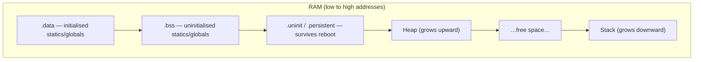
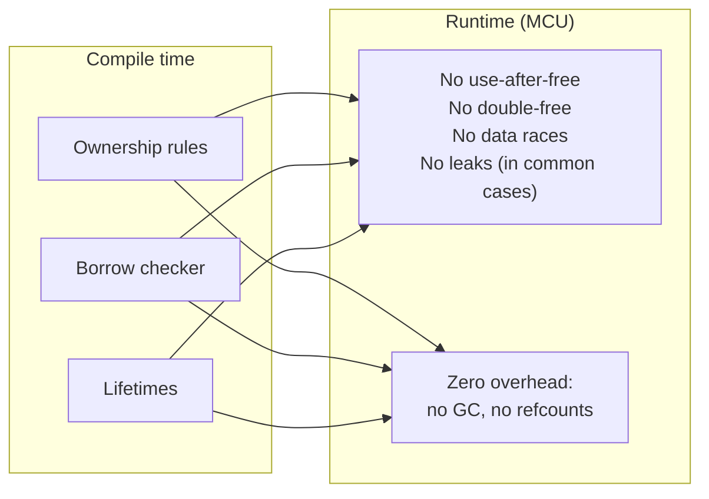

# Lecture 04: Ownership and Borrowing

**Video:** https://www.youtube.com/watch?v=OyzeR8_aGWU
**Uploader:** DigiKey  **Duration:** ~42 min  **Published:** 2026-02-12

Rust's ownership model is the cornerstone of its memory-safety guarantees.
Unlike garbage-collected languages, Rust enforces correctness almost entirely
at compile time, with essentially no runtime overhead. This lecture takes a
step back from the embedded demos of the previous two episodes to introduce
the rules behind ownership, moves, copying, borrowing, and the borrow
checker, with deliberate emphasis on the embedded context where the standard
library and the heap are usually unavailable.

---

## Table of Contents

- [1. Where Data Lives: A Memory Map](#1-where-data-lives-a-memory-map)
  - [1.1 Static and Global Sections (.data, .bss, .uninit)](#11-static-and-global-sections-data-bss-uninit)
  - [1.2 The Heap](#12-the-heap)
  - [1.3 The Stack](#13-the-stack)
  - [1.4 Address Space Collisions](#14-address-space-collisions)
  - [1.5 Why Embedded Rust Often Avoids the Heap](#15-why-embedded-rust-often-avoids-the-heap)
- [2. The Three Ownership Rules](#2-the-three-ownership-rules)
- [3. Rule One: Every Value Has an Owner](#3-rule-one-every-value-has-an-owner)
- [4. Rule Two: One Owner at a Time (Move Semantics)](#4-rule-two-one-owner-at-a-time-move-semantics)
  - [4.1 Move of a Struct](#41-move-of-a-struct)
  - [4.2 Copy of a Primitive](#42-copy-of-a-primitive)
  - [4.3 Arrays Implement Copy When Their Elements Do](#43-arrays-implement-copy-when-their-elements-do)
  - [4.4 The Clone Trait](#44-the-clone-trait)
  - [4.5 Move vs Copy vs Clone](#45-move-vs-copy-vs-clone)
- [5. Rule Three: When the Owner Goes Out of Scope, the Value Is Dropped](#5-rule-three-when-the-owner-goes-out-of-scope-the-value-is-dropped)
  - [5.1 What Scope Means](#51-what-scope-means)
  - [5.2 Functions Consume Ownership](#52-functions-consume-ownership)
  - [5.3 Returning Ownership](#53-returning-ownership)
- [6. References: A Safe Wrapper Around Pointers](#6-references-a-safe-wrapper-around-pointers)
  - [6.1 Shared References `&T`](#61-shared-references-t)
  - [6.2 Mutable References `&mut T`](#62-mutable-references-mut-t)
  - [6.3 The Borrowing Rules](#63-the-borrowing-rules)
- [7. The Borrow Checker](#7-the-borrow-checker)
  - [7.1 Common Pitfalls](#71-common-pitfalls)
  - [7.2 Non-Lexical Lifetimes](#72-non-lexical-lifetimes)
- [8. Preventing Dangling References](#8-preventing-dangling-references)
- [9. Slices](#9-slices)
- [10. Embedded Relevance](#10-embedded-relevance)
- [Quick Reference](#quick-reference)

---

## 1. Where Data Lives: A Memory Map

Before we can talk meaningfully about ownership, we have to know **where**
data actually sits. A typical embedded RAM layout looks like the following.
We ignore the program instructions (`.text`), which usually live in flash.



### 1.1 Static and Global Sections (.data, .bss, .uninit)

- `.data` — initialised statics and globals (low addresses).
- `.bss`  — uninitialised statics and globals; zeroed at startup.
- `.uninit` / `.persistent` — data preserved across reboots (battery-backed
  RAM, for instance).

### 1.2 The Heap

The heap is a general-purpose pool for **dynamic allocation**. In C, calling
`malloc` carves out a region of the heap. The compiler typically cannot know
the required size at compile time, so the heap grows and shrinks at runtime.
On the Raspberry Pi Pico 2 it grows **upward** toward higher addresses.

### 1.3 The Stack

The stack is a last-in, first-out region for **local variables, function
parameters, and return addresses**. It is automatically managed: data is
freed as variables go out of scope. The maximum stack size is known at
program start; the used portion grows **downward** as needed.

### 1.4 Address Space Collisions

If the heap and stack meet, you have **virtual address space exhaustion**.
Symptoms include allocation failure, silent data corruption, or outright
crashes. Some platforms add MPU regions or stack canaries to detect this;
this series does not rely on such guards.

> [!WARNING]
> Heap/stack collisions are silent in many MCUs. The safest defence in
> embedded systems is simply to **avoid the heap altogether** so that the
> maximum memory footprint is statically determinable.

### 1.5 Why Embedded Rust Often Avoids the Heap

Most ownership examples in **The Rust Book** use heap types like `String`
and `Vec`. We will deliberately **not** use them: our embedded targets often
run `#![no_std]`, which strips the standard library and the heap. Instead we
will use a small custom struct of primitives, which lives on the stack but
still demonstrates every ownership rule.

---

## 2. The Three Ownership Rules

> [!IMPORTANT]
> **The three rules of ownership in Rust:**
>
> 1. Each value in Rust has an **owner**.
> 2. There can only be **one owner at a time**.
> 3. When the owner goes **out of scope**, the value is **dropped**.

These three rules, together with the borrow checker, are sufficient to rule
out a large family of memory bugs: use-after-free, double-free, dangling
pointers, and many data races — all at compile time.

---

## 3. Rule One: Every Value Has an Owner

We will reuse this struct throughout. By choosing primitive fields we are
guaranteed it sits on the **stack**, yet we can still illustrate every
ownership and borrowing behaviour.

```rust
struct SensorReading {
    value: u16,
    timestamp_ms: u32,
}

fn demo_ownership() {
    let reading = SensorReading {value: 1, timestamp_ms: 100};

    println!("{}, {}", reading.value, reading.timestamp_ms);
}
```

`println!`'s `{}` uses the `Display` trait, which is implemented for the
primitives `u16` and `u32`, so this compiles and prints as expected. Build
and run with `cargo run` inside the `ownership-examples` project.

---

## 4. Rule Two: One Owner at a Time (Move Semantics)

Assignment in Rust is, by default, a **move** for types that own resources.

### 4.1 Move of a Struct

```rust
fn demo_one_owner() {
    let reading = SensorReading {value: 2, timestamp_ms: 100};

    // Transfer (move) ownership
    let new_owner = reading;

    // Error: borrow of moved value: `reading`
    // println!("{}", reading.value);
    // println!("{}", reading.timestamp_ms);

    // This works
    println!("{}, {}", new_owner.value, new_owner.timestamp_ms);
}
```

After `let new_owner = reading;`, the original binding `reading` is
**invalidated**. Attempting to use it gives:

```text
error[E0382]: borrow of moved value: `reading`
  --> src/main.rs:..
   |
   | let new_owner = reading;
   |                 ------- value moved here
   | println!("{}", reading.value);
   |                ^^^^^^^ value borrowed here after move
```

### 4.2 Copy of a Primitive

Primitives such as `u8`, `u16`, `u32`, `i32`, `bool`, `char`, and `f32`
implement the `Copy` marker trait. Assignment **copies** the bits rather
than moving them:

```rust
let a: u32 = 3;
let b = a;          // bit-wise copy
println!("a = {a}, b = {b}");  // both still valid
```

### 4.3 Arrays Implement Copy When Their Elements Do

```rust
fn demo_copy() {
    let my_array = [1, 1, 2, 3, 5, 8];

    // Primitives and arrays implement the Copy trait (if elements implement Copy)
    let my_copy = my_array;

    // Both of these work
    println!("{:?}", my_array);
    println!("{:?}", my_copy);
}
```

The `:?` format specifier uses the `Debug` trait. Arrays of `Copy` elements
are themselves `Copy`, so `let my_copy = my_array;` is a deep copy.

> [!WARNING]
> For large arrays this implicit deep copy can consume significant clock
> cycles and stack space. On a constrained MCU, prefer **references** to
> large arrays unless you really do need a duplicate.

### 4.4 The Clone Trait

If a type does not implement `Copy`, you can still duplicate it explicitly
by implementing `Clone` and calling `.clone()`:

```rust
#[derive(Clone)]
struct SensorReading {
    value: u16,
    timestamp_ms: u32,
}

let reading = SensorReading { value: 2, timestamp_ms: 100 };
let duplicate = reading.clone();   // explicit duplication; both usable
```

`Clone` is the explicit, potentially expensive cousin of `Copy`. Many
standard-library types (`String`, `Vec`, `Box`) implement `Clone` but not
`Copy`, precisely because the copy is non-trivial and the language wants
you to **see** the cost in the source code.

### 4.5 Move vs Copy vs Clone

| Behaviour | Trigger              | What happens                                   | Original still usable? |
|-----------|----------------------|------------------------------------------------|------------------------|
| Move      | Default for non-`Copy` types | Ownership transfers; source invalidated | No                     |
| Copy      | Type implements `Copy` (auto on primitives) | Bit-wise copy implicit on assignment | Yes |
| Clone     | Explicit `.clone()`  | User-defined (possibly deep) duplication       | Yes                    |

---

## 5. Rule Three: When the Owner Goes Out of Scope, the Value Is Dropped

### 5.1 What Scope Means

A **scope** is the region of code in which a variable is valid and visible.
Scopes are usually delimited by curly braces — function bodies, loop
bodies, `if` blocks — but you may also introduce one anywhere:

```rust
fn main() {
    {
        let reading = SensorReading { value: 2, timestamp_ms: 100 };
        println!("{}", reading.value);
    } // <-- `reading` goes out of scope here; its memory is freed.

    // println!("{}", reading.value);  // ERROR: cannot find value `reading`
}
```

The compiler sees that `reading` is no longer used and inserts the **drop**
exactly at the closing brace. Unlike Python or JavaScript, there is no
garbage collector scanning for unreachable objects; deallocation points are
determined statically.

This is what stops the classic C bugs of **use-after-free**, **double-free**,
and **memory leaks**: the compiler refuses to compile any program that
could exhibit them.

### 5.2 Functions Consume Ownership

Passing a non-`Copy` value into a function **moves** it. The function
becomes the new owner; when the function returns, that owner goes out of
scope and the value is dropped.

```rust
// fn print_reading(reading: SensorReading) {
//     // Ownership of reading is "consumed" by this function
//     println!("{}", reading.value);
//     println!("{}", reading.timestamp_ms);
//     // reading goes out of scope, so the value is dropped here
// }

fn demo_scope_drop_value() {
    let reading = SensorReading {value: 3, timestamp_ms: 100};

    // Error: borrow of moved value: `reading`
    // print_reading(reading);
    // println!("{}, {}", reading.value, reading.timestamp_ms);
}
```

### 5.3 Returning Ownership

One way to keep using a value after calling a function is to **return
ownership** back to the caller:

```rust
fn print_reading(reading: SensorReading) -> SensorReading {
    // Ownership of reading is "consumed" by this function
    println!("{}, {}", reading.value, reading.timestamp_ms);

    // Fix: return reading (shorthand for "return reading;")
    reading
}

fn demo_scope_drop_value() {
    // New scope
    {
        let mut reading = SensorReading {value: 3, timestamp_ms: 100};

        // Error: borrow of moved value: `reading`
        // print_reading(reading);

        // Fix: return reading ownership
        reading = print_reading(reading);

        // Use `reading` after a move
        println!("{}, {}", reading.value, reading.timestamp_ms);
    }

    // Error: cannot find value `reading` in this scope
    // println!("{}, {}", reading.value, reading.timestamp_ms);
}
```

Note the two Rust idioms here:

- **Tail expression returns**: an expression at the end of a function body
  without a trailing semicolon is returned. `reading` is equivalent to
  `return reading;`.
- **Mutability**: variables are immutable by default. Re-assigning to
  `reading` requires `let mut reading = …`.

Returning ownership works, but it is verbose. The idiomatic answer is to
**borrow** instead.

---

## 6. References: A Safe Wrapper Around Pointers

A raw pointer in Rust (or C) just stores a memory address. A **reference**
is a compile-time-checked wrapper around a raw pointer: at runtime it is
indistinguishable from a pointer — no extra cost — but the compiler refuses
to compile any program that could use the reference unsafely.

### 6.1 Shared References `&T`

A `&T` is a **shared, immutable** reference. You can have arbitrarily many
of them, but none of them can mutate the value.

```rust
fn print_borrowed_reading(reading: &SensorReading) {
    // We borrow reading instead of consuming ownership (pass by reference)
    println!("{}, {}", reading.value, reading.timestamp_ms);
}

fn demo_mutable_references() {
    let reading = SensorReading {value: 4, timestamp_ms: 100};

    // References are easier than consuming and returning ownership
    print_borrowed_reading(&reading);

    // Can have any number of immutable references
    let immut_ref_1 = &reading;
    let immut_ref_2 = &reading;
    let immut_ref_3 = &reading;
    println!("{}", (*immut_ref_1).timestamp_ms);    // Explicit dereference
    println!("{}", immut_ref_2.timestamp_ms);       // Automatic dereference
    println!("{}", immut_ref_3.timestamp_ms);
}
```

The `&reading` expression **borrows** `reading` without transferring
ownership. The borrow is given up when the reference is no longer used.

### 6.2 Mutable References `&mut T`

A `&mut T` is an **exclusive, mutable** reference: you may mutate through
it, but while it exists no other reference (mutable or shared) to the same
value may exist.

```rust
let mut reading = SensorReading {value: 4, timestamp_ms: 100};

// Only one mutable reference at a time (exclusive)
let mut_ref_1 = &mut reading;

// Error: cannot borrow `reading` as mutable more than once at a time
// let mut_ref_2 = &mut reading;
// println!("{}", mut_ref_2.timestamp_ms);

// Error: cannot borrow `reading` as immutable because it is also borrowed as mutable
// let immut_ref_4 = &reading;
// println!("{}", immut_ref_4.timestamp_ms);

// Change value in struct through the mutable reference
mut_ref_1.timestamp_ms = 1000;
println!("{}", reading.timestamp_ms);
// mut_ref_1 is no longer used, so it goes out of scope

// Now we can borrow again!
let mut_ref_3 = &mut reading;
mut_ref_3.timestamp_ms = 2000;
println!("{}", reading.timestamp_ms);
```

Two requirements: the binding must be `mut`, and the call site must
explicitly write `&mut`.

### 6.3 The Borrowing Rules

> [!IMPORTANT]
> **At any point in time, for any given value, you may have either:**
>
> - **any number of shared references `&T`**, *or*
> - **exactly one mutable reference `&mut T`**.
>
> Never both at the same time.

| Reference kind | Aliasing | Mutation | Syntax        |
|----------------|----------|----------|---------------|
| Shared         | Many     | No       | `&value`      |
| Exclusive      | One      | Yes      | `&mut value`  |
| Owned          | One      | Depends  | `value`       |

This single rule — **aliasing XOR mutation** — is what makes Rust's data
race freedom guarantee possible.

---

## 7. The Borrow Checker

The borrow checker is the part of the compiler that enforces the rules
above. It tracks the **lifetime** of every reference and rejects programs
that could leave a reference dangling or violate aliasing-XOR-mutation.

### 7.1 Common Pitfalls

> [!WARNING]
> The classic borrow-checker errors:
>
> - **Cannot borrow `x` as mutable because it is also borrowed as immutable.**
>   You created a `&x` and then tried to take a `&mut x` while the first
>   still exists.
> - **Cannot borrow `x` as mutable more than once at a time.**
>   Two `&mut x` borrows alive simultaneously.
> - **`x` does not live long enough.**
>   A reference would outlive the value it points to.
> - **Borrow of moved value: `x`.**
>   The value was moved; the binding is invalidated.

Examples:

```rust
let mut v = SensorReading { value: 1, timestamp_ms: 0 };

let a = &v;
let b = &mut v;             // ERROR: cannot borrow `v` as mutable
                            // because it is also borrowed as immutable
println!("{}", a.value);
```

```rust
let mut v = SensorReading { value: 1, timestamp_ms: 0 };

let a = &mut v;
let b = &mut v;             // ERROR: second mutable borrow
a.value = 2;
b.value = 3;
```

### 7.2 Non-Lexical Lifetimes

Modern Rust uses **non-lexical lifetimes (NLL)**: a borrow ends at its
**last use**, not at the closing brace. This lets the following compile:

```rust
let mut v = SensorReading { value: 1, timestamp_ms: 0 };

let a = &v;
println!("{}", a.value);    // last use of `a` here

let b = &mut v;             // OK: `a` is no longer in use
b.value = 2;
```

---

## 8. Preventing Dangling References

A *dangling reference* points to memory whose owner has already been
dropped. In C and C++ this is a frequent source of severe bugs. Rust rules
them out at compile time:

```rust
// Error: cannot return reference to local variable `some_reading`
// fn return_reading() -> &SensorReading {
//     let some_reading = SensorReading {value: 5, timestamp_ms: 100};
//     &some_reading
// }
```

The compiler emits:

```text
error[E0106]: missing lifetime specifier
…
help: this function's return type contains a borrowed value, but there is
       no value for it to be borrowed from
```

The fix is to **return ownership**, not a reference:

```rust
// Fix: return value with full ownership
fn return_reading() -> SensorReading {
    let some_reading = SensorReading {value: 5, timestamp_ms: 100};
    some_reading
    // More idiomatic to just return `SensorReading {value: 5, timestamp_ms: 100}`
}

fn demo_valid_references() {
    let reading = return_reading();
    println!("{}, {}", reading.value, reading.timestamp_ms);
}
```

This generalises: **a reference's lifetime must be a subset of the
lifetime of the value it points to.** The compiler infers this in almost
all cases; only occasionally must you spell it out with explicit lifetime
parameters (`'a`).

---

## 9. Slices

A slice is a reference to a contiguous **sub-range** of a collection. It is
a fat pointer: pointer + length, with no ownership of the underlying
storage. Slices are cheap and ubiquitous in embedded code because they let
you hand around views into stack-allocated buffers without copying.

```rust
fn demo_slices() {
    let my_array = [
        SensorReading {value: 7, timestamp_ms: 100},
        SensorReading {value: 7, timestamp_ms: 101},
        SensorReading {value: 7, timestamp_ms: 102},
    ];

    // Create a slice (section of the array), borrows all of my_array immutably
    let slice_1 = &my_array[0..1];

    // Error: cannot borrow `my_array` as mutable because it is also borrowed as immutable
    // let slice_2 = &mut my_array[1..3];

    // Fix: we can have multiple immutable references
    let slice_2 = &my_array[1..3];

    // Print out some of our slices
    println!("{}, {}", slice_1[0].value, slice_1[0].timestamp_ms);
    println!("{}, {}", slice_2[0].value, slice_2[0].timestamp_ms);
    println!("{}, {}", slice_2[1].value, slice_2[1].timestamp_ms);
}
```

Mutable slices `&mut [T]` let you mutate elements without resizing the
backing storage. When you need two disjoint mutable slices into the same
array, `split_at_mut` is the canonical safe tool: it returns two
non-overlapping `&mut [T]` halves so the borrow checker can prove there is
no aliasing.

```rust
fn demo_split_mut() {
    let mut my_array = [
        SensorReading {value: 7, timestamp_ms: 100},
        SensorReading {value: 7, timestamp_ms: 101},
        SensorReading {value: 7, timestamp_ms: 102},
    ];

    // Split at index 1 to borrow two mutable slices
    let (slice_1, slice_2) = my_array.split_at_mut(1);

    // Error: cannot assign to `my_array[_].timestamp_ms` because it is borrowed
    // my_array[0].timestamp_ms = 1234;

    // We can modify each slice
    slice_1[0].timestamp_ms = 1000;
    slice_2[0].timestamp_ms = 1001;
    slice_2[1].timestamp_ms = 1002;
    // slice_1 and slice_2 go out of scope here

    // We can access my_array again
    my_array[0].timestamp_ms = 1234;

    // Show that the original array changed
    println!("{}, {}", my_array[0].value, my_array[0].timestamp_ms);
    println!("{}, {}", my_array[1].value, my_array[1].timestamp_ms);
    println!("{}, {}", my_array[2].value, my_array[2].timestamp_ms);
}
```

String slices `&str` follow the same idea but are guaranteed to be valid
UTF-8. They work without `String` and without the heap, so they are
perfectly usable in `#![no_std]` code.

---

## 10. Embedded Relevance

Why does this matter when targeting an MCU?



Specifically for embedded:

- **No garbage collector.** Drops happen at statically known points; no
  unpredictable pauses on a hard-real-time interrupt path.
- **Heap is optional.** All the rules apply equally to stack-allocated data.
  You can write large, complex firmware entirely on the stack, with
  predictable maximum memory use.
- **Buffers as slices.** Peripherals (UART, SPI, DMA) take `&[u8]` or
  `&mut [u8]`. The borrow checker prevents a DMA engine from reading a
  buffer that a CPU task is mutating.
- **Peripherals as owned singletons.** Drivers usually take ownership of a
  peripheral (e.g. `Uart`), preventing two pieces of code from configuring
  the same UART concurrently — a memory-safe analogue of an HW mutex.
- **References are pointers underneath.** No fat metadata, no atomic
  refcounts — the generated assembly is the same as carefully written C.

---

## Source Code

The complete worked example for this lecture lives in the repository at
[`workspace/apps/ownership-examples/`](../workspace/apps/ownership-examples/).
It is a single binary crate (`src/main.rs`) that exercises each ownership
rule — owner uniqueness, move vs copy, scope-based drop, shared and
mutable borrowing, dangling-reference prevention, partial moves out of a
tuple, and slice borrowing including `split_at_mut`. Build and run with
`cargo run` from the crate directory.

---

## Quick Reference

**Memory regions (low → high address):** `.data`, `.bss`, `.uninit`, heap
(grows up), stack (grows down).

**Three ownership rules:**

1. Every value has exactly one owner.
2. Only one owner at a time.
3. When the owner leaves scope, the value is dropped.

**Move vs Copy vs Clone:**

| Operation       | Default for                          | Cost           |
|-----------------|--------------------------------------|----------------|
| Move (`let y = x;`)   | Non-`Copy` types (most structs) | Free (compile-time bookkeeping) |
| Copy (`let y = x;`)   | Types implementing `Copy` (primitives, arrays of `Copy`) | Implicit bit copy |
| Clone (`x.clone()`)   | Anything implementing `Clone`   | User-defined, often deep |

**Borrowing rules (aliasing XOR mutation):**

- Many `&T`, or
- Exactly one `&mut T`, but never both at the same time.

**Reference cheatsheet:**

```rust
let x: T;
let r: &T      = &x;           // shared, immutable
let m: &mut T  = &mut x;       // exclusive, mutable; needs `let mut x`

fn f(r: &T)        { /* read */ }
fn g(m: &mut T)    { /* read + write */ }
fn h(o: T)         { /* takes ownership */ }
fn i(s: &[T])      { /* slice: pointer + length */ }
```

**Common compiler errors and what they mean:**

| Error                                                  | Meaning                                |
|--------------------------------------------------------|----------------------------------------|
| `borrow of moved value`                                | You used a value after moving it.      |
| `cannot borrow … as mutable because it is also borrowed as immutable` | `&T` and `&mut T` overlap. |
| `cannot borrow … as mutable more than once`            | Two live `&mut T`.                     |
| `does not live long enough`                            | Reference outlives the referent.       |
| `missing lifetime specifier`                           | Compiler cannot infer how long a returned reference lives. |

**Idioms to remember:**

- Default to **borrowing** (`&T`, `&mut T`) over moving when a function only
  needs to inspect or mutate a value temporarily.
- Prefer **stack data** and **slices** in embedded Rust — they need no
  allocator and have completely predictable lifetimes.
- The compiler error messages are your friend: many of them suggest the
  exact fix (`consider adding 'mut'`, `consider borrowing here`, etc.).
