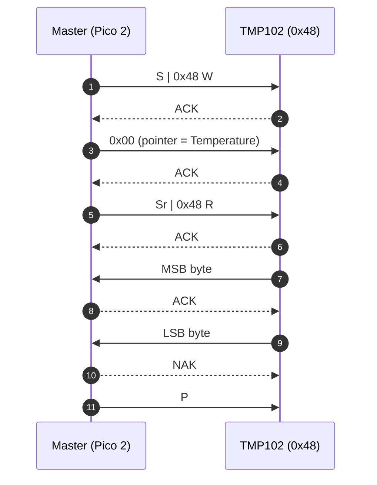

# Lecture 05: Reading from an I2C Temperature Sensor (TMP102)

**Video:** https://www.youtube.com/watch?v=RlzlzOUXPyw
**Uploader:** DigiKey  **Duration:** ~27 min  **Published:** 2026-02-19

## Table of Contents

- [Overview](#overview)
- [Hardware Setup and Wiring](#hardware-setup-and-wiring)
- [I2C Protocol Primer](#i2c-protocol-primer)
  - [Bus Signals and Topology](#bus-signals-and-topology)
  - [START, STOP and Repeated START](#start-stop-and-repeated-start)
  - [Acknowledgement (ACK/NAK)](#acknowledgement-acknak)
  - [7-bit Addressing and the R/W Bit](#7-bit-addressing-and-the-rw-bit)
  - [Bus Speeds](#bus-speeds)
- [TMP102 Datasheet Walkthrough](#tmp102-datasheet-walkthrough)
  - [Device Address and A0 Strapping](#device-address-and-a0-strapping)
  - [Register Map](#register-map)
  - [Temperature Register Layout](#temperature-register-layout)
- [The Read Transaction (write-then-read)](#the-read-transaction-write-then-read)
- [Project Skeleton](#project-skeleton)
- [Imports and Constants](#imports-and-constants)
- [Clock, SIO and Pin Initialisation](#clock-sio-and-pin-initialisation)
- [Configuring the Button Input](#configuring-the-button-input)
- [Configuring the I2C Pins](#configuring-the-i2c-pins)
- [Initialising the I2C Peripheral](#initialising-the-i2c-peripheral)
- [USB Serial and Heapless String Buffer](#usb-serial-and-heapless-string-buffer)
- [Main Loop: Edge Detection and the I2C Read](#main-loop-edge-detection-and-the-i2c-read)
- [Parsing the Raw Bytes into a 12-bit Signed Value](#parsing-the-raw-bytes-into-a-12-bit-signed-value)
- [Conversion to Celsius](#conversion-to-celsius)
- [Formatting and Writing over USB Serial](#formatting-and-writing-over-usb-serial)
- [Building and Flashing](#building-and-flashing)
- [Observing the Output and Switch Bounce](#observing-the-output-and-switch-bounce)
- [Exercises and Further Study](#exercises-and-further-study)
- [Source Code](#source-code)
- [Quick Reference](#quick-reference)

## Overview

Having previously assembled a template that blinks an LED and writes data over
the USB CDC serial port, this lecture introduces another widely used feature of
the Hardware Abstraction Layer (HAL): the **Inter-Integrated Circuit** bus,
written **I2C** or **I-squared-C**. I2C is the lingua franca of digital sensors,
EEPROMs, real-time clocks, expanders, and countless other small peripherals.

The worked example talks to a **TMP102** digital temperature sensor on a
SparkFun breakout board, fetches the raw 12-bit reading, converts it to
degrees Celsius, and prints the result over USB serial whenever a push-button
is pressed. The episode also lays the groundwork for the next lecture by
foreshadowing Rust **generics** and **traits**, both used implicitly in the
HAL's pin and bus types.

> [!NOTE]
> By the end of this lecture you should be able to: wire a TMP102 to a Pico 2,
> configure two GPIO pins as I2C alternate function, drive a `write_read`
> transaction through `embedded-hal`, and decode the raw bytes into a signed
> temperature in Celsius.

## Hardware Setup and Wiring

The wiring is intentionally minimal: a TMP102 breakout, a push-button to
trigger reads on demand, and the Pico 2's USB cable for power and serial I/O.

| Signal | Pico 2 Pin | TMP102 / Button |
| ------ | ---------- | --------------- |
| SDA    | GPIO18     | TMP102 SDA      |
| SCL    | GPIO19     | TMP102 SCL      |
| 3V3    | 3V3 OUT    | TMP102 VCC      |
| GND    | GND        | TMP102 GND, A0  |
| Button | GPIO14     | One side of switch (other side to GND) |

The SparkFun breakout ties A0 to GND by default, which selects I2C device
address `0x48`. Pull-up resistors on SDA and SCL are mandatory for I2C; the
SparkFun board includes them, so no external resistors are required.

```
                              3V3
                               |
                    +----------+----------+
                    |                     |
                   [Rp]                  [Rp]      Rp = 4.7 kΩ (on breakout)
                    |                     |
   Pico 2 GPIO18 ---+------ SDA ----------+--- TMP102 SDA
   Pico 2 GPIO19 ---+------ SCL ----------+--- TMP102 SCL
   Pico 2 3V3   --------- VCC ----------------- TMP102 VCC
   Pico 2 GND   --------- GND ----------------- TMP102 GND  (also A0)

   Pico 2 GPIO14 ------+
                       |
                     [BTN]   (internal pull-up enabled by software)
                       |
                      GND
```

> [!IMPORTANT]
> I2C lines are **open-drain**. The bus only works because of the pull-up
> resistors `Rp`. Without them SDA and SCL float and you will see nothing on
> the bus.

## I2C Protocol Primer

### Bus Signals and Topology

I2C is a two-wire, multi-master, multi-slave, half-duplex synchronous bus:

- **SDA** -- bidirectional Serial DAta
- **SCL** -- master-driven Serial CLock

Devices share the same SDA/SCL pair. Each slave responds only when its address
appears on the bus.

### START, STOP and Repeated START

A transaction is framed by special conditions on the bus:

| Condition       | Behaviour while SCL is HIGH      |
| --------------- | -------------------------------- |
| START (S)       | SDA falls from HIGH to LOW       |
| STOP (P)        | SDA rises from LOW to HIGH       |
| Repeated START  | A second START without a STOP    |

A **repeated START** (often written `Sr`) lets a master switch direction (write
then read) without releasing the bus to other masters.

### Acknowledgement (ACK/NAK)

After each byte (address or data) the receiver pulls SDA LOW during the 9th
clock pulse to **ACK**, or leaves it HIGH to **NAK**. The TMP102 ACKs both its
address byte and the pointer register write; the master typically NAKs the
final byte of a read to signal "I am done".

### 7-bit Addressing and the R/W Bit

In standard mode the address is 7 bits, transmitted MSB-first, followed by a
single **R/W̄** bit (0 = write, 1 = read). The first byte on the wire is
therefore `(addr << 1) | rw`. For the TMP102 with A0 grounded the 7-bit address
is `0x48`, so the on-the-wire bytes become `0x90` (write) and `0x91` (read).
The HAL handles this shift automatically -- application code passes `0x48`.

### Bus Speeds

| Mode               | Frequency  | Notes                                   |
| ------------------ | ---------- | --------------------------------------- |
| Standard           | 100 kHz    | Used in this lecture                    |
| Fast               | 400 kHz    | Reliable on short, well-laid-out lines  |
| Fast-mode Plus     | 1 MHz      | Tighter electrical requirements         |
| High-speed         | 3.4 MHz    | Specialised; rarely used on hobby boards|

Breadboard wiring is electrically noisy, so 100 kHz is the safe default.

## TMP102 Datasheet Walkthrough

### Device Address and A0 Strapping

The TMP102 derives its bus address from the A0 strap pin:

| A0 tied to | 7-bit address |
| ---------- | ------------- |
| GND        | `0x48`        |
| V+         | `0x49`        |
| SDA        | `0x4A`        |
| SCL        | `0x4B`        |

### Register Map

The TMP102 exposes four registers selected via an internal **pointer register**:

| Pointer | Register      | Purpose                                  |
| ------- | ------------- | ---------------------------------------- |
| `0x00`  | Temperature   | 16-bit signed temperature reading        |
| `0x01`  | Configuration | Resolution, conversion rate, alert mode  |
| `0x02`  | T_LOW         | Low-temperature alert threshold          |
| `0x03`  | T_HIGH        | High-temperature alert threshold         |

Only the temperature register is used here; the configuration register is left
at its power-on default (12-bit, 4 Hz conversion).

### Temperature Register Layout

The temperature register is 16 bits but only the upper 12 bits carry data in
the default mode:

```
   MSB byte (Rx[0])                LSB byte (Rx[1])
   ┌───┬───┬───┬───┬───┬───┬───┬───┬───┬───┬───┬───┬───┬───┬───┬───┐
   │T11│T10│T9 │T8 │T7 │T6 │T5 │T4 │T3 │T2 │T1 │T0 │ 0 │ 0 │ 0 │EM │
   └───┴───┴───┴───┴───┴───┴───┴───┴───┴───┴───┴───┴───┴───┴───┴───┘
   bit 15                                                       bit 0
```

The three low bits are unused (always 0), and `EM` is an extended-mode flag
that is left disabled. The 12-bit value is two's-complement signed, so
negative temperatures are encoded with a leading 1. Each LSB represents
**0.0625 °C**.

## The Read Transaction (write-then-read)

Reading any register requires two phases joined by a repeated START: write the
pointer, then read the register contents. This is exactly the operation that
`embedded-hal`'s `I2c::write_read` performs.



> [!TIP]
> A combined write-read with a repeated START is preferred over two separate
> transactions because it prevents another master from interleaving a request
> between the pointer write and the data read.

## Project Skeleton

The starting point is the previous USB-serial example. Copy it under
`workspace/apps/` and rename it.

```bash
# Inside the dev container or your host shell
rm -rf workspace/apps/usb-serial/target          # tidy before copying
cp -r workspace/apps/usb-serial workspace/apps/i2c-tmp102
```

Update `Cargo.toml` for the new crate name and pull in `heapless` for
stack-allocated strings:

```toml
[package]
name = "i2c-tmp102"
version = "0.1.0"
edition = "2021"

[dependencies]
# ...existing HAL / USB dependencies...
heapless = "0.8"
```

`heapless` supplies fixed-capacity collections (strings, vectors, queues) that
never touch the heap -- essential when running with no allocator.

## Imports and Constants

```rust
#![no_std]
#![no_main]

// We need to write our own panic handler
use core::panic::PanicInfo;

// Alias our HAL
use rp235x_hal as hal;

// Bring GPIO structs/functions into scope
use hal::gpio::{FunctionI2C, Pin};

// USB device and Communications Class Device (CDC) support
use usb_device::{class_prelude::*, prelude::*};
use usbd_serial::SerialPort;

// I2C structs/functions
use embedded_hal::{digital::InputPin, i2c::I2c};

// Used for the rate/frequency type
use hal::fugit::RateExtU32;

// For working with non-heap strings
use core::fmt::Write;
use heapless::String;

// Custom panic handler: just loop forever
#[panic_handler]
fn panic(_info: &PanicInfo) -> ! {
    loop {}
}

// Copy boot metadata to .start_block so Boot ROM knows how to boot our program
#[unsafe(link_section = ".start_block")]
#[used]
pub static IMAGE_DEF: hal::block::ImageDef = hal::block::ImageDef::secure_exe();

// Constants
const XOSC_CRYSTAL_FREQ: u32 = 12_000_000; // External crystal on board
const TMP102_ADDR: u8 = 0x48; // Device address on bus
const TMP102_REG_TEMP: u8 = 0x0; // Address of temperature register
```

## Clock, SIO and Pin Initialisation

The clock tree and PLLs are configured exactly as in earlier episodes; only
the timer is dropped because reads are now button-triggered.

```rust
// Get ownership of hardware peripherals
let mut pac = hal::pac::Peripherals::take().unwrap();

// Set up the watchdog and clocks
let mut watchdog = hal::Watchdog::new(pac.WATCHDOG);
let clocks = hal::clocks::init_clocks_and_plls(
    XOSC_CRYSTAL_FREQ,
    pac.XOSC,
    pac.CLOCKS,
    pac.PLL_SYS,
    pac.PLL_USB,
    &mut pac.RESETS,
    &mut watchdog,
)
.ok()
.unwrap();

// Single-cycle I/O block (fast GPIO)
let sio = hal::Sio::new(pac.SIO);

// Split off ownership of Peripherals struct, set pins to default state
let pins = hal::gpio::Pins::new(
    pac.IO_BANK0,
    pac.PADS_BANK0,
    sio.gpio_bank0,
    &mut pac.RESETS,
);
```

## Configuring the Button Input

```rust
// Configure button pin
let mut btn_pin = pins.gpio14.into_pull_up_input();
```

`into_pull_up_input` enables the internal pull-up, so the pin idles HIGH and
reads LOW when the button shorts it to GND.

> [!TIP]
> If rust-analyzer stops underlining `mut` bindings or showing type hints,
> open the command palette (`Ctrl/Cmd + P`, then `>`) and run
> **"rust-analyzer: Restart server"**. This is a common quirk inside the
> dev container.

## Configuring the I2C Pins

The I2C pins must be reconfigured to their **alternate function** (`FunctionI2C`)
rather than plain GPIO. Pin types in the HAL are generic, which makes
declarations verbose:

```rust
// Configure I2C pins
let sda_pin: Pin<_, FunctionI2C, _> = pins.gpio18.reconfigure();
let scl_pin: Pin<_, FunctionI2C, _> = pins.gpio19.reconfigure();
```

The underscores are *type placeholders*: the compiler infers the pin ID and
pull type from context. GPIO18 and GPIO19 are the SDA/SCL pair for the
**I2C1** peripheral on the RP2350; the Pico 2 pinout diagram confirms this.

> [!NOTE]
> Generics in Rust are conceptually similar to C++ templates. The
> `Pin<I, F, P>` type is parameterised by pin ID `I`, function `F`, and pull
> type `P`. Reconfiguring only changes the function parameter.

## Initialising the I2C Peripheral

```rust
// Initialize and take ownership of the I2C peripheral
let mut i2c = hal::I2C::i2c1(
    pac.I2C1,
    sda_pin,
    scl_pin,
    100.kHz(),
    &mut pac.RESETS,
    &clocks.system_clock,
);
```

This takes ownership of the I2C1 peripheral, both pins, and references to the
resets block and system clock. The returned `i2c` value is a struct that
*implements* the `embedded_hal::i2c::I2c` trait, giving us methods like
`read`, `write`, and `write_read`.

## USB Serial and Heapless String Buffer

The USB-serial plumbing is unchanged from the previous lecture; the receive
buffer is shrunk to two bytes (one TMP102 reading), and a 64-character
heapless string is used to format the output line.

```rust
// Read buffer
let mut rx_buf = [0u8; 2];
let mut output = String::<64>::new();
```

`String<64>` is a `heapless::String` with a *compile-time* capacity of 64
bytes. No allocator is used; the buffer lives on the stack.

## Main Loop: Edge Detection and the I2C Read

The main loop services USB, samples the button, and triggers a read on the
HIGH-to-LOW edge.

```rust
// Superloop
let mut prev_pressed = false;
loop {
    // Needs to be called at least every 10 ms
    let _ = usb_dev.poll(&mut [&mut serial]);

    // Get button state
    let btn_pressed = btn_pin.is_low().unwrap_or(false);

    if btn_pressed && (!prev_pressed) {
        // Read from sensor
        let result = i2c.write_read(TMP102_ADDR, &[TMP102_REG_TEMP], &mut rx_buf);
        if result.is_err() {
            let _ = serial.write(b"ERROR: Could not read temperature\r\n");
            continue;
        }

        // ... parse and print (see next sections) ...
    }

    // Save button pressed state for next iteration
    prev_pressed = btn_pressed;
}
```

A few points worth highlighting:

- `is_low()` returns `Result<bool, Self::Error>`. The idiomatic short form is
  `unwrap_or(false)`; the equivalent `match` is verbose but illustrative:

  ```rust
  let btn_pressed: bool = match btn_pin.is_low() {
      Ok(state) => state,
      Err(_e) => false,
  };
  ```

- The `continue` keyword skips the formatting code if the I2C transaction
  fails -- we still want the loop to keep polling USB.
- `prev_pressed` records the prior sample so the new sample only fires
  once per press (edge-triggered).

## Parsing the Raw Bytes into a 12-bit Signed Value

`rx_buf[0]` is the MSB and `rx_buf[1]` is the LSB. The bottom four bits of the
LSB are zero. Combine the two bytes into a `u16`, cast to `i16` so the right
shift performs **arithmetic** sign-extension, then shift right by 4 to obtain a
12-bit signed value.

```rust
// Convert raw reading (signed 12-bit value) into Celsius
let temp_raw = ((rx_buf[0] as u16) << 8) | (rx_buf[1] as u16);
let temp_signed = (temp_raw as i16) >> 4;
```

> [!NOTE]
> Casting to `i16` **before** shifting is key: Rust's `>>` on a signed integer
> is arithmetic (it copies the sign bit into the vacated high bits), so
> negative readings sign-extend correctly. A logical right shift on the `u16`
> followed by a cast would lose the sign and require an explicit
> sign-extension step.

## Conversion to Celsius

Each LSB of the 12-bit value represents 0.0625 °C, so:

$$T_{\degree C} = \text{raw}_{12\text{-bit}} \times 0.0625$$

In Rust:

```rust
let temp_c: f32 = (temp_signed as f32) * 0.0625;
```

The cast to `f32` is required before multiplying by the floating-point
resolution constant.

## Formatting and Writing over USB Serial

The `core::fmt::Write` trait makes `write!` available against any type that
implements it -- including `heapless::String`.

```rust
// Print out value
output.clear();
write!(&mut output, "Temperature: {:.2} deg C\r\n", temp_c).unwrap();
let _ = serial.write(output.as_bytes());
```

Notes:

- `output.clear()` resets the length to zero without touching the backing
  storage.
- `{:.2}` formats the float to two decimal places.
- `as_bytes()` converts the `&str` view of the heapless string into a `&[u8]`,
  which is what `SerialPort::write` consumes.
- `write!` returns a `Result` whose `Err` only fires if the buffer overflows;
  `.unwrap()` therefore routes such a logic error to the panic handler.

## Building and Flashing

```bash
cd workspace/apps/i2c-tmp102
cargo build
picotool uf2 convert \
    target/thumbv8m.main-none-eabihf/debug/i2c-tmp102 \
    --type elf \
    -o firmware.uf2
```

Hold **BOOTSEL** on the Pico 2 while plugging in USB, then drag-and-drop
`firmware.uf2` onto the mounted `RP2350` mass-storage volume. The board will
reset and re-enumerate as a USB CDC serial device.

```bash
# Linux/macOS: open a terminal on the Pico CDC port (path varies).
screen /dev/tty.usbmodem* 115200
```

## Observing the Output and Switch Bounce

Pressing the button prints one line such as:

```
Temperature: 22.94 deg C
```

Pinching the sensor between thumb and forefinger pushes the value upward;
releasing it lets the reading drift back down.

> [!IMPORTANT]
> A mechanical push-button does not produce a clean edge. Its contacts open
> and close several times in the first few milliseconds of a press -- this is
> **switch bounce**. The program currently fires `write_read` on every detected
> falling edge, so a single press may emit several lines.

## Exercises and Further Study

- **Software debounce.** Implement either a time-based filter (ignore further
  edges for ~20 ms after the first) or a shift-register style debouncer that
  requires the input to be stable for `N` consecutive samples. Adafruit has a
  classic article ("Debouncing buttons") by [Elliot Williams / Barella] with
  Arduino code -- translate the algorithm into Rust.
- **Configuration register.** Read `0x01` and decode the resolution,
  conversion rate, and alert flag fields. Try enabling extended (13-bit) mode.
- **Negative temperatures.** Place the sensor in a freezer and verify your
  sign-extension logic against the datasheet's two's-complement table.
- **Generics & traits prep.** Before the next lecture, read **chapters 10.1
  and 10.2** of *The Rust Programming Language* and complete the **options**,
  **generics**, and **traits** exercises in `rustlings`.

## Source Code

The full, checked-in implementation for this lecture lives at
[`workspace/apps/i2c-tmp102/`](../workspace/apps/i2c-tmp102/) -- see
`Cargo.toml` for the exact dependency versions and `src/main.rs` for the
program shown above.

## Quick Reference

| Item                          | Value / Snippet                                              |
| ----------------------------- | ------------------------------------------------------------ |
| TMP102 7-bit address (A0=GND) | `0x48`                                                       |
| Temperature register pointer  | `0x00`                                                       |
| Resolution per LSB            | `0.0625 °C`                                                  |
| Default bus speed             | `100 kHz` (standard mode)                                    |
| Pico 2 SDA / SCL              | `GPIO18` / `GPIO19` (I2C1)                                   |
| Read pattern                  | `i2c.write_read(addr, &[reg], &mut buf)`                     |
| 12-bit signed combine         | `(((hi as u16) << 8 \| lo as u16) as i16) >> 4`              |
| Celsius conversion            | `temp_c = (temp_signed as f32) * 0.0625`                     |
| Heapless string declaration   | `let mut s: heapless::String<64> = String::new();`           |
| USB poll cadence              | at least every 10 ms                                         |
| Build artefact path           | `target/thumbv8m.main-none-eabihf/debug/i2c-tmp102`          |
| UF2 conversion                | `picotool uf2 convert <elf> --type elf -o firmware.uf2`      |
| Next lecture topic            | Generics and traits (similar to C++ templates)               |
