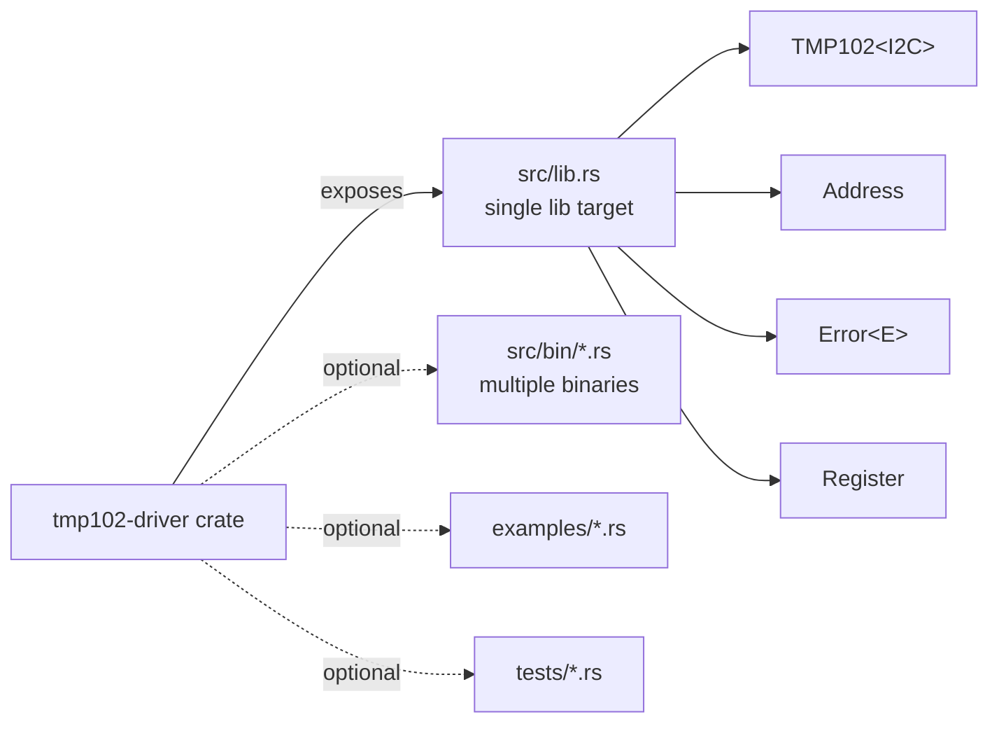
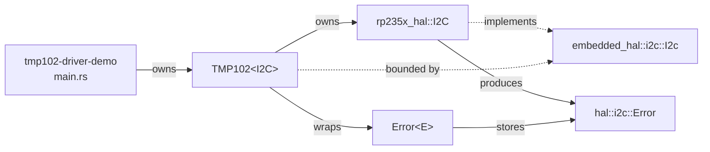

# Lecture 07: Creating a TMP102 Driver Library and Crate

**Video:** https://www.youtube.com/watch?v=8HDGmTvYLBA
**Uploader:** DigiKey  **Duration:** ~25 min  **Published:** 2026-03-05

> [!NOTE]
> Part 7 of DigiKey's *Intro to Embedded Rust* series. This episode shows how
> to take the inline I squared C code from Part 6 and refactor it into a
> standalone, reusable driver crate for the Texas Instruments TMP102 digital
> temperature sensor, then consume that crate from a demo application running
> on a Raspberry Pi Pico 2.

## Table of Contents

1. [Overview and Motivation](#overview-and-motivation)
2. [Hardware Setup](#hardware-setup)
3. [Libraries vs Binaries in Cargo](#libraries-vs-binaries-in-cargo)
4. [Scaffolding the Crate with `cargo new --lib`](#scaffolding-the-crate-with-cargo-new---lib)
5. [Crate Layout and File Roles](#crate-layout-and-file-roles)
6. [`no_std` and Targeting Embedded](#no_std-and-targeting-embedded)
7. [Doc Comments: Inner, Outer and `cargo doc`](#doc-comments-inner-outer-and-cargo-doc)
8. [Cargo.toml: Dependencies for the Library](#cargotoml-dependencies-for-the-library)
9. [Designing the Error Enum](#designing-the-error-enum)
10. [Device Address Enum](#device-address-enum)
11. [Register Lookup Struct](#register-lookup-struct)
12. [The `TMP102<I2C>` Driver Struct](#the-tmp102i2c-driver-struct)
13. [Trait-Bounded `impl` Block](#trait-bounded-impl-block)
14. [Constructors: `new` and `with_default_address`](#constructors-new-and-with_default_address)
15. [`read_temperature_c` and the Conversion Helper](#read_temperature_c-and-the-conversion-helper)
16. [The Demo Application](#the-demo-application)
17. [Path Dependencies and Local Crates](#path-dependencies-and-local-crates)
18. [Build, Flash, Run](#build-flash-run)
19. [Error Handling Demonstration](#error-handling-demonstration)
20. [Publishing and Community Alternatives](#publishing-and-community-alternatives)
21. [Quick Reference](#quick-reference)

---

## Overview and Motivation

Libraries in Rust are usually separate crates that can be imported into
applications. In Parts 5 and 6 of this series the TMP102 was driven directly
from `main.rs` using the `embedded-hal::i2c::I2c` trait. This episode wraps
that hand-written I squared C code into a reusable library crate, then
re-builds the previous demo as a *client* of that crate. The same generic
machinery introduced in Part 6 lets the crate stay HAL-agnostic.

> [!TIP]
> The end result is a small but realistic *platform-agnostic* sensor driver
> -- the same pattern used by the wider `embedded-hal` driver ecosystem on
> crates.io (e.g. the third-party `tmp1x2` crate referenced at the end of the
> lecture).

## Hardware Setup

Identical to Part 6:

| Signal | Pico 2 GPIO | Notes |
| --- | --- | --- |
| Button | GPIO 14 | Active-low, internal pull-up; reads falling edge |
| TMP102 SDA | GPIO 18 | I squared C0 SDA |
| TMP102 SCL | GPIO 19 | I squared C0 SCL |
| TMP102 ADD0 | GND | Selects address `0x48` |

## Libraries vs Binaries in Cargo

> [!IMPORTANT]
> A crate can only have **one library target** (one public-facing
> interface). It may have **multiple binary targets** for tests and examples.
> The library is rooted at `src/lib.rs` and can span many files that are all
> linked into the single library artefact.



## Scaffolding the Crate with `cargo new --lib`

From the `libraries/` directory:

```bash
cd libraries
cargo new tmp102-driver --lib --vcs none
```

| Flag | Purpose |
| --- | --- |
| `--lib` | Generates `src/lib.rs` instead of `src/main.rs` |
| `--vcs none` | Skips `git init` because the parent repository already tracks this folder |

Cargo emits a template `src/lib.rs` containing a placeholder `add` function
and a sample unit test module. Both are removed and replaced.

## Crate Layout and File Roles

```text
libraries/tmp102-driver/
|-- Cargo.toml          # crate metadata + dependencies
`-- src/
    `-- lib.rs          # the single library target
```

| File | Role |
| --- | --- |
| `Cargo.toml` | `[package]` metadata, `[dependencies]` (here just `embedded-hal`) |
| `src/lib.rs` | All public types: `Error<E>`, `Address`, `Register`, `TMP102<I2C>` |

## `no_std` and Targeting Embedded

The first non-comment line of `lib.rs` opts the crate out of the standard
library, exactly as the application crates have been doing:

```rust
#![no_std]
```

> [!WARNING]
> Without `#![no_std]` the library would pull in `std`, which is unavailable
> on bare-metal targets like `thumbv8m.main-none-eabihf` (Cortex-M33, RP2350).

## Doc Comments: Inner, Outer and `cargo doc`

Rust supports four comment styles, the last two of which feed `cargo doc`:

| Syntax | Kind | Documents |
| --- | --- | --- |
| `// ...` | Line comment | Nothing (ignored by docgen) |
| `/* ... */` | Block comment | Nothing (ignored by docgen) |
| `//! ...` | Inner doc | The *enclosing* item (crate, module) |
| `/// ...` | Outer doc | The item that *follows* it (fn, struct, enum, variant) |

`cargo doc` parses Markdown inside these comments. The crate-level header is
written at the top of `lib.rs`:

```rust
#![no_std]

//! # TMP102 Demo Driver
//!
//! A simple demo driver for the TMP102 temperature sensor

use embedded_hal::i2c::I2c;
```

## Cargo.toml: Dependencies for the Library

```toml
[package]
name = "tmp102-driver"
version = "0.1.0"
edition = "2021"

[dependencies]
embedded-hal = "1.0"
```

> [!NOTE]
> Only `embedded-hal` is needed -- the library never names a concrete HAL.
> All platform-specific types arrive through the generic `I` type parameter,
> which means the same crate compiles unchanged for RP2350, STM32, nRF, ESP32
> or any other HAL implementing `embedded_hal::i2c::I2c`.

## Designing the Error Enum

The driver defines its own error type, generic over the underlying I squared
C error `E` provided by the HAL.

```rust
/// Custom error for our crate
#[derive(Debug)]
pub enum Error<E> {
    /// I2C communication error
    Communication(E),
}
```

| Element | Meaning |
| --- | --- |
| `#[derive(Debug)]` | Auto-generates `Debug` impl so `{:?}` formatting works |
| `pub` | Visible to crate consumers (default visibility is private) |
| `E` | Generic placeholder filled in by the HAL's `I2c::Error` type |
| `Communication(E)` | Tuple-variant wrapping the underlying HAL error |

> [!TIP]
> Wrapping the HAL error preserves the underlying cause (e.g.
> `NoAcknowledge(Address)`) while letting the driver add its own variants
> later -- a classic *error enrichment* pattern.

## Device Address Enum

The TMP102 has four addressable slave addresses chosen by tying the `ADD0`
pin to one of four signals. From Table 6-4 of the datasheet:

| `ADD0` Connection | 7-bit Address |
| --- | --- |
| GND | `0x48` |
| V+ (VDD) | `0x49` |
| SDA | `0x4A` |
| SCL | `0x4B` |

```rust
/// Possible device addresses based on ADD0 pin connection
#[derive(Debug, Clone, Copy)]
pub enum Address {
    Ground = 0x48, // Default
    Vdd = 0x49,
    Sda = 0x4A,
    Scl = 0x4B,
}

impl Address {
    /// Get the I2C address in u8 format
    pub fn as_u8(self) -> u8 {
        self as u8
    }
}
```

> [!IMPORTANT]
> `Clone` and `Copy` are derived so the address can be cheaply duplicated
> -- needed because the value is consumed both when stored in the driver
> struct and when passed to `write_read`.

## Register Lookup Struct

A *struct of associated constants* is used instead of an enum so that
register addresses can be referenced without constructing an instance, and
so the names live in their own namespace (`Register::TEMPERATURE`).

```rust
/// List internal registers in a struct
#[allow(dead_code)]
struct Register;

#[allow(dead_code)]
impl Register {
    const TEMPERATURE: u8 = 0x00;
    const CONFIG: u8 = 0x01;
    const T_LOW: u8 = 0x02;
    const T_HIGH: u8 = 0x03;
}
```

| Attribute | Why |
| --- | --- |
| `#[allow(dead_code)]` | Silences warnings for the three registers the demo never reads |

Values come from the TMP102 datasheet, Table 6-7.

## The `TMP102<I2C>` Driver Struct

```rust
/// TMP102 temperature sensor driver
pub struct TMP102<I2C> {
    i2c: I2C,
    address: Address,
}
```

| Field | Type | Purpose |
| --- | --- | --- |
| `i2c` | `I2C` (generic) | Owns the bus handle; will satisfy `embedded_hal::i2c::I2c` |
| `address` | `Address` | One of the four datasheet addresses, statically restricted |

## Trait-Bounded `impl` Block

Methods are gated on `I2C: I2c` so the driver only exposes its API when the
generic parameter actually implements the required trait.

```rust
impl<I2C> TMP102<I2C>
where
    I2C: I2c,
{
    // constructors and methods follow
}
```

The trait `embedded_hal::i2c::I2c` requires implementors to provide
`transaction`, `read`, `write` and `write_read`. The HAL may add its own
inherent methods, but the trait signatures are fixed -- which is precisely
what makes the driver portable.

## Constructors: `new` and `with_default_address`

Rust has no function overloading, so two constructors are provided with
distinct names:

```rust
/// Create a new TMP102 driver instance
pub fn new(i2c: I2C, address: Address) -> Self {
    Self { i2c, address }
}

/// Create new instance with default address (Ground)
pub fn with_default_address(i2c: I2C) -> Self {
    Self::new(i2c, Address::Ground)
}
```

> [!NOTE]
> `new` *moves* the bus into the struct -- ownership now lives inside
> `TMP102`. After this point, only the driver may speak to the sensor on
> that bus, which is exactly the static guarantee we want.

## `read_temperature_c` and the Conversion Helper

The public read method returns `Result<f32, Error<E>>`. The math for
unpacking the 12-bit two's-complement temperature is identical to Part 6 but
now lives behind a clean API.

```rust
/// Read the current temperature in degrees Celsius (blocking)
pub fn read_temperature_c(&mut self) -> Result<f32, Error<I2C::Error>> {
    let mut rx_buf = [0u8; 2];

    // Read from sensor
    match self
        .i2c
        .write_read(self.address.as_u8(), &[Register::TEMPERATURE], &mut rx_buf)
    {
        Ok(()) => Ok(self.raw_to_celsius(rx_buf)),
        Err(e) => Err(Error::Communication(e)),
    }
}

/// Convert raw reading to Celsius
fn raw_to_celsius(&self, buf: [u8; 2]) -> f32 {
    let temp_raw = ((buf[0] as u16) << 8) | (buf[1] as u16);
    let temp_signed = (temp_raw as i16) >> 4;
    (temp_signed as f32) * 0.0625
}
```

The conversion implements:

$$T_{\\,^{\\circ}\\mathrm{C}} = \\bigl((\\text{byte}_0 \\ll 8) \\mathbin{|} \\text{byte}_1\\bigr)_{i16} \\gg 4 \\;\\times\\; 0.0625$$

where the arithmetic right-shift by 4 preserves the sign of the 12-bit
value, and $0.0625\\,^{\\circ}\\mathrm{C} = 1/16$ is the TMP102's LSB
resolution.

| Step | Operation | Result |
| --- | --- | --- |
| 1 | `(byte0 << 8) \| byte1` | 16-bit big-endian word |
| 2 | Cast `as i16`, `>> 4` | 12-bit signed temperature count |
| 3 | `as f32 * 0.0625` | Degrees Celsius |

> [!TIP]
> `raw_to_celsius` is **not** `pub`, so the conversion can be refined later
> (e.g. extended mode for sub-zero ranges) without breaking semver.

## The Demo Application

The previous `i2c-tmp102-demo` app is copied to a fresh crate called
`tmp102-driver-demo`. The application's `target/` and `Cargo.lock` are
deleted before copying to keep the duplicate small (they regenerate on
first build).

```rust
use tmp102_driver::{Address, TMP102};

// ...inside main, after the I squared C bus handle `i2c` is built:
let mut tmp102 = TMP102::new(i2c, Address::Ground);
```

Differences from the Part 6 application:

| Removed from `main.rs` | Replaced by |
| --- | --- |
| Local `TMP102_REGISTER_TEMP` constant | `Register::TEMPERATURE` (private inside crate) |
| Local 2-byte `rx_buf` | Internal buffer in `read_temperature_c` |
| Direct `i2c.write_read(...)` call | `tmp102.read_temperature_c()` |
| Manual conversion math | `TMP102::raw_to_celsius` |
| `use ... I2c` | Not needed -- the driver hides it |

The button-press handler now becomes:

```rust
let temp_c = match tmp102.read_temperature_c() {
    Ok(temp) => temp,
    Err(e) => {
        output.clear();
        write!(&mut output, "Error: {:?}\r\n", e).unwrap();
        let _ = serial.write(output.as_bytes());
        continue;                       // skip the print-temp branch
    }
};
```

> [!NOTE]
> The `match` mixes an *expression arm* (`Ok` returns `temp`, which becomes the
> value of the whole `match`) and a *statement arm* (`Err` prints and
> `continue`s -- never returning a value). This works because `continue`'s
> type is `!`, which unifies with `f32`.

## Path Dependencies and Local Crates

To avoid publishing during development, the demo's `Cargo.toml` uses a
**path dependency** instead of a version:

```toml
[dependencies]
tmp102-driver = { path = "../../libraries/tmp102-driver" }
```

> [!IMPORTANT]
> Path dependencies are the recommended way to develop libraries alongside
> their consumers. Cargo treats the path target as a fully fledged crate --
> it reads its `Cargo.toml`, resolves its dependencies, and rebuilds on
> change.

## Build, Flash, Run

```bash
cd workspace/apps/tmp102-driver-demo
cargo build
picotool uf2 convert \
    target/thumbv8m.main-none-eabihf/debug/tmp102-driver-demo \
    --type elf firmware.uf2
```

> [!WARNING]
> The lecturer hit two common pitfalls on first compile:
> 1. A missing semicolon after a statement.
> 2. Pasting the binary name from the previous project into `picotool` --
>    update the ELF path when copying a crate.

Hold BOOTSEL while plugging in the Pico, then drop `firmware.uf2` onto the
mass-storage device that appears. The Pico reboots into the new firmware.
A serial terminal (e.g. PuTTY) on the Pico's USB CDC ACM port prints
temperatures on each falling edge of the button.

## Error Handling Demonstration

Pulling the TMP102 breakout off the bus and pressing the button surfaces the
full error chain:

```text
Error: Communication(NoAcknowledge(Address))
```

- `Communication(..)` is the variant defined in the driver crate.
- `NoAcknowledge(Address)` is the underlying `embedded-hal` I squared C
  error reported by the RP235x HAL.

This validates the design: the driver's enrichment preserves the original
HAL diagnostic *and* identifies which abstraction layer first noticed the
fault.

## Publishing and Community Alternatives

The lecture does not publish the crate but signposts two next steps:

1. **Publish to crates.io** -- covered in *The Rust Programming Language*,
   Chapter 14. Requires unique name, license, repository and
   `cargo publish`.
2. **Swap in a community driver** -- the third-party
   [`tmp1x2`](https://crates.io/crates/tmp1x2) crate is `embedded-hal`-based
   and is a drop-in replacement: change the path dependency to a version
   dependency, adjust the `use` statements, and the demo behaves
   identically. This is the day-to-day reality of the embedded Rust
   ecosystem -- generic, well-tested drivers are a one-line `Cargo.toml`
   change away.

## Next Episode

Part 8 takes a break from hardware to cover **lifetimes and lifetime
annotations**. Recommended preparation:

- *The Rust Programming Language*, Section 10.3.
- The *lifetimes* chapter of `rustlings`.

---

## Source Code

- Driver library: [`workspace/libraries/tmp102-driver`](../workspace/libraries/tmp102-driver)
- Demo application: [`workspace/apps/tmp102-driver-demo`](../workspace/apps/tmp102-driver-demo)

## Quick Reference

### Crate Layout

```text
introduction-to-embedded-rust/
|-- libraries/
|   `-- tmp102-driver/
|       |-- Cargo.toml
|       `-- src/lib.rs
`-- workspace/apps/
    `-- tmp102-driver-demo/
        |-- Cargo.toml          # path = "../../libraries/tmp102-driver"
        `-- src/main.rs
```

### Public API

| Item | Kind | Signature / Purpose |
| --- | --- | --- |
| `Error<E>` | `enum` | `Communication(E)` -- wraps HAL error |
| `Address` | `enum` | `Ground`, `Vdd`, `Sda`, `Scl` (discriminants `0x48`..`0x4B`) |
| `Address::as_u8` | method | `fn(self) -> u8` |
| `TMP102<I2C>` | `struct` | Generic driver, owns the bus |
| `TMP102::new` | ctor | `fn(i2c: I2C, address: Address) -> Self` |
| `TMP102::with_default_address` | ctor | `fn(i2c: I2C) -> Self` -- assumes `Address::Ground` |
| `TMP102::read_temperature_c` | method | `fn(&mut self) -> Result<f32, Error<I2C::Error>>` |

### Internal (Crate-Private) Items

| Item | Purpose |
| --- | --- |
| `Register` struct + assoc consts | `TEMPERATURE`, `CONFIG`, `T_LOW`, `T_HIGH` |
| `TMP102::raw_to_celsius` | Big-endian unpack, sign-extension, scale by `0.0625` |

### Key Cargo Commands

| Command | Effect |
| --- | --- |
| `cargo new tmp102-driver --lib --vcs none` | Scaffolds a library crate without git init |
| `cargo build` (in demo) | Builds the demo and (transitively) the library |
| `cargo doc --open` | Renders the inner/outer doc comments to HTML |
| `cargo publish` | Uploads to crates.io (not used in this lecture) |

### Doc-Comment Cheatsheet

| Syntax | Targets |
| --- | --- |
| `//!` | The enclosing item (crate-level when at the top of `lib.rs`) |
| `///` | The item directly below it |
| Markdown | Headings, code fences, tables all rendered by `cargo doc` |

### Trait Bound Recap

```rust
impl<I2C> TMP102<I2C>
where
    I2C: embedded_hal::i2c::I2c,
{ /* ... */ }
```

| Bound | Why |
| --- | --- |
| `I2C: I2c` | Provides `write_read`, `read`, `write`, `transaction` |
| `I2C::Error` | The HAL's associated error type, wrapped by `Error<E>` |

### TMP102 Conversion Maths

$$T = \\frac{\\text{sign\\_extend}_{12 \\to 16}\\bigl(\\text{raw}_{u16} \\gg 4\\bigr)}{16}\\;^{\\circ}\\mathrm{C}$$

with $1\\,\\text{LSB} = 0.0625\\,^{\\circ}\\mathrm{C}$ and a measurement range of
$-55\\,^{\\circ}\\mathrm{C}$ to $+128\\,^{\\circ}\\mathrm{C}$ in standard mode.

### Mental Model


