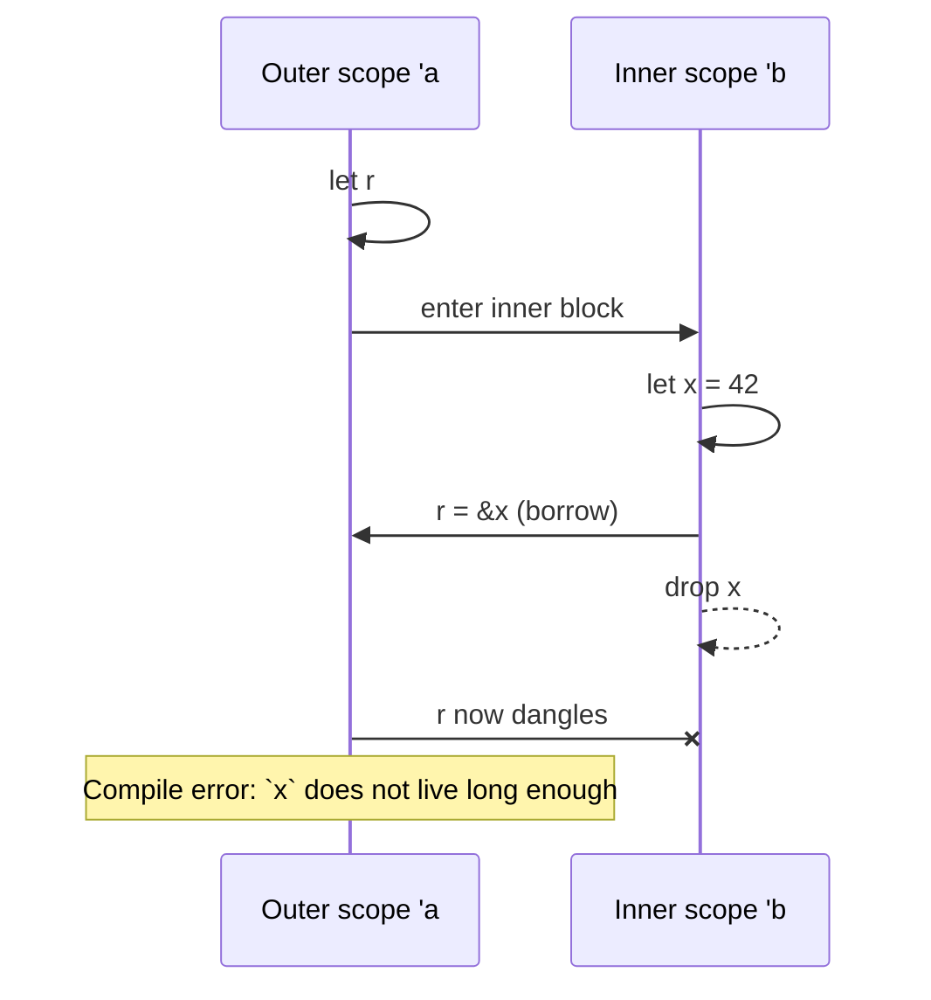
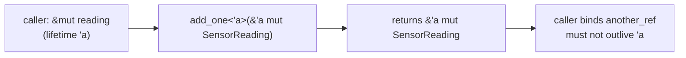

# Lecture 08: Lifetimes and Lifetime Annotations

**Video:** https://www.youtube.com/watch?v=3hzrRgXeNuk
**Uploader:** DigiKey  **Duration:** ~24 min  **Published:** 2026-03-12

## Table of Contents

- [Why Lifetimes Exist](#why-lifetimes-exist)
- [Dangling Reference Scenarios](#dangling-reference-scenarios)
- [The Tick-A Syntax](#the-tick-a-syntax)
- [Lifetime Annotations in Function Signatures](#lifetime-annotations-in-function-signatures)
- [A Function With Multiple Input References](#a-function-with-multiple-input-references)
- [Lifetimes in Structs](#lifetimes-in-structs)
- [Lifetimes in `impl` Blocks](#lifetimes-in-impl-blocks)
- [The Three Lifetime Elision Rules](#the-three-lifetime-elision-rules)
- [The `'static` Lifetime](#the-static-lifetime)
- [Lifetimes in Trait Objects](#lifetimes-in-trait-objects)
- [Embedded Relevance](#embedded-relevance)
- [Source Code](#source-code)
- [Quick Reference](#quick-reference)

## Why Lifetimes Exist

The Rust borrow checker makes assumptions about how long every reference is
valid. Its primary purpose is to prevent memory safety violations such as
*double frees* and *use-after-free* errors. Whilst the checker is highly
capable, there are points at which it cannot, from a function signature or
struct definition alone, infer how long the data behind a reference must
remain live. In those situations the programmer must annotate the lifetimes
explicitly so that the checker has enough information to enforce the
guarantees.

A **lifetime** is simply a name for the span of program execution during
which a reference is valid. Lifetime annotations do not change how long
something lives; they merely *describe* relationships between the lifetimes
of references so that the compiler can verify them.

> [!IMPORTANT]
> Annotations never extend a lifetime. They only express constraints the
> compiler must enforce.

## Dangling Reference Scenarios

Consider a reference `r` declared in an outer scope, that we attempt to
bind to a value `x` introduced in a nested scope:

```rust
{
    let r;                  // lifetime 'a begins
    {
        let x = 42;         // lifetime 'b begins
        r = &x;             // r borrows from x
    }                       // 'b ends — x is dropped
    println!("{}", r);      // 'a still alive but borrow is dangling
}
```

Once `x` falls out of scope its memory is reclaimed. Any outstanding
reference would then point at freed or reused memory — a classic dangling
pointer. Rust refuses to compile this example, but it is the canonical
illustration of why lifetime tracking matters.



## The Tick-A Syntax

A lifetime parameter is written as a single quote (a *tick*) followed by a
lowercase identifier — by convention `'a`, `'b`, and so on in increasing
alphabetical order. The lifetime is a kind of generic parameter, declared
inside angle brackets after the item name:

```rust
fn example<'a>(/* ... */) { /* ... */ }
struct Wrapper<'a> { /* ... */ }
```

The tick is read aloud as "tick a" or "lifetime a". Like type generics,
lifetimes must be declared before they can be used in parameters, return
types, or field types.

## Lifetime Annotations in Function Signatures

The compiler treats every function as a *black box* at its call site. It
looks only at the signature — never at the body — when deciding whether a
returned reference is still valid for the caller. Consequently, if a
function returns a reference, the signature must tell the compiler which
input reference it derives from.

Reusing the running `SensorReading` struct from the ownership episode (to
avoid heap-allocated data such as `String`):

```rust
struct SensorReading {
    value: u16,
    timestamp_ms: u32,
}

// Explicit form — return a reference that lives as long as the input:
// fn add_one<'a>(reading: &'a mut SensorReading) -> &'a mut SensorReading {
//     reading.value += 1;
//     reading
// }

// Elision: the compiler can infer lifetimes in this common pattern.
fn add_one(reading: &mut SensorReading) -> &mut SensorReading {
    reading.value += 1;
    reading
}

fn demo_adding() {
    let mut reading = SensorReading { value: 1, timestamp_ms: 101 };
    let another_ref = add_one(&mut reading);
    println!("{}, {}", another_ref.value, another_ref.timestamp_ms);
}
```

The explicit `'a` annotation on both the parameter and the return type
tells the compiler: *the returned reference lives at least as long as the
borrow of `reading`*. In this particular case elision rules 1 and 2 do
the job for us, so the annotation is optional; the commented form above
shows what the compiler is effectively inferring.



## A Function With Multiple Input References

When a function takes two references that may have different lifetimes and
returns one of them, elision cannot decide which one the result derives
from — that decision is made at runtime.

```rust
fn highest_val<'a>(r1: &'a SensorReading, r2: &'a SensorReading) -> &'a SensorReading {
    if r1.value > r2.value {
        r1
    } else {
        r2
    }
}
```

By giving both parameters and the return type the *same* lifetime `'a`,
the caller is told: *the returned reference is valid only for the
intersection of `r1`'s and `r2`'s lifetimes*. Without annotations on
`highest_val` the compiler emits:

> [!WARNING]
> `error[E0106]: missing lifetime specifier` — *"this function's return
> type contains a borrowed value, but the signature does not say whether
> it is borrowed from `r1` or `r2`."* The fix is to add `'a` to both
> inputs and the output.

## Lifetimes in Structs

A struct that holds a reference must outlive nothing that it borrows from.
Annotating the struct propagates the lifetime requirement to every
instance:

```rust
struct SampleHolder<'a> {
    sample: &'a SensorReading,
}

fn demo_struct_ref() {
    let reading = SensorReading { value: 11, timestamp_ms: 103 };
    let holder = SampleHolder { sample: &reading };
    println!("{}, {}", holder.sample.value, holder.sample.timestamp_ms);
}
```

The annotation `<'a>` after the struct name and `&'a SensorReading` for
the field together promise the compiler that *no `SampleHolder<'a>` may
outlive the `SensorReading` it references*. Omitting the annotation
yields:

> [!WARNING]
> `error[E0106]: missing lifetime specifier` on the field declaration.
> The compiler needs the field to advertise the lifetime so it can verify
> the relationship at every construction site.

## Lifetimes in `impl` Blocks

When implementing methods on a struct that carries a lifetime, the
lifetime must be declared on the `impl` header *and* on the struct name:

```rust
struct SensorBuffer<'a> {
    name: &'a str,
    readings: &'a [SensorReading],
}

impl<'a> SensorBuffer<'a> {
    fn new(name: &'a str, readings: &'a [SensorReading]) -> Self {
        SensorBuffer { name, readings }
    }

    fn get_latest(&self) -> &'a SensorReading {
        &self.readings[self.readings.len() - 1]
    }
}

fn demo_methods() {
    let readings = [
        SensorReading { value: 23, timestamp_ms: 104 },
        SensorReading { value: 25, timestamp_ms: 204 },
        SensorReading { value: 21, timestamp_ms: 304 },
    ];

    let buffer = SensorBuffer::new("My Readings", &readings);
    let latest = buffer.get_latest();
    println!("{} latest: {}, {}", buffer.name, latest.value, latest.timestamp_ms);
}
```

The return type of `get_latest` is annotated `&'a SensorReading` so that
the returned reference is tied to the underlying readings slice rather
than to the temporary `&self` borrow — elision rule 3 would otherwise
shorten it to `&self`'s lifetime. The string slice and the slice of
readings must both share `'a` so that the buffer cannot outlive its
backing storage.

## The Three Lifetime Elision Rules

Rather than force annotations on every reference, the compiler applies a
fixed set of rules. If, after applying them, every reference has a known
lifetime, no annotation is required. If any lifetime remains unresolved,
the compiler emits an error and the programmer must annotate explicitly.

> [!IMPORTANT]
> The elision rules are deterministic. They never guess — they either
> assign every lifetime unambiguously or stop and demand explicit help.

| Rule | Where applied | Effect |
| --- | --- | --- |
| 1 | Each input reference | Each elided input reference receives its own distinct lifetime parameter. |
| 2 | Single input lifetime | If there is exactly one input lifetime, it is assigned to every elided output lifetime. |
| 3 | Methods (`&self` / `&mut self`) | If one of the inputs is `&self` or `&mut self`, its lifetime is assigned to every elided output lifetime. |

Applying them to `add_one`:

1. Rule 1 gives `reading` a lifetime, call it `'1`.
2. Rule 2 applies because there is exactly one input lifetime, so the
   return type receives `'1` as well.

Both references therefore share a lifetime without any annotation. The
two-input case `highest_val` fails rule 2 (there are two input
lifetimes) and is not a method, so rule 3 does not apply — annotations
become mandatory.

## The `'static` Lifetime

A reference annotated `'static` is valid for the entire duration of the
program. String literals are the most familiar example — they live in the
binary's read-only data, never freed.

```rust
struct SensorConfig {
    name: &'static str,
    units: &'static str,
}

// const inlines its value at every use; static keeps a single instance
// in memory for the whole program.
static TEMP_SENSOR_CONFIG: SensorConfig = SensorConfig {
    name: "Temperature Sensor",
    units: "C",
};

fn demo_static() {
    println!("{}, units: {}",
        TEMP_SENSOR_CONFIG.name,
        TEMP_SENSOR_CONFIG.units);
}
```

A `static` item (note the keyword — distinct from `const`, which inlines
its value at every use) keeps a single instance in memory for the whole
program. Because the data never goes out of scope, no custom lifetime
parameter is required on the struct; `'static` is used directly on each
reference field.

> [!IMPORTANT]
> `'static` is a *bound*, not a *promise to leak*. It declares that the
> reference *may* live for the entire program — which the compiler then
> verifies. In embedded code, `&'static` is the typical type for
> singletons constructed once at boot and never deallocated.

## Lifetimes in Trait Objects

When a trait object holds borrowed data, its lifetime must be expressed
in the type. The default for `Box<dyn Trait>` is `'static`, but a
borrowed trait object must spell its lifetime out:

```rust
trait Sensor {
    fn read(&self) -> i32;
}

fn use_sensor<'a>(s: &'a dyn Sensor) -> i32 { s.read() }

// Trait object stored in a struct
struct Probe<'a> {
    backend: &'a dyn Sensor,
}
```

Two patterns appear regularly:

- `&'a dyn Trait` — a borrowed trait object tied to the lifetime `'a`.
- `Box<dyn Trait + 'a>` — an owned trait object whose underlying value
  must not contain references shorter than `'a`. With no explicit
  bound, `Box<dyn Trait>` is shorthand for `Box<dyn Trait + 'static>`.

## Embedded Relevance

Lifetime annotations turn up everywhere in embedded Rust. Two recurring
themes are worth highlighting:

### DMA Buffer Borrowing

A DMA peripheral writes into RAM independently of the CPU. While the
transfer is in flight the buffer must not be moved, freed, or aliased.
HAL crates encode this by taking a `&'a mut [u8]` (or a typed wrapper)
and returning a *transfer handle* whose own lifetime is bounded by `'a`:

```rust
fn start_dma<'a>(buf: &'a mut [u8]) -> DmaTransfer<'a> { /* ... */ }

struct DmaTransfer<'a> {
    buffer: &'a mut [u8],
}
```

The compiler then prevents the buffer being reused until the transfer
object is dropped or explicitly `wait`ed upon — eliminating an entire
class of "buffer freed mid-DMA" bugs at compile time.

### `&'static` Singletons

Peripheral access crates, interrupt handlers, RTIC resources, and Embassy
executors all rely on data that lives forever. They expose APIs that
require `&'static T` or `&'static mut T`:

```rust
static mut SHARED: Option<MyResource> = None;

fn init() -> &'static mut MyResource {
    // SAFETY: called once before any interrupts use SHARED.
    unsafe {
        SHARED = Some(MyResource::new());
        SHARED.as_mut().unwrap()
    }
}
```

Crates such as `static_cell` and `cortex_m::singleton!` provide safe,
once-only constructors that yield `&'static mut T` references without
the manual `unsafe` block. The `'static` bound is what lets these
references be moved into interrupt handlers, given to DMA peripherals,
or shared between asynchronous tasks.

## Source Code

The companion crate for this lecture lives at
[`workspace/apps/lifetime-examples/`](../workspace/apps/lifetime-examples/).
It collects the running `SensorReading`, `SampleHolder`, `SensorBuffer`,
and `SensorConfig` examples into a single binary so the elision rules
and explicit annotations can be exercised end-to-end with `cargo run`.

## Quick Reference

| Construct | Meaning |
| --- | --- |
| `'a`, `'b`, ... | Named lifetime parameters, declared in `<...>`. |
| `&'a T` | Shared reference valid for at least `'a`. |
| `&'a mut T` | Exclusive reference valid for at least `'a`. |
| `<'a>` after a name | Declaration of a lifetime generic on an item. |
| `'static` | Reference valid for the entire program runtime. |
| `T: 'a` | The type `T` contains no references shorter than `'a`. |
| `dyn Trait + 'a` | Trait object whose data lives for at least `'a`. |

**Common signatures**

```rust
// One input, one output reference: elision succeeds.
fn first_word(s: &str) -> &str { /* ... */ }

// Two input references sharing a lifetime, returning one of them.
fn longest<'a>(x: &'a str, y: &'a str) -> &'a str {
    if x.len() > y.len() { x } else { y }
}

// Struct holding a reference.
struct Wrap<'a, T> { r: &'a T }

// Method whose output lifetime is taken from `&self` via elision rule 3.
impl<'a, T> Wrap<'a, T> {
    fn get(&self) -> &T { self.r }
}

// `'static` data — typical for embedded singletons.
static CLOCK_HZ: u32 = 64_000_000;
fn boot_message() -> &'static str { "starting" }
```

**Mental model for diagnosing errors**

1. Identify every reference in the signature.
2. Apply the three elision rules in order. If every reference now has a
   lifetime, the signature is well-formed.
3. If a reference is still unresolved, decide which input the output
   borrows from and annotate accordingly.
4. For structs, every reference field needs a lifetime; for `impl`
   blocks, declare the lifetime on both the `impl` header and the type
   name.
5. Reach for `'static` only when the data genuinely lives for the whole
   program — typically constants, string literals, or singletons
   constructed once at boot.
