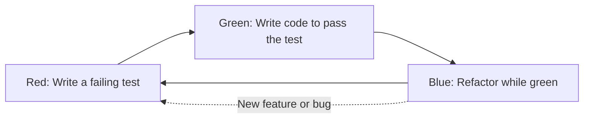

# Lecture 09: Test-Driven Development

**Video:** https://www.youtube.com/watch?v=n7q4WYA9qVY
**Uploader:** DigiKey  **Duration:** ~27 min  **Published:** 2026-03-19

## Table of Contents

- [Introduction](#introduction)
- [What is Test-Driven Development](#what-is-test-driven-development)
- [The Red-Green-Refactor Cycle](#the-red-green-refactor-cycle)
- [Categories of Tests](#categories-of-tests)
- [Test Doubles: Dummies, Fakes, Stubs, Spies and Mocks](#test-doubles-dummies-fakes-stubs-spies-and-mocks)
- [Testing Strategies for Embedded Code](#testing-strategies-for-embedded-code)
- [Setting Up Cargo Tests in a Driver Library](#setting-up-cargo-tests-in-a-driver-library)
- [Importing the Standard Library and embedded-hal Types](#importing-the-standard-library-and-embedded-hal-types)
- [Building an I2C Stub](#building-an-i2c-stub)
- [Implementing a Concrete Error Type](#implementing-a-concrete-error-type)
- [Implementing the I2C Trait for the Stub](#implementing-the-i2c-trait-for-the-stub)
- [Writing Unit Tests](#writing-unit-tests)
- [Running Tests with Cargo](#running-tests-with-cargo)
- [Filtering Tests by Name](#filtering-tests-by-name)
- [Doctests and Beyond](#doctests-and-beyond)
- [Source Code](#source-code)
- [Quick Reference](#quick-reference)

## Introduction

Test-driven development (TDD) is a method of writing code that involves writing
automated tests first and then developing functional code to pass those tests.
It is widely adopted in professional programming circles and helps reduce the
number of bugs shipped in production code. Now that the basics of embedded
Rust are out of the way, the concepts can be applied to practical workflows.

Embedded TDD can be tricky because it often means writing dummy or stub
implementations of low-level protocols so that automated tests may run on a
host computer without real hardware. This lecture shows how to construct a
stub `I2C` implementation so automated unit tests can be written for the
TMP102 driver developed in earlier episodes.

> [!NOTE]
> The driver code under test is the one written in the previous episode. The
> tests are placed at the bottom of the library's `lib.rs` file inside a
> dedicated `tests` module.

## What is Test-Driven Development

The basic idea behind TDD is that you write your tests **before** you write
your functional code. The workflow is iterative: each new feature request or
bug fix begins with a failing test. Once the test passes, you refactor the
implementation, then move on to the next test.

This discipline encourages tight feedback loops, deliberate API design, and
high test coverage. It is a cornerstone of modern continuous integration and
continuous delivery (CI/CD) pipelines. Even in embedded development, setting
up such a pipeline can save substantial debugging time by catching regressions
early.

## The Red-Green-Refactor Cycle

The TDD cycle is conventionally split into three phases:

| Phase | Colour | Purpose |
|-------|--------|---------|
| Red | Red | Write a failing test that captures a feature request or bug. Write just enough functional code for the test to compile and run, but it must fail. |
| Green | Green | Write the minimum functional code required to make the test pass. Optimisation is not the priority here. |
| Refactor | Blue | Rewrite the functional code in a cleaner, more optimised form while keeping all tests green. |



Each refactor pass may surface new bugs or trigger fresh feature work, so the
cycle repeats indefinitely as the project grows.

## Categories of Tests

Tests are usually broken into three categories:

| Category | Scope | Embedded Feasibility |
|----------|-------|----------------------|
| Unit tests | Individual values, methods or functions in isolation | Usually feasible on host machine |
| Integration tests | Larger components operating together | Trickier; often needs mocks or fakes |
| System / end-to-end tests | The whole application | Generally requires hardware-in-the-loop or full emulation |

Unit tests dominate embedded TDD because integration and system tests either
require automated hardware-in-the-loop rigs or substantial emulation of
low-level drivers such as GPIO and I2C.

## Test Doubles: Dummies, Fakes, Stubs, Spies and Mocks

Definitions vary among practitioners, but the following terms recur:

| Term | Meaning |
|------|---------|
| Dummy | An object, struct or value that is passed around to satisfy a parameter list but does nothing. |
| Fake | A mostly working implementation that takes shortcuts and is unsuitable for production. |
| Stub | A bare-bones implementation that returns canned, predetermined responses. Only the test path is implemented. |
| Spy | Like a stub but records information about how it was called or used. |
| Mock | Like a stub but with extra implementation that performs internal checks and is capable of failing a test from within itself. |

> [!TIP]
> For the TMP102 driver, the example uses **dummies** and **stubs** to
> simulate I2C calls and exercise the driver without real hardware.

## Testing Strategies for Embedded Code

Embedded code typically targets `no_std` environments without an operating
system, but unit tests are usually run on the host, where the standard
library is available. Two broad strategies exist:

| Strategy | Where Tests Run | Pros | Cons |
|----------|-----------------|------|------|
| Host tests | Developer machine or CI runner | Fast feedback, easy to automate, free standard library, simple toolchain | Requires emulation/stubs of hardware peripherals; cannot exercise timing, ISRs or vendor silicon bugs |
| On-target tests | Real MCU (or hardware-in-the-loop rig) | Tests actual peripherals, timing, ISRs, electrical behaviour | Slow, expensive, requires physical infrastructure, harder to automate |

> [!IMPORTANT]
> The `no_std` attribute used in the library is conditional. When running
> under `cargo test`, the `std` library must be available because the test
> harness, panic handler and assertion macros depend on it.

The embedded-hal ecosystem offers `embedded-hal-mock`, a crate that supplies
ready-made mock implementations of the I2C, SPI and other traits with
expectation-based assertions. The DigiKey example builds an equivalent stub
by hand to illustrate the underlying mechanics.

## Setting Up Cargo Tests in a Driver Library

Cargo ships with a built-in test framework, so no new dependencies are
required in `Cargo.toml`. Tests live at the bottom of `lib.rs` inside a
module gated by the `#[cfg(test)]` attribute:

```rust
#[cfg(test)]
mod tests {
    use super::*;

    extern crate std;

    // ... tests go here ...
}
```

The `#[cfg(test)]` attribute tells the compiler to compile the annotated code
only when the special `test` configuration is set. Cargo sets that
configuration automatically when `cargo test` is invoked.

`use super::*;` pulls every public item from the parent module (the driver
itself) into the test module so tests can refer to `TMP102`, `Address` and
related items directly.

## Importing the Standard Library and embedded-hal Types

Because the test binary runs on the host, the test module must explicitly
link to the standard library even though the surrounding crate is `no_std`:

```rust
extern crate std;
```

The tests also require a handful of items from the embedded-hal `i2c`
module:

```rust
use embedded_hal::i2c::{Error as I2cError, ErrorKind, Operation};
```

`Error` is aliased to `I2cError` to avoid confusion with other error types.
`ErrorKind` is an enum representing common I2C error categories. `Operation`
is an enum holding read and write operations used by the `transaction`
method. The `I2c` and `ErrorType` traits are referred to via their full paths
(`embedded_hal::i2c::I2c` and `embedded_hal::i2c::ErrorType`) when they are
implemented for the stub below.

## Building an I2C Stub

The stub needs to mimic an I2C bus with an attached TMP102 sensor. It stores
a fixed response and a counter for diagnostic purposes:

```rust
#[derive(Debug)]
pub struct I2cStub {
    pub response_data: [u8; 2],
    pub call_count: usize,
}

impl I2cStub {
    pub fn new() -> Self {
        Self {
            response_data: [0x00, 0x00],
            call_count: 0,
        }
    }

    pub fn set_temperature(&mut self, temp_c: f32) {
        let temp_raw = ((temp_c / 0.0625) as i16) << 4;
        self.response_data[0] = (temp_raw >> 8) as u8;
        self.response_data[1] = (temp_raw & 0xFF) as u8;
    }
}
```

The `set_temperature` method performs the inverse of the driver's temperature
conversion, packing a floating-point Celsius value back into the two-byte
register layout expected by the TMP102:

$$\text{temp\_raw} = \left(\frac{\text{temp\_c}}{0.0625}\right) \ll 4$$

The most significant byte is written first, followed by the masked least
significant byte, matching the on-wire ordering produced by the real device.

> [!WARNING]
> The presenter initially forgot to return `Self` from `new`. Cargo's error
> output flagged the omission. Always read the compiler's hints rather than
> guessing at fixes.

## Implementing a Concrete Error Type

`embedded-hal` requires a concrete error type. In production code this comes
from the chip HAL (for example `rp235x-hal`). Because the stub does not pull
in a chip HAL, a dummy error type is defined locally:

```rust
#[derive(Debug, Clone)]
pub struct DummyError;

impl I2cError for DummyError {
    fn kind(&self) -> ErrorKind {
        ErrorKind::Other
    }
}
```

`#[derive(Debug, Clone)]` lets the compiler auto-generate the debug and clone
implementations so the type can be printed and deep-copied without
hand-written boilerplate.

The `kind` method is required by the `embedded_hal::i2c::Error` trait. The
real `ErrorKind` enum distinguishes between bus errors, arbitration loss,
NACK, receive overrun and a catch-all `Other` variant. The stub returns
`Other` because the granular kinds are irrelevant for the host-side tests.

## Implementing the I2C Trait for the Stub

`embedded-hal`'s `I2c` trait requires implementations of `read`, `write`,
`write_read` and `transaction`. The TMP102 driver only uses `write_read`, so
the others can return `Ok(())` immediately. An associated type defines the
error returned by the trait methods:

```rust
impl embedded_hal::i2c::ErrorType for I2cStub {
    type Error = DummyError;
}

impl embedded_hal::i2c::I2c for I2cStub {
    fn read(
        &mut self,
        _address: u8,
        _read: &mut [u8],
    ) -> Result<(), Self::Error> {
        Ok(())
    }

    fn write(
        &mut self,
        _address: u8,
        _write: &[u8],
    ) -> Result<(), Self::Error> {
        Ok(())
    }

    fn write_read(
        &mut self,
        _address: u8,
        _write: &[u8],
        read: &mut [u8],
    ) -> Result<(), Self::Error> {
        read.copy_from_slice(&self.response_data);
        self.call_count += 1;
        Ok(())
    }

    fn transaction(
        &mut self,
        _address: u8,
        _operations: &mut [Operation<'_>],
    ) -> Result<(), Self::Error> {
        Ok(())
    }
}
```

Several Rust-specific details show up here:

- The unit type `()` (an empty pair of parentheses) represents "no meaningful
  value". It is Rust's stand-in for "nothing" but it is still a real type.
- Underscored parameters (`_address`, `_write`) tell the compiler the
  argument is intentionally unused, suppressing the dead-parameter warning.
- The `'_` in `&mut [Operation<'_>]` is an anonymous lifetime. It instructs
  the compiler to infer an appropriate lifetime without naming it
  explicitly.
- `Self::Error` resolves to `DummyError` through the associated type defined
  on `ErrorType`.

The associated-type concept can be paraphrased as "a placeholder type living
inside a trait". The `embedded-hal` I2C trait forces an implementor to fix a
specific error type. Naming `DummyError` via the associated type lets the
test stub satisfy that contract without depending on any chip-specific HAL.

> [!NOTE]
> `write_read` is the only method exercised by the driver under test. The
> stub fills the read buffer with the canned `response_data` and increments
> `call_count` so a future spy-style test could inspect how many times the
> driver hit the bus.

## Writing Unit Tests

Each test is marked with the `#[test]` attribute. Cargo discovers and runs
every function decorated with `#[test]` inside a `#[cfg(test)]` module.

### Test 1: Driver Construction

```rust
#[test]
fn test_new_driver() {
    let i2c = I2cStub::new();
    let driver = TMP102::new(i2c, Address::Ground);
    assert_eq!(driver.address.as_u8(), 0x48);
}
```

The TMP102 driver is constructed against the stub bus. With the address pin
tied to ground, the configured device address should be `0x48`. Because the
test lives inside the same module as `TMP102`, it can reach the private
`address` field directly and call `as_u8()` on the `Address` enum. The
`assert_eq!` macro panics with a useful diff if the values differ; the test
harness catches the panic and records the failure rather than terminating
the whole binary.

### Test 2: Temperature Read-Back

```rust
#[test]
fn test_temperature_read() {
    // Create a new I2C stub driver
    let mut i2c = I2cStub::new();

    // Set the temperature
    i2c.set_temperature(25.0);

    // Read the temperature
    let mut driver = TMP102::new(i2c, Address::Ground);
    let temp = driver.read_temperature_c().unwrap();

    assert_eq!(temp, 25.0);
}
```

The stub is loaded with 25 degrees Celsius via `set_temperature`. The driver
then reads the temperature back through `write_read`, decodes the bytes and
returns the floating-point value. `assert_eq!` verifies the round-trip
conversion.

> [!TIP]
> Rust ships with several assertion macros. `assert!(expr)` checks an
> arbitrary boolean. `assert_eq!(a, b)` and `assert_ne!(a, b)` compare values
> and print both sides on failure. All three may be used in non-test code as
> well, though they will panic the program if violated.

## Running Tests with Cargo

From the driver library directory:

```bash
cargo test
```

Cargo compiles the library in test configuration, links the test harness,
and runs every discovered test. Output reports how many tests passed,
failed, were ignored, and how many doctests were executed.

To deliberately observe a failure, change an expected value (for example
flipping `0x48` to a wrong address). The harness will mark only the broken
test as failed and continue running the others.

## Filtering Tests by Name

Tests can be filtered by name, which is useful when iterating on a single
failing case:

```bash
cargo test test_temperature_read
```

The filter is a substring match, not an exact name. Running
`cargo test new` matches any test whose name contains `new`. Running
`cargo test test` matches every function whose name contains `test`, which
includes both example tests in this lecture.

## Doctests and Beyond

`cargo test` also runs **doctests** -- code blocks embedded in `///`
documentation comments. They are compiled and executed alongside the unit
tests and double as both verification and documentation:

```rust
/// Returns the configured device address.
///
/// ```
/// use tmp102::{Address, Tmp102};
/// // doctest body here
/// ```
pub fn address(&self) -> Address { /* ... */ }
```

This lecture stays focused on unit tests, but doctests, integration tests
(in the `tests/` directory) and benchmarks all live in the same Cargo
testing framework.

In the next episode the series turns to interrupts, which play a critical
role in many embedded projects.

## Source Code

The driver and its accompanying unit tests live in
[`workspace/libraries/tmp102-driver/`](../workspace/libraries/tmp102-driver/).
The tests are not in a separate `tests/` directory; they sit inside
`src/lib.rs` under a `#[cfg(test)] mod tests { ... }` block alongside the
`I2cStub` and `DummyError` helper types.

## Quick Reference

| Item | Value |
|------|-------|
| Test gate attribute | `#[cfg(test)]` |
| Test function attribute | `#[test]` |
| Standard library import in `no_std` test module | `extern crate std;` |
| Pull parent items into test module | `use super::*;` |
| Run all tests | `cargo test` |
| Run tests matching a substring | `cargo test <pattern>` |
| Unit type | `()` |
| Anonymous lifetime | `'_` |
| Unused parameter convention | prefix with `_` |
| Associated type for I2C error | `type Error = DummyError;` |
| Required `I2c` trait methods | `read`, `write`, `write_read`, `transaction` |
| `ErrorKind` variants | `Bus`, `ArbitrationLoss`, `NoAcknowledge(_)`, `Overrun`, `Other` |
| Test doubles | Dummy, Fake, Stub, Spy, Mock |
| Common assertion macros | `assert!`, `assert_eq!`, `assert_ne!` |
| TDD phases | Red (failing test) -> Green (make it pass) -> Blue (refactor) |
| Test categories | Unit, Integration, System/End-to-end |
| Embedded test strategies | Host tests with stubs vs hardware-in-the-loop |
| Recommended mocking crate | `embedded-hal-mock` |
