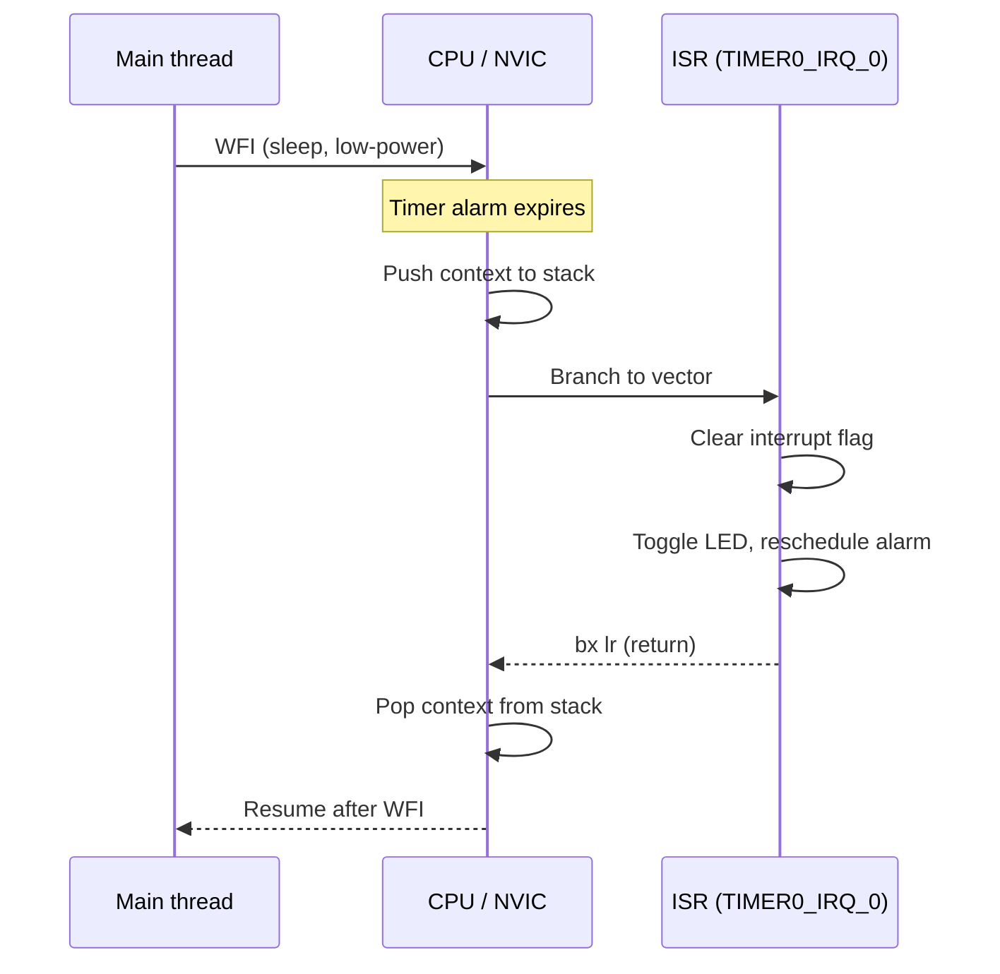
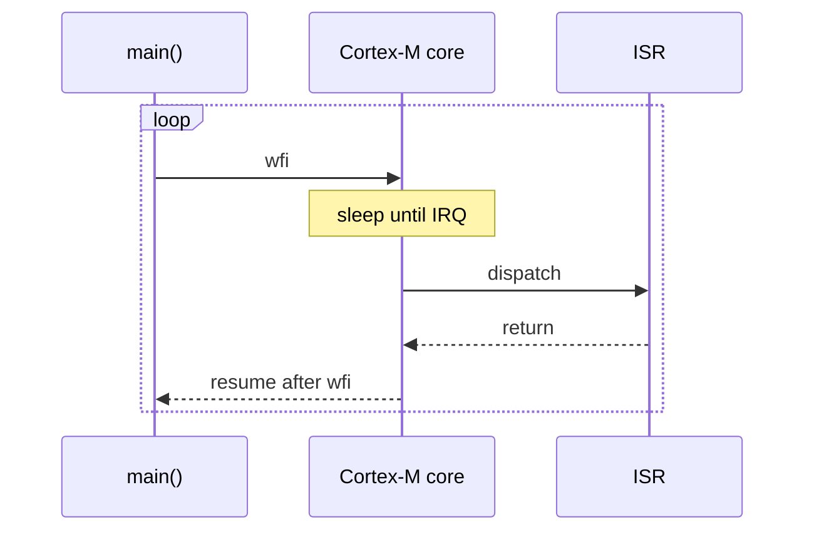

# Lecture 10: Interrupts

**Video:** https://www.youtube.com/watch?v=t5Wbx5XKV9M
**Uploader:** DigiKey  **Duration:** ~22 min  **Published:** 2026-03-26

## Table of Contents

- [Introduction](#introduction)
- [What is an Interrupt?](#what-is-an-interrupt)
- [Polling versus Interrupts](#polling-versus-interrupts)
- [ARM Cortex-M Vector Table and the NVIC](#arm-cortex-m-vector-table-and-the-nvic)
- [Interrupt Service Routine Latency](#interrupt-service-routine-latency)
- [Project Setup: timer-interrupt](#project-setup-timer-interrupt)
- [Crates and Imports](#crates-and-imports)
- [Sharing State Between Main and ISR in Rust](#sharing-state-between-main-and-isr-in-rust)
- [Defining a Global Pin Alias](#defining-a-global-pin-alias)
- [The `Mutex<RefCell<Option<...>>>` Pattern](#the-mutexrefcelloption-pattern)
- [Configuring the Timer and Alarm](#configuring-the-timer-and-alarm)
- [Critical Sections and Moving Values into Globals](#critical-sections-and-moving-values-into-globals)
- [Unmasking the NVIC Interrupt Line](#unmasking-the-nvic-interrupt-line)
- [The `wait-for-interrupt` (`wfi`) Idle Loop](#the-wait-for-interrupt-wfi-idle-loop)
- [Writing the ISR with `#[interrupt]`](#writing-the-isr-with-interrupt)
- [Destructuring Assignment with Pattern Matching](#destructuring-assignment-with-pattern-matching)
- [Building and Flashing the Firmware](#building-and-flashing-the-firmware)
- [GPIO EXTI Example and the Pin-Change Challenge](#gpio-exti-example-and-the-pin-change-challenge)
- [Switch Debouncing](#switch-debouncing)
- [Source Code](#source-code)
- [Quick Reference](#quick-reference)

---

## Introduction

Interrupts are foundational to embedded systems. They allow the processor to
stop the current thread of execution, handle some event in a deterministic
amount of time, and then resume exactly where it left off. The events that
trigger an interrupt can be external (a GPIO line changing state, a UART byte
arriving) or internal (a timer expiring, a watchdog firing).

This lecture follows on from the unit-test work in the previous episode and
returns to embedded-specific code. We build a `timer-interrupt` application
that uses a hardware timer alarm on the RP235x to toggle an LED entirely from
an interrupt service routine (ISR), while the main thread sleeps using the
ARM Cortex-M `wfi` instruction.

---

## What is an Interrupt?

An interrupt is a hardware signal to the CPU that asks it to suspend the
current instruction stream and jump to a dedicated routine -- the **interrupt
service routine (ISR)** -- to handle the event. After the ISR finishes, the
CPU automatically restores the saved registers and returns to the interrupted
code.

> [!IMPORTANT]
> Interrupts respond to events **quickly** and **predictably**. That
> determinism is the property that makes them indispensable for real-time
> behaviour: a timer or external pin event is serviced within a bounded number
> of cycles, regardless of what the main thread is doing.



---

## Polling versus Interrupts

There are two basic ways to react to an event:

| Strategy | Mechanism | Latency | CPU usage | Determinism |
|---|---|---|---|---|
| Polling | Main loop reads a status register or pin in a tight loop | Bounded by loop period | High (CPU busy) | Depends on loop length |
| Interrupts | Hardware signals the CPU directly via the NVIC | A handful of cycles | Very low (CPU may sleep) | Hardware-bounded |

The blinky example from earlier in the series **looked** interrupt-driven,
but it was actually using a *blocking* delay backed by a hardware timer that
the HAL abstracted away. In this lecture we drop one level lower and drive
the LED from a real ISR.

---

## ARM Cortex-M Vector Table and the NVIC

ARM Cortex-M parts (including the RP2350) include the **Nested Vectored
Interrupt Controller (NVIC)**. The NVIC owns a table of function pointers --
the **vector table** -- where each entry corresponds to a specific interrupt
line (the *exception number*). When a peripheral asserts an interrupt, the
NVIC:

1. Latches the request.
2. Compares its priority against the currently-executing context.
3. If higher (lower numeric value), pre-empts the current code.
4. Pushes a defined set of registers onto the stack (R0-R3, R12, LR, PC, xPSR).
5. Loads the PC from the corresponding vector-table slot.
6. On `bx lr` with an `EXC_RETURN` value, restores the saved context.

The RP235x HAL re-exports a `pac::interrupt` enumeration that maps named
interrupt sources to their NVIC line numbers. The relevant one for this
lecture is `TIMER0_IRQ_0`.

> [!IMPORTANT]
> The name of the function decorated with `#[interrupt]` **must match** an
> entry in the PAC's `interrupt` enum. `cortex-m-rt` uses that name to place
> the function pointer into the correct vector-table slot at link time.

---

## Interrupt Service Routine Latency

For a Cortex-M0+/M33-class core, the worst-case time from interrupt assertion
to first ISR instruction is dominated by context save and pipeline refill:

$$
t_{\text{response}} = t_{\text{detect}} + t_{\text{stacking}} + t_{\text{fetch}}
$$

In practice, on a Cortex-M33 running at $f_\text{CPU}$ Hz, the entry latency
is on the order of 12 cycles:

$$
t_{\text{entry}} \approx \frac{12}{f_{\text{CPU}}}
$$

Tail-chaining (consecutive pending interrupts) collapses the unstack/restack
overhead so back-to-back ISRs are even cheaper:

$$
t_{\text{tail-chain}} < t_{\text{entry}} + t_{\text{exit}}
$$

> [!CAUTION]
> Keep ISRs short. Any long-running work executed inside an ISR delays
> every lower-priority interrupt and increases worst-case latency for the
> entire system. A bounded ISR that sets a flag and returns is almost
> always preferable to an ISR that "does the work".

---

## Project Setup: timer-interrupt

The lecture begins by copying the existing `blinky` application into a new
crate:

1. `cd apps`
2. Delete the `target` folder (so the copy is fast).
3. Copy `blinky` and rename the copy to `timer-interrupt`.
4. Edit `Cargo.toml` and rename the `package.name` to `timer-interrupt`.

Two extra dependencies must be added:

```toml
[dependencies]
fugit = "0.3"            # time-unit types (millis, micros, durations)
critical-section = "1"   # cross-platform critical-section / mutex primitives
```

`fugit` provides ergonomic duration helpers such as
`MicrosDurationU32::millis(500)`. The `critical-section` crate exposes a
portable `Mutex` type whose lock is "global interrupts disabled" rather than
a thread mutex -- exactly the right primitive for sharing state with an ISR.

---

## Crates and Imports

The new `main.rs` imports, beyond what `blinky` already used:

```rust
use core::cell::RefCell;

use critical_section::Mutex;
use cortex_m::peripheral::NVIC;
use fugit::MicrosDurationU32;

use embedded_hal::digital::StatefulOutputPin; // for .toggle()

use hal::gpio::{FunctionSio, Pin, PullDown, SioOutput};
use hal::pac::interrupt;
use hal::timer::{Alarm, Alarm0, CopyableTimer0};
```

A few notes:

- `embedded_hal::digital::OutputPin` is replaced by
  `embedded_hal::digital::StatefulOutputPin`, which provides `.toggle()`.
  A stateful output pin remembers its previous level so toggling does not
  require a read-modify-write of the GPIO output register.
- The `CopyableTimer0` marker lets multiple alarms reference the same
  underlying hardware timer.
- Bringing `cortex_m::peripheral::NVIC` and `hal::pac::interrupt` into scope
  is what ties this crate to Cortex-M; the code is no longer portable to
  non-Cortex-M targets.

> [!TIP]
> If IntelliSense fails to pick up the new traits, press
> `Ctrl+P`, type `>` and run *Rust Analyzer: Restart server*. Give it a few
> seconds to re-index.

---

## Sharing State Between Main and ISR in Rust

In C, sharing a variable between `main()` and an ISR is trivial: declare it
`volatile` and access it from both contexts.

```c
volatile uint32_t counter = 0;
void TIMER0_IRQHandler(void) { counter++; }
```

Rust's ownership model makes this much harder. Only one piece of code may
own a value at a time, and only one mutable borrow may exist at a time.
A static `Pin` cannot simply be mutated from two contexts.

The standard embedded Rust idiom is:

$$
\text{shared state} = \texttt{Mutex<RefCell<Option<T>>>}
$$

Each layer of that onion has a specific job:

| Layer | Purpose |
|---|---|
| `Option<T>` | Lets the static start as `None` and have a value moved in later, after peripherals are initialised. |
| `RefCell<T>` | Enforces single-mutable-borrow at **runtime** instead of compile time, so `&` references can yield interior mutability. |
| `Mutex<T>` (from `critical-section`) | Requires a `CriticalSection` token to access the inner value. Holding that token implies global interrupts are disabled, so no ISR can pre-empt the access. |

> [!WARNING]
> A bare `static mut` would technically compile, but every access is
> `unsafe` and there is nothing preventing the main thread from being
> pre-empted mid-write by an ISR that reads or writes the same variable.
> Always wrap shared state in the `Mutex<RefCell<Option<T>>>` pattern (or
> use atomics for word-sized flags).

---

## Defining a Global Pin Alias

`Pin` in the RP HAL is a heavily-generic type. To keep the static
declaration readable, the lecture introduces a type alias:

```rust
type LedPin = Pin<hal::gpio::bank0::Gpio15, FunctionSio<SioOutput>, PullDown>;
```

Three pieces of information are encoded in the type:

1. **Pin ID** -- `Gpio15`, fixing the physical pin.
2. **Function** -- `FunctionSio<SioOutput>`, i.e. single-cycle IO configured
   as an output.
3. **Pull resistor** -- `PullDown`. `PullNone` would arguably be more correct
   for a push-pull output, but `.into_push_pull_output()` defaults to
   `PullDown`, and matching that keeps the types compatible.

---

## The `Mutex<RefCell<Option<...>>>` Pattern

With the alias in place, the two shared globals are declared:

```rust
static G_ALARM: Mutex<RefCell<Option<Alarm0<CopyableTimer0>>>> =
    Mutex::new(RefCell::new(None));

static G_LED: Mutex<RefCell<Option<LedPin>>> =
    Mutex::new(RefCell::new(None));
```

- `static` -- lives for the whole program.
- `G_ALARM`, `G_LED` -- conventional SCREAMING_SNAKE_CASE names.
- Initialised to `None`. The real values are moved in after peripheral
  initialisation, inside a critical section.

---

## Configuring the Timer and Alarm

`Timer::alarm_0()` returns `Option<Alarm0<...>>`, since alarms 0..3 are a
finite resource. We unwrap the first one:

```rust
let mut alarm = timer.alarm_0().unwrap();
let _ = alarm.schedule(MicrosDurationU32::millis(500));
alarm.enable_interrupt();
```

Three things happen here:

1. **Take ownership of alarm 0.** Up to four alarms (0..3) can share the
   same underlying hardware timer.
2. **Schedule the first firing.** `schedule` wants a `MicrosDurationU32`;
   `MicrosDurationU32::millis(500)` performs the conversion to microseconds
   internally. The return value of `schedule` is discarded with `let _ = ...`.
3. **Enable the interrupt on the alarm itself.** Forgetting this line is the
   most common reason an ISR "never fires" -- the alarm will still expire,
   but no interrupt request reaches the NVIC.

---

## Critical Sections and Moving Values into Globals

The peripherals are still owned by the local function. They must be moved
into the global statics through the mutex. That is done with
`critical_section::with`, a function that takes a closure and passes it a
`CriticalSection` token:

```rust
critical_section::with(|cs| {
    G_ALARM.borrow(cs).replace(Some(alarm));
    G_LED.borrow(cs).replace(Some(led_pin));
});
```

Inside the closure:

- `cs` is the **critical-section token**. Holding it is the proof that
  interrupts are currently disabled.
- `.borrow(cs)` returns a `&RefCell<Option<T>>`. The token is the key that
  unlocks the mutex.
- `.replace(Some(alarm))` swaps the inner `Option`, transferring ownership
  of `alarm` into the global and returning whatever was there before
  (here, `None`).

> [!IMPORTANT]
> Because `G_ALARM` and `G_LED` are wrapped in `Mutex<RefCell<...>>`, you
> **cannot** assign to them with `=`. Every access must go through the
> `.borrow(cs)` / `.replace(...)` (or `.borrow_mut()`) pattern.

---

## Unmasking the NVIC Interrupt Line

Even with the alarm interrupt enabled at the peripheral, the NVIC must be
told to forward that line to the core. The `cortex-m::peripheral::NVIC`
helpers do this, but they touch hardware directly and are `unsafe`:

```rust
unsafe {
    NVIC::unmask(hal::pac::Interrupt::TIMER0_IRQ_0);
}
```

The PAC's `Interrupt` enum lists every interrupt source in the RP235x.
`TIMER0_IRQ_0` is the line associated with alarm 0 of timer 0. The
**name of the ISR must match this enum variant** so that `cortex-m-rt` can
place the function pointer into the correct vector-table slot.

| Source | PAC variant | Purpose |
|---|---|---|
| Timer 0, alarm 0 | `TIMER0_IRQ_0` | Used in this lecture |
| Timer 0, alarm 1 | `TIMER0_IRQ_1` | Spare alarm |
| Timer 0, alarm 2 | `TIMER0_IRQ_2` | Spare alarm |
| Timer 0, alarm 3 | `TIMER0_IRQ_3` | Spare alarm |
| Bank 0 GPIO | `IO_IRQ_BANK0` | All bank-0 GPIO edge/level events |

> [!CAUTION]
> Priority registers (`NVIC::set_priority`) are not configured in this
> example, so all unmasked interrupts run at the default priority. Once
> multiple interrupts are in play, deliberately set priorities to control
> pre-emption behaviour; otherwise you may see surprising ordering.

---

## The `wait-for-interrupt` (`wfi`) Idle Loop

With everything driven from the ISR, `main` has nothing to do. Rather than
spin, the Cortex-M `wfi` instruction puts the core into a low-power state
until any interrupt fires:

```rust
loop {
    cortex_m::asm::wfi();
}
```

`wfi` returns immediately after the ISR completes, so any work that should
happen "after an event" can be placed below the `wfi` call within the loop
body.



---

## Writing the ISR with `#[interrupt]`

`cortex-m-rt` re-exports an `#[interrupt]` attribute (via the PAC) that:

- Verifies the function name matches a valid interrupt variant.
- Registers the function pointer in the vector table at link time.
- Emits the necessary prologue/epilogue to save and restore caller-saved
  registers cleanly.

```rust
#[interrupt]
fn TIMER0_IRQ_0() {
    critical_section::with(|cs| {
        let mut alarm_ref = G_ALARM.borrow(cs).borrow_mut();
        let mut led_ref   = G_LED.borrow(cs).borrow_mut();

        if let (Some(alarm), Some(led)) =
            (alarm_ref.as_mut(), led_ref.as_mut())
        {
            alarm.clear_interrupt();
            let _ = led.toggle();
            let _ = alarm.schedule(fugit::MicrosDurationU32::millis(500));
        }
    });
}
```

Step by step:

1. Enter a critical section so the borrow of the `RefCell` cannot race
   another context.
2. `borrow_mut()` returns a `RefMut<Option<T>>`. We take that for both the
   alarm and the LED.
3. Pattern-match `(Some(alarm), Some(led))` so the rest of the body only
   runs when both globals have been initialised. If either is still `None`,
   the body is skipped silently.
4. **Clear the interrupt flag.** The NVIC will keep re-entering the ISR
   immediately otherwise.
5. Toggle the LED.
6. Re-arm the alarm for another 500 ms; alarms are one-shot.

> [!CAUTION]
> Failing to call `alarm.clear_interrupt()` (or the equivalent
> peripheral-specific acknowledgement) is the classic embedded bug: the
> ISR fires, returns, the pending bit is still set, and the core re-enters
> the ISR instantly -- an infinite handler loop that starves the main
> thread completely.

---

## Destructuring Assignment with Pattern Matching

The line

```rust
if let (Some(alarm), Some(led)) = (alarm_ref.as_mut(), led_ref.as_mut()) {
    /* ... */
}
```

is worth unpacking. `as_mut` converts `&mut Option<T>` into
`Option<&mut T>`. The right-hand side is therefore a tuple of two
`Option<&mut _>` values. The pattern on the left destructures that tuple
and binds:

- `alarm: &mut Alarm0<CopyableTimer0>`
- `led:   &mut LedPin`

if and only if **both** options are `Some`. If either is `None`, the
pattern fails to match, the `if let` evaluates to false, and the body is
skipped. There is no need for nested `if let Some(...) = ...` ladders.

---

## Building and Flashing the Firmware

From the new project directory:

```bash
cd apps/timer-interrupt
cargo build
picotool uf2 convert \
    target/thumbv8m.main-none-eabihf/debug/timer-interrupt -t elf \
    firmware.uf2
```

A handful of warnings ("unused import") may appear after the
`OutputPin` to `StatefulOutputPin` swap; remove the stale imports and
rebuild. To deploy:

1. Hold **BOOTSEL** on the Pico and connect it via USB.
2. The board enumerates as a mass-storage device.
3. Copy `firmware.uf2` onto the drive.
4. The LED begins blinking at 1 Hz -- but now driven entirely by the
   timer ISR while the core sleeps in `wfi`.

The visible behaviour matches the original blinky, yet the CPU is idle
nearly all the time.

---

## GPIO EXTI Example and the Pin-Change Challenge

The closing challenge is to drive the LED from an external **pin-change**
interrupt rather than a timer.

```
    3V3 ──┬───┐
          │   │ 10 kΩ pull-up
          │   │
          ├───●────────► GPIO (input, EXTI)
          │
          /  Push button
          \
          │
         GND
```

The starting point is the `gpio_irq` example in the `rp-hal` repository,
under `rp235x-hal/examples/`. Its structure mirrors the timer example:

1. Configure the button pin as an input with the appropriate pull resistor.
2. Attach an interrupt source -- e.g. `pin.set_interrupt_enabled(EdgeLow, true)`.
3. Move the pin into a `Mutex<RefCell<Option<...>>>` static.
4. Unmask `IO_IRQ_BANK0` in the NVIC.
5. Spin in `wfi` from `main`.
6. The ISR borrows the pin, clears the interrupt source, and acts on the
   event.

The lecture's example toggles the LED directly inside the ISR. That is
quick but fragile, because mechanical switches bounce.

---

## Switch Debouncing

A real push-button does not produce a single clean edge:

```
ideal:    ──────┐_______________
                │
pressed: ──┐_┌┐_┐_______________
                ^^^^ tens of ms of bounce
```

The challenge requires moving the action out of the ISR and debouncing in
main:

1. ISR sets a `static FLAG: AtomicBool = AtomicBool::new(false);` to `true`
   and returns immediately.
2. `main` loops on `wfi`. After `wfi` returns, it checks `FLAG.load(...)`.
3. If `true`, the flag is cleared, the CPU blocks for **50 ms**, then
   the pin is sampled again.
4. If the pin is still asserted, the LED is toggled.

> [!IMPORTANT]
> Use an **atomic** type for a flag-only signal (e.g.
> `core::sync::atomic::AtomicBool` with `Ordering::Relaxed` or
> `Ordering::SeqCst`). Atomics do not require a critical section for
> word-sized loads and stores, so they are cheaper than the
> `Mutex<RefCell<...>>` machinery.

> [!CAUTION]
> Never block for 50 ms **inside** an ISR. Doing so delays every other
> interrupt by the same 50 ms and destroys the latency guarantees that
> made interrupts attractive in the first place. Blocking briefly in
> `main` is acceptable; blocking in an ISR is not.

---

## Source Code

The companion applications for this lecture live in the workspace:

- **Main demo (timer ISR):**
  [`workspace/apps/timer-interrupt`](../workspace/apps/timer-interrupt) --
  toggles the LED on GPIO15 from a `TIMER0_IRQ_0` ISR while `main` sleeps
  in `wfi`.
- **Challenge (GPIO EXTI):**
  [`workspace/apps/external-interrupt`](../workspace/apps/external-interrupt)
  -- a button on GPIO14 fires `IO_IRQ_BANK0`; the ISR sets an
  `AtomicBool` flag and `main` debounces with a 50 ms delay before
  toggling the LED.

---

## Quick Reference

**The shared-state recipe**

```rust
type LedPin = Pin<Gpio15, FunctionSio<SioOutput>, PullDown>;

static G_LED: Mutex<RefCell<Option<LedPin>>> =
    Mutex::new(RefCell::new(None));

// in main, after peripherals are configured:
critical_section::with(|cs| {
    G_LED.borrow(cs).replace(Some(led));
});

// in the ISR:
critical_section::with(|cs| {
    if let Some(led) = G_LED.borrow(cs).borrow_mut().as_mut() {
        let _ = led.toggle();
    }
});
```

**Enabling an interrupt end-to-end**

| Step | API | Reason |
|---|---|---|
| 1 | `alarm.enable_interrupt()` | Peripheral asks core for interrupts. |
| 2 | `unsafe { NVIC::unmask(pac::Interrupt::TIMER0_IRQ_0) }` | NVIC forwards line to core. |
| 3 | `#[interrupt] fn TIMER0_IRQ_0()` | Vector-table slot bound to handler. |
| 4 | Inside ISR: `alarm.clear_interrupt()` | Acknowledge so the line does not re-trigger immediately. |

**Concurrency primitives, picked by use case**

| Need | Primitive |
|---|---|
| Boolean flag set in ISR, read in main | `AtomicBool` |
| Counter (word-sized) | `AtomicU32` / `AtomicUsize` |
| Compound peripheral handle (`Pin`, `Alarm0`) | `Mutex<RefCell<Option<T>>>` |
| Brief mutual exclusion across contexts | `critical_section::with(|cs| { ... })` |

**Cortex-M idle idiom**

```rust
loop {
    cortex_m::asm::wfi();
}
```

**Common ISR pitfalls**

- Forgetting `enable_interrupt()` on the peripheral.
- Forgetting `NVIC::unmask(...)`.
- Misnaming the ISR (must match the PAC `Interrupt` variant exactly).
- Forgetting to clear/acknowledge the source inside the ISR.
- Running long work or blocking delays inside the ISR.
- Sharing state through `static mut` instead of `Mutex<RefCell<...>>`/atomics.

**Next episode:** step-through debugging with the Raspberry Pi Debug Probe.
