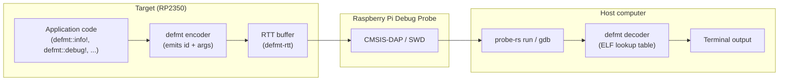

# Lecture 11: Logging with defmt and Step-through Debugging

**Video:** https://www.youtube.com/watch?v=UZF2ToD2udA
**Uploader:** DigiKey  **Duration:** ~25 min  **Published:** 2026-04-02

## Table of Contents

- [Overview](#overview)
- [Hardware Setup: The Raspberry Pi Debug Probe](#hardware-setup-the-raspberry-pi-debug-probe)
- [Why defmt? Deferred Formatting and String Interning](#why-defmt-deferred-formatting-and-string-interning)
- [Host and Target Topology](#host-and-target-topology)
- [Project Configuration](#project-configuration)
  - [Linker Flag and Environment Variable](#linker-flag-and-environment-variable)
  - [Cargo.toml Dependencies and Profiles](#cargotoml-dependencies-and-profiles)
- [defmt Log Levels and Macros](#defmt-log-levels-and-macros)
- [main.rs: Imports, Panic Handler, and Log Macros](#mainrs-imports-panic-handler-and-log-macros)
- [Building With and Without defmt](#building-with-and-without-defmt)
- [Installing probe-rs and Drivers](#installing-probe-rs-and-drivers)
- [Running and Flashing with probe-rs](#running-and-flashing-with-probe-rs)
- [Step-through Debugging with GDB](#step-through-debugging-with-gdb)
- [VS Code Debugging with Cortex-Debug](#vs-code-debugging-with-cortex-debug)
- [Limitations and Caveats](#limitations-and-caveats)
- [Source Code](#source-code)
- [Quick Reference](#quick-reference)

## Overview

Toggling a pin or printing strings over a serial port can carry a beginner project a long way, but as embedded systems grow in complexity additional tooling becomes necessary. This lecture introduces two advanced debugging mechanisms: the `defmt` (deferred formatting) logging framework, and step-through debugging using `probe-rs` together with GDB and the Cortex-Debug VS Code extension.

> [!IMPORTANT]
> GDB support for Rust on the RP2350 is, at the time of recording, new and a little buggy. `defmt` logging, by contrast, is fast and reliable; pin toggling combined with `defmt` messages is the most pragmatic everyday workflow.

## Hardware Setup: The Raspberry Pi Debug Probe

The lecture uses the Raspberry Pi Debug Probe, an inexpensive RP2040-based hardware debugger that communicates over SWD (Serial Wire Debug) and UART to RP2040 / RP2350 targets. For this demo only the **D** (debug) port on the probe is used; the **U** (UART) port is unused.

Wiring (using the supplied JST cable to the Pico2 SWD header):

| Probe wire | Pico2 pin |
|------------|-----------|
| Orange     | SWCLK     |
| Black      | GND       |
| Yellow     | SWDIO     |

Both the Pico2 and the debug probe must be powered over their own USB cables; the probe does not supply power to the target.

## Why defmt? Deferred Formatting and String Interning

Traditional embedded logging (for example, `println!` over a UART) embeds the full ASCII format string into the firmware image and formats it on the target. `defmt` instead places the format strings in a dedicated section of the ELF file that is **never flashed** to the device. At runtime, the target transmits only a small integer identifier together with the runtime arguments; the host tool (`probe-rs`) performs the lookup against the ELF and prints the rendered message.

The flash savings are substantial. A naive estimate: if the average format-string body is $B$ bytes and a program has $N$ log sites, traditional logging costs roughly

$$\text{flash}_\text{ascii} \approx N \cdot B \text{ bytes}$$

`defmt` reduces this to

$$\text{flash}_\text{defmt} \approx N \cdot k \text{ bytes}, \quad k \in \{1, 2\}$$

where $k$ is the size of the interned identifier. For $B \approx 30$ bytes and $N$ in the hundreds the saving is roughly an order of magnitude. In this lecture the example grows from approximately 1.8 kB (no `defmt`) to about 48 kB (debug profile, full `defmt`) -- mostly debug metadata rather than the strings themselves.

> [!TIP]
> Because the format strings live on the host, log output is also fast: the SWD link only carries integer identifiers plus the variable arguments.

## Host and Target Topology



The encoder lives on the target, the decoder lives on the host, and only compact identifiers cross the SWD link via the RTT (Real-Time Transfer) transport.

## Project Configuration

The example is derived from the `blinky` project of Episode 2, copied into `apps/blinky-debug`.

### Linker Flag and Environment Variable

A linker argument must be added so the linker pulls in the `defmt` section descriptor:

```toml
# .cargo/config.toml
[build]
# Target is the Cortex-M33 with FPU enabled
target = "thumbv8m.main-none-eabihf"

[target.thumbv8m.main-none-eabihf]
rustflags = [
  # Compiler optimizations
  "-C", "target-cpu=cortex-m33",    # Target the Cortex-M33

  # Linker directives
  "-C", "link-arg=-Tlink.x",  # Use link.x script with cortex-m-rt to lay out memory
  "-C", "link-arg=--nmagic",  # Prevent padding memory between sections to save space
  "-C", "link-arg=-Tdefmt.x", # Store debug string lookup table in binary (required for defmt to work)
]

[env]
DEFMT_LOG = "debug"
```

`DEFMT_LOG` is consumed by Cargo at **build time**: the macros for levels finer than the configured threshold are compiled out entirely. There is no runtime cost for filtered-out messages.

> [!TIP]
> Set `DEFMT_LOG` to `trace`, `debug`, `info`, `warn`, `error`, or `off`. To temporarily disable logging from the command line without editing the file, prefix the build command, for example:
> `DEFMT_LOG=off cargo size --release`.

### Cargo.toml Dependencies and Profiles

```toml
[package]
name = "blinky-debug"
version = "0.1.0"
edition = "2021"

[dependencies]
cortex-m = "0.7"
cortex-m-rt = "0.7"
rp235x-hal = { version = "0.2", features = ["binary-info", "critical-section-impl", "rt"] }
embedded-hal = "1.0"

defmt = "0.3"
defmt-rtt = "0.4"
panic-probe = { version = "0.3", features = ["print-defmt"] }

[profile.dev]
codegen-units = 1

[profile.release]
opt-level = "s"
lto = true
codegen-units = 1
strip = true
```

Notes:
- `defmt-rtt` is the **transport** that carries the encoded log records over RTT.
- `panic-probe` provides the panic handler; the `print-defmt` feature routes panic messages through `defmt`. This replaces any existing user-defined `#[panic_handler]`.
- `codegen-units = 1` in the `dev` profile keeps everything compiled together, which helps step-through debugging cope with inlining.

## defmt Log Levels and Macros

`defmt` exposes five macros that mirror the standard log crate, in order of increasing severity:

| Macro            | Level   | Typical use                                |
|------------------|---------|--------------------------------------------|
| `defmt::trace!`  | TRACE   | Extremely verbose per-iteration tracing    |
| `defmt::debug!`  | DEBUG   | Developer diagnostics                      |
| `defmt::info!`   | INFO    | Lifecycle events ("starting blinky")       |
| `defmt::warn!`   | WARN    | Recoverable anomalies                      |
| `defmt::error!`  | ERROR   | Hard failures, fault paths                 |

Setting `DEFMT_LOG=debug` admits `debug`, `info`, `warn`, and `error`; setting `DEFMT_LOG=warn` admits only `warn` and `error`.

## main.rs: Imports, Panic Handler, and Log Macros

```rust
#![no_std]
#![no_main]

// Alias our HAL
use rp235x_hal as hal;

// Import traits for embedded abstractions
use embedded_hal::delay::DelayNs;
use embedded_hal::digital::OutputPin;

// Debugging output
use defmt::*;
use defmt_rtt as _;

// Let panic_probe handle our panic routine
use panic_probe as _;

// Copy boot metadata to .start_block so Boot ROM knows how to boot our program
#[unsafe(link_section = ".start_block")]
#[used]
pub static IMAGE_DEF: hal::block::ImageDef = hal::block::ImageDef::secure_exe();

// Set external crystal frequency
const XOSC_CRYSTAL_FREQ: u32 = 12_000_000;

// Main entrypoint (custom defined for embedded targets)
#[hal::entry]
fn main() -> ! {
    info!("Starting blinky");

    // Get ownership of hardware peripherals
    let mut pac = hal::pac::Peripherals::take().unwrap();

    // Set up the watchdog and clocks
    let mut watchdog = hal::Watchdog::new(pac.WATCHDOG);
    let clocks = hal::clocks::init_clocks_and_plls(
        XOSC_CRYSTAL_FREQ,
        pac.XOSC,
        pac.CLOCKS,
        pac.PLL_SYS,
        pac.PLL_USB,
        &mut pac.RESETS,
        &mut watchdog,
    )
    .ok()
    .unwrap();

    // Single-cycle I/O block (fast GPIO)
    let sio = hal::Sio::new(pac.SIO);

    // Split off ownership of Peripherals struct, set pins to default state
    let pins = hal::gpio::Pins::new(
        pac.IO_BANK0,
        pac.PADS_BANK0,
        sio.gpio_bank0,
        &mut pac.RESETS,
    );

    // Configure pin, get ownership of that pin
    let mut led_pin = pins.gpio15.into_push_pull_output();

    // Move ownership of TIMER0 peripheral to create Timer struct
    let mut timer = hal::Timer::new_timer0(pac.TIMER0, &mut pac.RESETS, &clocks);

    // Blink loop
    loop {
        led_pin.set_high().unwrap();
        debug!("LED on");
        timer.delay_ms(500);
        led_pin.set_low().unwrap();
        debug!("LED off");
        timer.delay_ms(500);
    }
}
```

Key points:
- `use defmt::*;` brings the level macros into scope.
- `use defmt_rtt as _;` is a *side-effect import*: it registers the RTT transport as the `defmt` global logger without exposing a name.
- `use panic_probe as _;` similarly installs the panic handler; no manual `#[panic_handler]` may be present in the crate.

## Building With and Without defmt

A debug build with `defmt` enabled:

```bash
cd apps/blinky-debug
cargo build
```

To produce a release binary **without** `defmt`, two steps are needed:

1. Comment out the `-Tdefmt.x` linker argument in `.cargo/config.toml` (this stops embedding the lookup section).
2. Override the environment variable for the invocation:

```bash
DEFMT_LOG=off cargo build --release
DEFMT_LOG=off cargo size --release
```

> [!IMPORTANT]
> If you forget `DEFMT_LOG=off`, the build may fail with a `defmt timestamp` error because `defmt` insists on a timestamp provider that is not configured by default on this target. The timestamp can be supplied via a `defmt::timestamp!(...)` macro registering a free-running counter; this is omitted in the lecture.

A representative size comparison:

| Build              | Approx. flash usage |
|--------------------|--------------------:|
| Plain blinky       | 1.8 kB              |
| blinky-debug (`defmt` on, debug profile) | ~48 kB |

The bulk of the increase is debug metadata; the format-string section itself is small.

## Installing probe-rs and Drivers

On Windows the `CMSIS-DAP v2` interface presented by the debug probe needs the WinUSB driver. Use [Zadig](https://zadig.akeo.ie/), enable *Options > List All Devices*, select `CMSIS-DAP v2 Interface`, choose the WinUSB driver and click **Install Driver**.

Then install `probe-rs` itself (it is, fittingly, written in Rust):

```bash
# Linux / macOS
curl --proto '=https' --tlsv1.2 -LsSf https://github.com/probe-rs/probe-rs/releases/latest/download/probe-rs-tools-installer.sh | sh

# Windows (PowerShell)
irm https://github.com/probe-rs/probe-rs/releases/latest/download/probe-rs-tools-installer.ps1 | iex
```

On Windows the `cargo/bin` directory must be on `PATH`:

```powershell
$env:PATH = "C:\Users\<you>\.cargo\bin;$env:PATH"
```

Verify:

```bash
probe-rs list                       # should show the CMSIS-DAP probe with an ID
probe-rs info --protocol swd --speed 1000   # 1 MHz; lower speed often more reliable
```

> [!TIP]
> If `probe-rs info` fails, unplug and replug the debug probe. The classic "turn it off and on again" really does help here.

## Running and Flashing with probe-rs

```bash
cd apps/blinky-debug
probe-rs run \
  --protocol swd \
  --speed 1000 \
  --chip RP235x \
  target/thumbv8m.main-none-eabihf/debug/blinky-debug
```

Important: pass the **ELF** file directly. There is no need to convert to UF2 via `picotool`; `probe-rs` erases, flashes, and then attaches to the RTT channel automatically. The console will show:

```
INFO  starting blinky
DEBUG LED on
DEBUG LED off
...
```

Press **Ctrl+C** to detach.

## Step-through Debugging with GDB

`probe-rs gdb` exposes a GDB stub that can be attached to with any GDB build that understands the target architecture. The lecture works inside a Docker container, so the stub binds to the host's LAN IP so that the container can reach it.

Start the GDB stub on the host:

```bash
probe-rs gdb \
  --protocol swd \
  --speed 1000 \
  --chip RP235x \
  --gdb-connection-string 10.0.0.100:33033
```

From the container (`gdb-multiarch` is preinstalled):

```bash
gdb-multiarch target/thumbv8m.main-none-eabihf/debug/blinky-debug
```

Inside GDB:

```
(gdb) target remote 10.0.0.100:33033
(gdb) monitor reset halt        # often abbreviated `mon reset halt`
(gdb) break main
(gdb) continue
(gdb) list
(gdb) step
(gdb) print my_variable
(gdb) info registers
(gdb) quit
```

The `monitor` (or `mon`) prefix sends commands directly to the `probe-rs` GDB server rather than treating them as GDB built-ins.

> [!IMPORTANT]
> `defmt` output and a GDB session cannot run simultaneously against the same probe in this setup. While the GDB stub owns the link, the RTT channel will be silent.

## VS Code Debugging with Cortex-Debug

The [Cortex-Debug](https://marketplace.visualstudio.com/items?itemName=marus25.cortex-debug) extension gives a graphical front-end onto the same GDB stub. The lecture's Docker image ships it preinstalled.

Create `apps/.vscode/launch.json`:

```json
{
  "version": "0.2.0",
  "configurations": [
    {
      "name": "Attach (probe-rs GDB)",
      "type": "cortex-debug",
      "request": "attach",
      "cwd": "${workspaceFolder}",
      "servertype": "external",
      "gdbTarget": "10.0.0.100:33033",
      "objdumpPath": "/usr/bin/arm-none-eabi-objdump",
      "gdbPath": "/usr/bin/gdb-multiarch",
      "executable": "${input:elfPath}"
    }
  ],
  "inputs": [
    {
      "id": "elfPath",
      "type": "pickString",
      "description": "Select the ELF file to debug",
      "options": [
        "target/thumbv8m.main-none-eabihf/debug/blinky-debug"
      ]
    }
  ]
}
```

Workflow:

1. Start the `probe-rs gdb` stub on the host (as above).
2. In VS Code: *File > Open Workspace from File* and load the default `.code-workspace`.
3. Open the *Run and Debug* pane, choose the configuration, and pick the ELF from the dropdown.
4. Set breakpoints by clicking in the gutter (for example, on the clock initialisation line).
5. Use *Reset*, *Continue*, *Step Over*, *Step Into*, *Step Out* from the debug toolbar.

The *Watch* pane works for source-level variables. A *Live Watch* pane is available for memory-mapped values, but the lecture finds it unreliable over a remote GDB connection.

## Limitations and Caveats

| Concern                                | Notes                                                                                  |
|----------------------------------------|----------------------------------------------------------------------------------------|
| `defmt` + GDB simultaneously           | Not supported in this setup; pick one at a time.                                       |
| `Step Into` on RP2350 via Cortex-Debug | Frequently emits "cannot access memory at 0"; setting breakpoints is more reliable.    |
| Live Watch on remote GDB               | Memory-address watches do not work through `probe-rs gdb`; local-only.                 |
| Timestamps                             | `defmt::timestamp!` must be provided manually; otherwise build with `defmt` disabled.  |
| UF2 flashing                           | Not used here; `probe-rs` flashes the ELF directly via SWD.                            |

The presenter's pragmatic recommendation: lean on `defmt` logging and pin toggles for day-to-day work, drop into command-line GDB for the rare cases that require single-stepping, and treat the VS Code GUI as experimental on this target until tooling matures.

## Source Code

The companion demo for this lecture lives at [`workspace/apps/blinky-debug/`](../workspace/apps/blinky-debug/).

## Quick Reference

**Required Cargo dependencies**

```toml
defmt        = "0.3"
defmt-rtt    = "0.4"
panic-probe  = { version = "0.3", features = ["print-defmt"] }
```

**`.cargo/config.toml` essentials**

```toml
rustflags = ["-C", "link-arg=-Tdefmt.x", ...]

[env]
DEFMT_LOG = "debug"   # trace | debug | info | warn | error | off
```

**Source-level boilerplate**

```rust
use defmt::*;
use defmt_rtt as _;
use panic_probe as _;

info!("Starting blinky");
debug!("LED on");
```

**Probe and tool commands**

| Task                           | Command                                                                                  |
|--------------------------------|------------------------------------------------------------------------------------------|
| List probes                    | `probe-rs list`                                                                          |
| Target metadata                | `probe-rs info --protocol swd --speed 1000`                                              |
| Flash + RTT console            | `probe-rs run --protocol swd --speed 1000 --chip RP235x <ELF>`                           |
| GDB stub                       | `probe-rs gdb --protocol swd --speed 1000 --chip RP235x --gdb-connection-string <addr>`  |
| Connect from GDB               | `target remote <addr>` then `monitor reset halt` then `break main` then `continue`       |
| Build without `defmt`          | `DEFMT_LOG=off cargo build --release` (with `defmt.x` linker arg commented out)          |

**Debug-probe wiring (Pico2)**

| Wire   | Pin   |
|--------|-------|
| Orange | SWCLK |
| Yellow | SWDIO |
| Black  | GND   |

**Log levels admitted by `DEFMT_LOG`**

| `DEFMT_LOG` value | Emits                                |
|-------------------|--------------------------------------|
| `trace`           | trace, debug, info, warn, error      |
| `debug`           | debug, info, warn, error             |
| `info`            | info, warn, error                    |
| `warn`            | warn, error                          |
| `error`           | error                                |
| `off`             | nothing                              |
