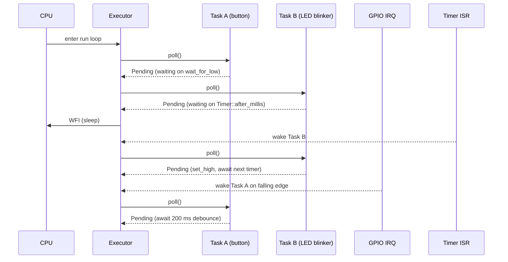

# Lecture 12: Async Programming with Embassy

**Video:** https://www.youtube.com/watch?v=m9FT1qSm-KM
**Uploader:** DigiKey  **Duration:** ~39 min  **Published:** 2026-04-09

This is the final episode in the *Introduction to Embedded Rust* series. It
introduces the Embassy framework, walks through cooperative concurrency
using `async`/`await`, and rebuilds the earlier blinking-LED + USB-serial
demo in an event-driven style. Along the way we contrast Embassy with RTIC
and FreeRTOS, look at the executor poll loop, and discuss the practical
implications of `'static` bounds on tasks and the dangers of blocking inside
async code.

## Table of Contents

- [1. Why Another Concurrency Framework?](#1-why-another-concurrency-framework)
- [2. Cooperative Concurrency vs Preemption](#2-cooperative-concurrency-vs-preemption)
- [3. Async / Await Primer: Futures, Poll and Wakers](#3-async--await-primer-futures-poll-and-wakers)
- [4. The Embassy Ecosystem](#4-the-embassy-ecosystem)
- [5. Project Setup: `.cargo/config.toml` and `Cargo.toml`](#5-project-setup-cargoconfigtoml-and-cargotoml)
- [6. Binding Interrupts the Embassy Way](#6-binding-interrupts-the-embassy-way)
- [7. The `#[embassy_executor::main]` Entry Point](#7-the-embassy_executormain-entry-point)
- [8. Defining Tasks with `#[embassy_executor::task]`](#8-defining-tasks-with-embassy_executortask)
- [9. The `Spawner` and `'static` Bounds](#9-the-spawner-and-static-bounds)
- [10. `embassy_time`: Timers and Durations](#10-embassy_time-timers-and-durations)
- [11. Async I/O: GPIO, USB, I2C and SPI](#11-async-io-gpio-usb-i2c-and-spi)
- [12. Inter-Task Communication with `embassy_sync`](#12-inter-task-communication-with-embassy_sync)
- [13. The Executor Poll Loop in Detail](#13-the-executor-poll-loop-in-detail)
- [14. Combinators: `join!`, `join_array` and `select!`](#14-combinators-join-join_array-and-select)
- [15. Embassy vs RTIC vs FreeRTOS](#15-embassy-vs-rtic-vs-freertos)
- [16. Static Memory Footprint](#16-static-memory-footprint)
- [17. Pitfalls: Blocking, Long Awaits, and Debouncing](#17-pitfalls-blocking-long-awaits-and-debouncing)
- [18. Flashing via UF2 and Verifying Behaviour](#18-flashing-via-uf2-and-verifying-behaviour)
- [19. Where to Go Next](#19-where-to-go-next)
- [Source Code](#source-code)
- [Quick Reference](#quick-reference)

## 1. Why Another Concurrency Framework?

Two frameworks dominate multitasking in embedded Rust today: **Embassy** and
**RTIC** (Real-Time Interrupt-driven Concurrency). RTIC sits closer to a
classical preemptive real-time operating system such as FreeRTOS, but lacks
some of the higher-level abstractions and ready-made libraries that Embassy
ships with. Embassy is currently the more popular of the two and is the
focus of this final episode.

Embassy is *not* a single library. It is a collection of cooperating crates:
HALs for several MCU families, an `async` executor, a time crate, a USB
stack, a networking stack and a synchronisation crate. You opt in to the
parts you need.

The demo for this episode reuses the hardware from earlier lectures:

- A push button on **GPIO 14** (pulled up internally).
- An LED on **GPIO 15** with a 220 Ω current-limiting resistor.

By the end we will toggle blinking on and off from the button while
simultaneously logging button presses over USB CDC -- all driven by
cooperative async tasks rather than a manual super-loop.

## 2. Cooperative Concurrency vs Preemption

Embassy schedules **cooperatively**. Tasks only relinquish the CPU when
they hit an `.await` point. There is no timer interrupt forcibly slicing
execution between tasks, and there is no priority-based preemption between
async tasks running on the same executor.

This has a profound implication, repeated several times in the lecture: if a
task enters a tight loop without awaiting anything, it monopolises the
processor forever. There is no scheduler to step in and run something else.

> [!WARNING]
> Never call a blocking function from inside an async task. A
> `cortex_m::asm::delay`, a busy-wait loop, or even a long synchronous I/O
> call will stall every other task sharing the executor. Use
> `Timer::after_millis(...).await` instead of a software delay, and prefer
> the async variants of peripheral drivers over their blocking equivalents.

| Property | Cooperative (Embassy) | Preemptive (RTIC / FreeRTOS) |
| --- | --- | --- |
| Switch point | Explicit `.await` | Any time the scheduler decides |
| Priority enforcement | No (within one executor) | Yes |
| Stack per task | Single shared stack; per-task state is a state machine | Separate stack per task |
| Determinism | Latency-bounded only if every task yields promptly | Strong, especially with fixed priorities |
| Risk of starvation | High if a task forgets to yield | Lower; scheduler can intervene |
| Typical overhead | Very low; no context switches | Higher; full register save/restore |

A useful informal characterisation:

$$
\text{Throughput} \propto \frac{1}{\text{context-switch cost}}
\qquad
\text{Latency}_{\text{worst-case}} \le \max_i \, t_{\text{between awaits},i}
$$

Cooperative schedulers maximise throughput and minimise switching overhead;
preemptive schedulers minimise worst-case latency.

## 3. Async / Await Primer: Futures, Poll and Wakers

The Rust `async`/`await` model has three core ingredients:

1. **`Future`** -- a state machine produced by an `async fn` or an `async`
   block. It represents a computation that may not yet be complete.
2. **`poll`** -- the executor calls `Future::poll`, which returns either
   `Poll::Ready(value)` or `Poll::Pending`.
3. **`Waker`** -- when a future returns `Pending`, it stores a `Waker`
   somewhere (an interrupt handler, a timer queue, etc). When the awaited
   event happens, the `Waker` is invoked and the executor knows to poll the
   future again.

In Embassy, `async fn` bodies are compiled into compact state machines that
live in static storage owned by the task slot, which is why tasks are
allocation-free and require `'static` lifetimes for their arguments.

> [!IMPORTANT]
> Every argument to a `#[embassy_executor::task]` function must satisfy
> `'static`. This is why peripheral singletons obtained from
> `embassy_rp::init(...)` are `'static`, and why the task in this lecture
> takes `Output<'static>` rather than a borrowed pin.

## 4. The Embassy Ecosystem

Embassy is documented at <https://embassy.dev/book>. The crates used in
this lecture are:

| Crate | Purpose |
| --- | --- |
| `embassy-executor` | Cooperative async executor and `#[main]` / `#[task]` macros. |
| `embassy-futures` | Async combinators such as `join`, `join_array`, `select`. |
| `embassy-time` | `Timer`, `Duration`, `Instant`; abstracts over hardware timers. |
| `embassy-rp` | HAL for the Raspberry Pi RP2040 / RP2350 family. |
| `embassy-usb` | Full USB device stack. |
| `embassy-usb-logger` | USB CDC ACM logger that plugs into the `log` crate. |
| `embassy-sync` | `Signal`, `Channel`, `Mutex`, etc. |
| `cortex-m`, `cortex-m-rt` | Underlying Cortex-M support. |
| `panic-probe` | Panic handler. |
| `log` | Lightweight logging façade used by `embassy-usb-logger`. |

You are free to mix and match. For example, you could use `embassy-rp`'s
blocking drivers without pulling in the executor at all.

## 5. Project Setup: `.cargo/config.toml` and `Cargo.toml`

Create the binary crate and add a `.cargo/config.toml` that targets the
Cortex-M33 found on the RP2350-A in the Pico 2:

```toml
[build]
target = "thumbv8m.main-none-eabihf"

[target.thumbv8m.main-none-eabihf]
rustflags = [
  "-C", "target-cpu=cortex-m33",
  "-C", "link-arg=-Tlink.x",
  "-C", "link-arg=--nmagic",
]
```

Note that, unlike previous episodes, there is no `defmt` or `probe-rs` run
configuration: we flash by drag-and-drop UF2 in this demo.

A complete `Cargo.toml` for the demo:

```toml
[package]
name = "embassy-demo"
version = "0.1.0"
edition = "2021"

[dependencies]
embassy-executor = { version = "0.9.0", features = ["arch-cortex-m", "executor-thread"] }
embassy-futures  = "0.1"
embassy-time     = "0.4"
embassy-rp       = { version = "0.4", features = ["time-driver", "critical-section-impl", "rp235xa"] }
embassy-usb      = "0.4"
embassy-usb-logger = "0.4"
embassy-sync     = "0.7.2"
log              = "0.4"
cortex-m         = "0.7"
cortex-m-rt      = "0.7"
panic-probe      = "0.3"

[profile.dev]
codegen-units = 1

[profile.release]
opt-level = "s"
lto = true
codegen-units = 1
strip = true
```

Pay attention to the `embassy-rp` features: `time-driver` wires up the
hardware timer, `critical-section-impl` provides the global critical-section
implementation used for atomics, and `rp235xa` selects the A-variant pinout
of the RP2350 on the Pico 2 (do not pick `rp235xb` by accident).

A `memory.x` identical to the one used in earlier blinky lectures must also
be present at the crate root, otherwise linking fails.

## 6. Binding Interrupts the Embassy Way

Embassy needs to know which interrupt handlers belong to which peripherals.
This is done declaratively with the `bind_interrupts!` macro:

```rust
use embassy_rp::bind_interrupts;
use embassy_rp::peripherals::USB;
use embassy_rp::usb::{Driver, InterruptHandler};

bind_interrupts!(struct Irqs {
    USBCTRL_IRQ => InterruptHandler<USB>;
});
```

The macro generates a zero-sized type `Irqs` whose impl wires the
`USBCTRL_IRQ` vector to `embassy_rp::usb::InterruptHandler<USB>`. The
`=>` is not normal Rust syntax; it is part of the macro's DSL.

## 7. The `#[embassy_executor::main]` Entry Point

`main` becomes an `async fn` and is annotated with `#[embassy_executor::main]`.
The macro hides the boilerplate of constructing the executor, allocating
the main task slot and running the poll loop.

```rust
#![no_std]
#![no_main]

// Embassy: HAL imports
use embassy_rp::bind_interrupts;
use embassy_rp::gpio;
use embassy_rp::peripherals::USB;
use embassy_rp::usb::{Driver, InterruptHandler};

// Embassy: main executor
use embassy_executor::Spawner;

// Embassy: futures
use embassy_futures::join::join_array;

// Embassy: timer
use embassy_time::Timer;

// Embassy: sync
use embassy_sync::blocking_mutex::raw::CriticalSectionRawMutex;
use embassy_sync::signal::Signal;

// Let panic_probe handle our panic routine
use panic_probe as _;

// Create signal handle
static SIGNAL_BLINK: Signal<CriticalSectionRawMutex, bool> = Signal::new();

// Macro to bind USB interrupt handler
bind_interrupts!(struct Irqs {
    USBCTRL_IRQ => InterruptHandler<USB>;
});

#[embassy_executor::main]
async fn main(spawner: Spawner) {
    // Initialize embassy HAL
    let p = embassy_rp::init(Default::default());

    // Initialize USB driver and task
    let usb_driver = Driver::new(p.USB, Irqs);
    let _ = spawner.spawn(logger_task(usb_driver));

    // Create a new output pin
    let led_pin = gpio::Output::new(p.PIN_15, gpio::Level::Low);

    // Spawn blink task
    spawner.spawn(blink_led_task(led_pin)).unwrap();

    // Create a new input pin with an internal pulldown
    let btn_pin = gpio::Input::new(p.PIN_14, gpio::Pull::Up);

    // Create button monitor
    let btn_fut = monitor_button(btn_pin, "Pin 14");

    // Wait for the button monitor future to complete (it never will)
    join_array([btn_fut]).await;
}
```

Key points:

- `embassy_rp::init(Default::default())` consumes peripherals and hands back
  a `Peripherals` struct from which each pin and bus is moved out exactly
  once -- the singleton pattern enforced at the type level.
- `Spawner` is injected by the macro and is the only handle that can spawn
  tasks on the current executor.

## 8. Defining Tasks with `#[embassy_executor::task]`

A task is a standalone, statically-allocated async function. It must be
async, must have `'static` arguments, and is registered with the
`#[embassy_executor::task]` macro.

```rust
#[embassy_executor::task]
async fn logger_task(driver: Driver<'static, USB>) {
    embassy_usb_logger::run!(1024, log::LevelFilter::Debug, driver);
}
```

The macro expands into a statically allocated `TaskStorage<F>` whose `F` is
the concrete `Future` type produced by the function body. There is no heap
allocation. The `1024` is the size of the USB-side log buffer in bytes -- a
single log line larger than this will be dropped.

A second task handles the LED:

```rust
use embassy_sync::blocking_mutex::raw::CriticalSectionRawMutex;
use embassy_sync::signal::Signal;

static SIGNAL_BLINK: Signal<CriticalSectionRawMutex, bool> = Signal::new();

#[embassy_executor::task]
async fn blink_led_task(mut pin: gpio::Output<'static>) {
    let mut enabled = false;
    loop {
        // See if signal has anything, otherwise use previous `enabled` value
        enabled = SIGNAL_BLINK.try_take().unwrap_or(enabled);

        // Only blink if `enabled` is `true`
        if enabled {
            pin.set_high();
            Timer::after_millis(250).await;
        }
        pin.set_low();
        Timer::after_millis(250).await;
    }
}
```

Even though `pin` is owned `Output<'static>`, internal state changes require
the binding to be `mut`. Ownership is moved into the task and lives there
for the whole program.

## 9. The `Spawner` and `'static` Bounds

A `Spawner` is a small handle that submits a `SpawnToken` -- produced by the
macro-generated task constructors -- to the executor. The compiler-enforced
`'static` bound is what makes tasks safe in the absence of a heap:

> [!IMPORTANT]
> Task arguments must be `'static`. In practice this means owning the data
> (move semantics) or referencing data declared `static`. References to
> stack-allocated values from `main` will not satisfy the bound. This is
> *not* an arbitrary restriction; the task's future may outlive the caller,
> and the compiler refuses to let it borrow data that could go away.

If `spawner.spawn(...)` fails (for example, because the task is already
running), it returns a `SpawnError`. The lecture uses `.unwrap()` and later
`let _ = spawner.spawn(...);` once the warning about an unused unit value
appears.

## 10. `embassy_time`: Timers and Durations

`embassy_time` abstracts over the underlying hardware timer through the
`time-driver` feature of the HAL. The basic API:

```rust
use embassy_time::{Duration, Timer, Instant};

Timer::after_millis(500).await;
Timer::after(Duration::from_secs(2)).await;
let now = Instant::now();
```

`Timer::after_millis(n)` produces a `Future` that resolves once `n`
milliseconds have elapsed. While waiting, the executor is free to poll
other tasks. This is fundamentally different from `cortex_m::asm::delay`,
which simply burns cycles.

## 11. Async I/O: GPIO, USB, I2C and SPI

Most peripheral drivers in `embassy-rp` expose async methods. For the
button monitor:

```rust
async fn monitor_button(mut pin: gpio::Input<'_>, id: &str) {
    let mut state = false;
    loop {
        // Yield waiting for button press
        pin.wait_for_low().await;
        log::info!("Button {} pressed", id);

        // Toggle and send signal to blinky thread
        state = !state;
        SIGNAL_BLINK.signal(state);

        // Simple debounce
        Timer::after_millis(200).await;
        pin.wait_for_high().await;
    }
}
```

`wait_for_low` and `wait_for_high` are async wrappers around the RP2350's
edge-triggered GPIO interrupts. The executor parks the task until the
appropriate edge arrives, at which point the GPIO ISR wakes the task.

The same pattern is exposed for higher-level buses:

- `embassy_rp::i2c::I2c::<...>::write_async / read_async / write_read_async`
- `embassy_rp::spi::Spi::<...>::transfer / write / read` (async variants)
- `embassy_usb` builds a complete USB device stack with class drivers
  (CDC ACM, HID, MIDI...) on top of `embassy_rp::usb::Driver`.

> [!TIP]
> When you need to wait for *any* of several events, use `select!`. When
> you need *all* of several futures to complete, use `join!` or
> `join_array`. Both come from `embassy_futures` and let a single task
> multiplex several concurrent operations without spawning extra tasks.

```rust
use embassy_futures::select::{select, Either};

match select(pin.wait_for_low(), Timer::after_millis(1_000)).await {
    Either::First(_) => log::info!("Pressed"),
    Either::Second(_) => log::info!("Timed out"),
}
```

## 12. Inter-Task Communication with `embassy_sync`

Embassy is `no_std` and heap-free; it cannot use `std::sync` primitives.
Instead, `embassy-sync` provides synchronisation built on top of raw mutex
implementations parameterised by the platform's needs.

The lecture uses a `Signal`, which is effectively a single-slot mailbox:

```rust
use embassy_sync::blocking_mutex::raw::CriticalSectionRawMutex;
use embassy_sync::signal::Signal;

static SIGNAL_BLINK: Signal<CriticalSectionRawMutex, bool> = Signal::new();
```

- `CriticalSectionRawMutex` allows sharing between executors and interrupts
  by briefly disabling interrupts during the critical section.
- The generic `bool` is the message type. Any `Send` value works; a
  `u32` counter would turn this into a counting semaphore.
- `Signal::new()` is a `const fn`, which is why the static can be
  initialised at compile time without needing a runtime constructor.

Methods:

| Method | Blocking? | Behaviour |
| --- | --- | --- |
| `signal(value)` | No | Overwrites the current slot. |
| `try_take()` | No | Returns `Option<T>`. `None` if nothing has been signalled since the last take. |
| `wait().await` | Yes (async) | Yields until something is signalled, then returns the value. |

Other primitives in `embassy-sync` include `Channel` (multi-slot MPMC),
`PubSubChannel`, `Mutex`, and `RwLock`.

## 13. The Executor Poll Loop in Detail



When no task is ready, the executor issues a `WFI` (Wait For Interrupt),
allowing the core to drop into a low-power state until an ISR runs and
wakes a task. This is what gives Embassy a useful power profile despite
having no explicit sleep API.

## 14. Combinators: `join!`, `join_array` and `select!`

You do not have to spawn a separate task for every concurrent operation.
Within a single async function you can use combinators from
`embassy_futures`:

```rust
use embassy_futures::join::join_array;

let btn_fut = monitor_button(btn_pin, "Pin 14");
// Add more futures here as needed; they run concurrently in the main task.
join_array([btn_fut]).await;
```

This pattern keeps the main task alive forever (since `monitor_button`
loops indefinitely) and lets the other spawned tasks run alongside it. If
you replace `join_array` with `select`, the main task will instead resume
as soon as the *first* future completes -- handy for fallback timeouts.

> [!TIP]
> Prefer combinators inside one task over spawning many tiny tasks when the
> futures share data: it avoids `'static` constraints and lets you keep
> non-`Send` state on the task's stack.

## 15. Embassy vs RTIC vs FreeRTOS

| Aspect | Embassy | RTIC | FreeRTOS |
| --- | --- | --- | --- |
| Scheduling | Cooperative async | Preemptive, priority-based on interrupts | Preemptive, priority-based |
| Concurrency model | `async`/`await` futures | Interrupt-priority tasks + message passing | Threads with separate stacks |
| Memory model | `no_std`, no heap, static slots | `no_std`, no heap | Static or heap |
| Per-task stack | Shared (state machine in static storage) | Shared (uses MSP / handler mode) | Per-task stack |
| Drivers | Rich async HAL, USB, net, Bluetooth | Minimal; bring your own | C drivers, must FFI from Rust |
| Learning curve | Moderate; async borrow rules | Steeper; resource locking via priority ceilings | Familiar to C developers |
| Determinism | Latency depends on cooperation | Strong, formally analysable | Strong with care |
| Footprint | Small (tens of KB) | Smallest | Largest of the three |
| Best fit | Mixed I/O-bound workloads, networking, USB | Hard real-time control loops | Porting C codebases |

## 16. Static Memory Footprint

The demo, built with the development profile, measures around **148 KB** of
flash -- predominantly debug information. Switching to the release profile
configured in section 5 (`opt-level = "s"`, `lto = true`,
`codegen-units = 1`, `strip = true`) brings the same binary down to roughly
**28 KB**. That is generous in absolute terms but extremely modest given
that it includes:

- The Cortex-M33 runtime,
- The Embassy executor,
- A full USB device stack with CDC ACM,
- The `log` façade and the USB logger,
- Two cooperating tasks plus the main task,
- Signal-based inter-task communication.

The Pico 2 has megabytes of flash to spare, so even unoptimised builds fit
comfortably.

## 17. Pitfalls: Blocking, Long Awaits, and Debouncing

A handful of recurring issues tripped up the demo:

1. **Forgetting `memory.x`** -- the first `cargo build` fails until the
   memory layout file from the earlier blinky project is copied across.
2. **Wrong `embassy-rp` variant feature** -- enabling `rp235xb` instead of
   `rp235xa` produces a pin set that does not match the Pico 2.
3. **Long awaits in `blink_led_task`** -- `try_take` is only checked once
   per blink cycle, so the LED cannot react mid-blink. Combining `select!`
   over `SIGNAL_BLINK.wait()` and `Timer::after_millis(...)` would give an
   instantaneous response.
4. **Naive debounce** -- a fixed 200 ms wait plus `wait_for_high` is easily
   defeated by rapid presses. Production code should sample the pin
   repeatedly within a debounce window or use a hardware debouncer.
5. **USB enumerates with a different VID/PID** than the bare-metal
   examples, so the host operating system allocates a new COM port. Check
   the device manager (Windows) or `/dev/ttyACM*` (Linux/macOS) before
   opening the terminal at 115 200 baud.

> [!WARNING]
> Calling `loop { /* no await */ }` inside an async function is a silent
> deadlock: every other task on the executor will starve. If a state
> machine genuinely has no I/O to wait on, insert
> `embassy_futures::yield_now().await` to give other tasks a chance to run.

## 18. Flashing via UF2 and Verifying Behaviour

The demo deliberately avoids the debug-probe workflow used earlier. Build
and convert the ELF into a UF2:

```bash
cargo build --release
picotool uf2 convert \
    target/thumbv8m.main-none-eabihf/release/embassy-demo \
    -t elf firmware.uf2
```

Hold **BOOTSEL**, plug the Pico 2 in, drag `firmware.uf2` onto the
`RP2350` mass-storage volume that appears, and the board will reboot into
the new firmware. Open the new serial port at 115 200 baud (PuTTY,
`screen`, `minicom`...) to see `Button 14 pressed` lines stream in as the
button is pressed. Pressing again toggles the LED blink on and off.

## 19. Where to Go Next

The lecture closes with recommended further reading and viewing:

- The [Rust Book](https://doc.rust-lang.org/book/) and the
  [Rust Reference](https://doc.rust-lang.org/reference/).
- *Let's Get Rusty* on YouTube for general-purpose Rust.
- *The Rusty Bits* for low-level embedded Rust.
- Omar Hiari's books on Rust for the ESP32 -- by this point in the
  series, the `core` edition is the right pick.

That brings the *Introduction to Embedded Rust* series to a close.

## Source Code

The full working demo for this lecture lives in this repository at
[`workspace/apps/embassy-demo/`](../workspace/apps/embassy-demo/). Refer to
`workspace/apps/embassy-demo/src/main.rs` for the authoritative button + LED
async demo, and `workspace/apps/embassy-demo/Cargo.toml` for the exact
crate versions and feature flags used.

## Quick Reference

**Project skeleton**

```text
embassy-demo/
  .cargo/config.toml       # target + linker flags (thumbv8m.main-none-eabihf)
  memory.x                 # flash + RAM layout (copy from earlier blinky)
  Cargo.toml               # embassy-* dependencies + size-optimised release profile
  src/main.rs              # #![no_std] #![no_main] entry point
```

**Boilerplate macros**

```rust
bind_interrupts!(struct Irqs {
    USBCTRL_IRQ => InterruptHandler<USB>;
});

#[embassy_executor::main]
async fn main(spawner: Spawner) { /* ... */ }

#[embassy_executor::task]
async fn my_task(arg: SomethingStatic) { /* ... */ }
```

**Time and delays**

```rust
Timer::after_millis(500).await;
Timer::after(Duration::from_secs(2)).await;
let t = Instant::now();
```

**Spawning**

```rust
let _ = spawner.spawn(logger_task(usb_driver));
spawner.spawn(blink_led_task(led_pin)).unwrap();
```

**Synchronisation**

```rust
static SIGNAL: Signal<CriticalSectionRawMutex, bool> = Signal::new();
SIGNAL.signal(true);                    // producer
let v = SIGNAL.wait().await;            // blocking consumer
let v = SIGNAL.try_take();              // non-blocking consumer (Option<T>)
```

**Combinators**

```rust
join!(a, b).await;                      // wait for all
join_array([a, b, c]).await;            // wait for all (array form)
match select(a, b).await {              // wait for first
    Either::First(x) => { /* a */ }
    Either::Second(y) => { /* b */ }
}
```

**Common pitfalls**

- Every task argument must be `'static`.
- Never block inside an async task; replace `delay` with
  `Timer::after_millis(...).await`.
- Cooperative scheduling means starvation is real -- yield often.
- `rp235xa` for Pico 2, not `rp235xb`.
- Add `embassy-rp` features: `time-driver`, `critical-section-impl`,
  and the correct chip variant.

**Approximate footprint of the lecture's demo**

| Profile | Size |
| --- | --- |
| `dev` (with debug info) | ~148 KB |
| `release` (`opt-level = "s"`, `lto`, `strip`) | ~28 KB |
